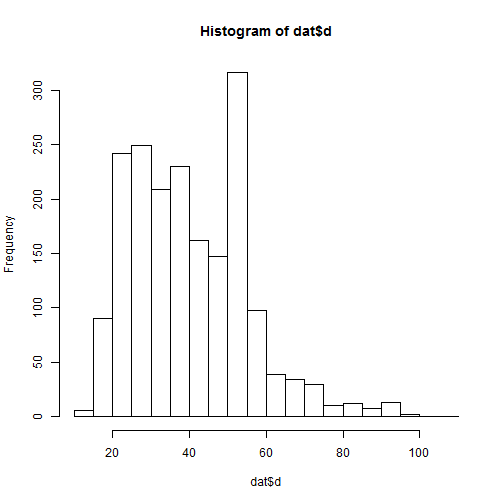

Red Snapper Video Index Using Delta GLM
========


 

```
##    Min. 1st Qu.  Median    Mean 3rd Qu.    Max. 
##    15.0    28.0    38.0    40.7    52.0    98.0
```

 

```
##    Min. 1st Qu.  Median    Mean 3rd Qu.    Max. 
##    27.2    29.7    31.3    31.3    32.8    35.0
```

 

```
##    Min. 1st Qu.  Median    Mean 3rd Qu.    Max. 
##     115     171     209     205     235     300
```

 

```
##    Min. 1st Qu.  Median    Mean 3rd Qu.    Max. 
##    12.4    19.6    22.2    22.1    24.8    29.1
```

 

```
##    Min. 1st Qu.  Median    Mean 3rd Qu.    Max. 
##   0.443   0.522   0.647   0.658   0.766   0.924
```


**So this bit allows variable selection of each of the model types**


```
## Start:  AIC=1519
## log(cpue) ~ y + wc + cd + cm + sc + sr + ss + bd + bt + bh + 
##     d + t + lat + temp + tod
## 
##        Df Deviance  AIC
## - d     3      593 1515
## - cm    2      591 1515
## - sr    2      591 1515
## - temp  3      594 1515
## - tod   3      594 1516
## - ss    1      591 1517
## - sc    2      593 1517
## - wc    2      594 1518
## - t     3      597 1518
## <none>         590 1519
## - lat   3      600 1520
## - bd    4      607 1523
## - bh    2      603 1524
## - bt    3      608 1526
## - cd    3      612 1529
## - y     2      631 1546
## 
## Step:  AIC=1515
## log(cpue) ~ y + wc + cd + cm + sc + sr + ss + bd + bt + bh + 
##     t + lat + temp + tod
## 
##        Df Deviance  AIC
## - sr    2      594 1511
## - cm    2      594 1511
## - temp  3      597 1512
## - tod   3      597 1512
## - ss    1      593 1513
## - sc    2      597 1514
## - wc    2      598 1515
## <none>         593 1515
## - lat   3      602 1516
## - t     3      602 1516
## - bd    4      610 1520
## - bh    2      609 1523
## - bt    3      612 1523
## - cd    3      614 1525
## - y     2      636 1544
## 
## Step:  AIC=1511
## log(cpue) ~ y + wc + cd + cm + sc + ss + bd + bt + bh + t + lat + 
##     temp + tod
## 
##        Df Deviance  AIC
## - cm    2      594 1508
## - temp  3      597 1508
## - tod   3      598 1508
## - ss    1      594 1509
## - sc    2      598 1511
## - wc    2      598 1511
## <none>         594 1511
## - lat   3      602 1512
## - t     3      602 1512
## - bd    4      611 1517
## - bh    2      609 1519
## - bt    3      612 1519
## - cd    3      615 1522
## - y     2      637 1540
## 
## Step:  AIC=1508
## log(cpue) ~ y + wc + cd + sc + ss + bd + bt + bh + t + lat + 
##     temp + tod
## 
##        Df Deviance  AIC
## - temp  3      597 1504
## - tod   3      598 1505
## - ss    1      594 1506
## - wc    2      599 1507
## - sc    2      599 1507
## <none>         594 1508
## - t     3      603 1508
## - lat   3      603 1508
## - bd    4      611 1513
## - bh    2      609 1515
## - bt    3      613 1516
## - cd    3      615 1518
## - y     2      638 1537
## 
## Step:  AIC=1504
## log(cpue) ~ y + wc + cd + sc + ss + bd + bt + bh + t + lat + 
##     tod
## 
##        Df Deviance  AIC
## - tod   3      601 1501
## - ss    1      597 1502
## - sc    2      601 1503
## - wc    2      601 1503
## <none>         597 1504
## - t     3      606 1505
## - lat   3      608 1506
## - bd    4      614 1509
## - bh    2      612 1511
## - bt    3      617 1514
## - cd    3      618 1514
## - y     2      647 1538
## 
## Step:  AIC=1501
## log(cpue) ~ y + wc + cd + sc + ss + bd + bt + bh + t + lat
## 
##        Df Deviance  AIC
## - ss    1      601 1499
## - sc    2      604 1500
## - wc    2      605 1500
## <none>         601 1501
## - t     3      609 1501
## - lat   3      611 1503
## - bd    4      617 1506
## - bh    2      616 1509
## - bt    3      621 1510
## - cd    3      623 1512
## - y     2      653 1536
## 
## Step:  AIC=1499
## log(cpue) ~ y + wc + cd + sc + bd + bt + bh + t + lat
## 
##        Df Deviance  AIC
## - sc    3      606 1497
## - wc    2      605 1498
## <none>         601 1499
## - t     3      609 1499
## - lat   3      611 1501
## - bd    4      617 1504
## - bh    2      616 1507
## - bt    3      621 1508
## - cd    3      623 1510
## - y     2      655 1535
## 
## Step:  AIC=1497
## log(cpue) ~ y + wc + cd + bd + bt + bh + t + lat
## 
##        Df Deviance  AIC
## <none>         606 1497
## - wc    2      612 1497
## - t     3      615 1498
## - lat   3      619 1501
## - bd    4      623 1502
## - bh    3      621 1502
## - cd    3      628 1508
## - bt    3      629 1509
## - y     2      664 1536
```

```
## Start:  AIC=-352.1
## cpue ~ y + wc + cd + cm + sc + sr + ss + bd + bt + bh + d + t + 
##     lat + temp + tod
## 
##        Df Deviance  AIC
## - cm    2      590 -356
## - tod   3      595 -355
## - sr    2      592 -355
## - temp  3      596 -354
## - ss    1      590 -354
## - t     3      597 -354
## - d     3      598 -353
## - bd    4      602 -353
## <none>         590 -352
## - wc    2      597 -352
## - lat   3      602 -351
## - sc    2      599 -351
## - bh    2      602 -349
## - cd    3      608 -348
## - bt    3      612 -345
## - y     2      634 -330
## 
## Step:  AIC=-356.1
## cpue ~ y + wc + cd + sc + sr + ss + bd + bt + bh + d + t + lat + 
##     temp + tod
## 
##        Df Deviance  AIC
## - tod   3      595 -359
## - sr    2      592 -359
## - temp  3      596 -358
## - ss    1      590 -358
## - t     3      597 -358
## - d     3      598 -357
## - bd    4      602 -357
## <none>         590 -356
## - wc    2      597 -356
## - lat   3      602 -355
## - sc    2      599 -355
## - bh    2      602 -353
## - cd    3      608 -351
## - bt    3      613 -348
## - y     2      634 -333
## 
## Step:  AIC=-357.4
## cpue ~ y + wc + cd + sc + sr + ss + bd + bt + bh + d + t + lat + 
##     temp
## 
##        Df Deviance  AIC
## - temp  3      600 -361
## - sr    2      596 -361
## - ss    1      595 -359
## - t     3      602 -359
## - bd    4      606 -359
## - d     3      603 -359
## <none>         595 -357
## - wc    2      603 -357
## - sc    2      604 -356
## - lat   3      608 -356
## - bh    2      607 -355
## - cd    3      615 -352
## - bt    3      619 -349
## - y     2      643 -333
## 
## Step:  AIC=-359.1
## cpue ~ y + wc + cd + sc + sr + ss + bd + bt + bh + d + t + lat
## 
##        Df Deviance  AIC
## - sr    2      601 -362
## - bd    4      610 -361
## - ss    1      600 -361
## - t     3      607 -361
## - d     3      608 -360
## <none>         600 -359
## - wc    2      607 -359
## - sc    2      607 -359
## - bh    2      610 -357
## - lat   3      615 -357
## - cd    3      620 -353
## - bt    3      626 -350
## - y     2      656 -331
## 
## Step:  AIC=-361.9
## cpue ~ y + wc + cd + sc + ss + bd + bt + bh + d + t + lat
## 
##        Df Deviance  AIC
## - bd    4      611 -364
## - t     3      609 -364
## - d     3      609 -363
## - ss    1      603 -363
## <none>         601 -362
## - wc    2      609 -361
## - sc    2      609 -361
## - bh    2      611 -360
## - lat   3      615 -360
## - cd    3      621 -357
## - bt    3      628 -353
## - y     2      658 -333
## 
## Step:  AIC=-360.5
## cpue ~ y + wc + cd + sc + ss + bt + bh + d + t + lat
```

```
## Start:  AIC=1821
## cpue ~ y + wc + cd + cm + sc + sr + ss + bd + bt + bh + d + t + 
##     lat + temp + tod
## 
##        Df Deviance  AIC
## - sc    3     1733 1815
## - ss    2     1733 1817
## - tod   3     1736 1818
## - sr    3     1737 1819
## - cm    2     1735 1819
## - wc    2     1735 1819
## - temp  3     1738 1820
## <none>        1733 1821
## - bd    4     1742 1822
## - bh    3     1741 1823
## - t     3     1741 1823
## - y     2     1745 1829
## - bt    3     1754 1836
## - cd    3     1757 1839
## - d     3     1765 1847
## - lat   3     1931 2013
## 
## Step:  AIC=1815
## cpue ~ y + wc + cd + cm + sr + ss + bd + bt + bh + d + t + lat + 
##     temp + tod
## 
##        Df Deviance  AIC
## - sr    3     1737 1813
## - cm    2     1735 1813
## - tod   3     1737 1813
## - wc    2     1735 1813
## - temp  3     1738 1814
## <none>        1733 1815
## - bd    4     1743 1817
## - bh    3     1741 1817
## - t     3     1741 1817
## - y     2     1746 1824
## - ss    3     1748 1824
## - bt    3     1754 1830
## - cd    3     1757 1833
## - d     3     1766 1842
## - lat   3     1931 2007
## 
## Step:  AIC=1813
## cpue ~ y + wc + cd + cm + ss + bd + bt + bh + d + t + lat + temp + 
##     tod
## 
##        Df Deviance  AIC
## - cm    2     1738 1810
## - wc    2     1738 1810
## - tod   3     1740 1810
## - temp  3     1741 1811
## <none>        1737 1813
## - bh    3     1744 1814
## - bd    4     1746 1814
## - t     3     1745 1815
## - y     2     1749 1821
## - ss    3     1753 1823
## - bt    3     1757 1827
## - cd    3     1761 1831
## - d     3     1769 1839
## - lat   3     1937 2007
## 
## Step:  AIC=1810
## cpue ~ y + wc + cd + ss + bd + bt + bh + d + t + lat + temp + 
##     tod
## 
##        Df Deviance  AIC
## - wc    2     1739 1807
## - tod   3     1742 1808
## - temp  3     1743 1809
## <none>        1738 1810
## - t     3     1746 1812
## - bh    3     1746 1812
## - bd    4     1748 1812
## - y     2     1750 1818
## - ss    3     1755 1821
## - bt    3     1760 1826
## - cd    3     1762 1828
## - d     3     1771 1837
## - lat   3     1938 2004
## 
## Step:  AIC=1807
## cpue ~ y + cd + ss + bd + bt + bh + d + t + lat + temp + tod
## 
##        Df Deviance  AIC
## - tod   3     1743 1805
## - temp  3     1744 1806
## <none>        1739 1807
## - t     3     1748 1810
## - bd    4     1750 1810
## - bh    3     1748 1810
## - y     2     1751 1815
## - ss    3     1756 1818
## - bt    3     1762 1824
## - cd    3     1764 1826
## - d     3     1771 1833
## - lat   3     1950 2012
## 
## Step:  AIC=1805
## cpue ~ y + cd + ss + bd + bt + bh + d + t + lat + temp
## 
##        Df Deviance  AIC
## - temp  3     1748 1804
## <none>        1743 1805
## - bd    4     1753 1807
## - t     3     1751 1807
## - bh    3     1752 1808
## - y     2     1755 1813
## - ss    3     1760 1816
## - bt    3     1765 1821
## - cd    3     1768 1824
## - d     3     1776 1832
## - lat   3     1955 2011
## 
## Step:  AIC=1804
## cpue ~ y + cd + ss + bd + bt + bh + d + t + lat
## 
##        Df Deviance  AIC
## <none>        1748 1804
## - bd    4     1758 1806
## - bh    3     1758 1808
## - t     3     1759 1809
## - y     2     1761 1813
## - ss    3     1764 1814
## - bt    3     1769 1819
## - cd    3     1773 1823
## - d     3     1787 1837
## - lat   3     1960 2010
```

```
##        preds                              
## 1    0.18828 0.34146  5.953e-01  5.953e-01
## 2    0.16492 0.26829  4.866e-01  4.866e-01
## 6    0.37453 0.31707 -1.665e-01 -1.665e-01
## 7    0.15935 0.07317 -7.783e-01 -7.783e-01
## 8    0.32857 1.00000  1.113e+00  1.113e+00
## 10   0.13161 0.46341  1.259e+00  1.259e+00
## 11   0.16434 0.04878 -1.215e+00 -1.215e+00
## 17   0.21754 0.12195 -5.787e-01 -5.787e-01
## 25   0.07333 0.04878 -4.077e-01 -4.077e-01
## 27   0.08916 0.17073  6.497e-01  6.497e-01
## 33   0.19561 0.97561  1.607e+00  1.607e+00
## 35   0.21067 0.41463  6.771e-01  6.771e-01
## 37   0.10965 0.09756 -1.169e-01 -1.169e-01
## 39   0.09959 0.53659  1.684e+00  1.684e+00
## 40   0.26477 0.12195 -7.752e-01 -7.752e-01
## 44   0.23470 0.07317 -1.165e+00 -1.165e+00
## 48   0.09059 0.02439 -1.312e+00 -1.312e+00
## 56   0.15218 0.09756 -4.446e-01 -4.446e-01
## 64   0.06126 0.04878 -2.278e-01 -2.278e-01
## 70   0.31284 0.02439 -2.552e+00 -2.552e+00
## 73   0.07443 0.14634  6.761e-01  6.761e-01
## 74   0.16537 0.24390  3.886e-01  3.886e-01
## 76   0.20297 0.07317 -1.020e+00 -1.020e+00
## 78   0.04211 0.02439 -5.461e-01 -5.461e-01
## 81   0.06919 0.48780  1.953e+00  1.953e+00
## 91   0.10050 0.09756 -2.973e-02 -2.973e-02
## 93   0.03365 0.19512  1.758e+00  1.758e+00
## 94   0.07274 0.48780  1.903e+00  1.903e+00
## 98   0.09852 0.07317 -2.974e-01 -2.974e-01
## 99   0.25541 0.90244  1.262e+00  1.262e+00
## 104  0.18466 0.21951  1.729e-01  1.729e-01
## 109  0.22522 0.02439 -2.223e+00 -2.223e+00
## 134  0.04613 0.04878  5.595e-02  5.595e-02
## 139  0.07877 0.04878 -4.792e-01 -4.792e-01
## 147  0.11594 0.04878 -8.657e-01 -8.657e-01
## 165  0.11297 0.04878 -8.398e-01 -8.398e-01
## 170  0.05696 0.02439 -8.482e-01 -8.482e-01
## 203  0.03828 0.07317  6.478e-01  6.478e-01
## 221  0.25940 0.17073 -4.183e-01 -4.183e-01
## 223  0.44949 0.68293  4.183e-01  4.183e-01
## 460  0.17108 0.09756 -5.617e-01 -5.617e-01
## 502  0.07224 0.12195  5.236e-01  5.236e-01
## 516  0.07507 0.04878 -4.311e-01 -4.311e-01
## 525  0.13175 0.04878 -9.936e-01 -9.936e-01
## 526  0.03057 0.02439 -2.257e-01 -2.257e-01
## 571  0.24407 0.19512 -2.238e-01 -2.238e-01
## 573  0.15661 0.04878 -1.166e+00 -1.166e+00
## 578  0.14595 0.04878 -1.096e+00 -1.096e+00
## 579  0.12807 0.02439 -1.658e+00 -1.658e+00
## 581  0.17732 0.07317 -8.852e-01 -8.852e-01
## 585  0.17955 0.17073 -5.036e-02 -5.036e-02
## 595  0.10574 0.07317 -3.681e-01 -3.681e-01
## 615  0.09183 0.34146  1.313e+00  1.313e+00
## 625  0.06668 0.12195  6.037e-01  6.037e-01
## 684  0.06927 0.17073  9.020e-01  9.020e-01
## 713  0.10090 0.19512  6.595e-01  6.595e-01
## 763  0.06887 0.14634  7.537e-01  7.537e-01
## 778  0.06301 0.02439 -9.492e-01 -9.492e-01
## 781  0.13112 0.04878 -9.888e-01 -9.888e-01
## 784  0.17278 0.26829  4.401e-01  4.401e-01
## 790  0.16956 0.07317 -8.404e-01 -8.404e-01
## 820  0.11162 0.09756 -1.346e-01 -1.346e-01
## 831  0.05051 0.29268  1.757e+00  1.757e+00
## 859  0.04664 0.04878  4.478e-02  4.478e-02
## 968  0.07231 0.02439 -1.087e+00 -1.087e+00
## 970  0.13969 0.09756 -3.590e-01 -3.590e-01
## 982  0.15065 0.07317 -7.222e-01 -7.222e-01
## 1007 0.09400 0.02439 -1.349e+00 -1.349e+00
## 1009 0.20678 0.12195 -5.280e-01 -5.280e-01
## 1046 0.05046 0.02439 -7.271e-01 -7.271e-01
## 1105 0.08800 0.19512  7.962e-01  7.962e-01
## 1109 0.06137 0.02439 -9.228e-01 -9.228e-01
## 1183 0.04074 0.09756  8.733e-01  8.733e-01
## 1244 0.26841 0.09756 -1.012e+00 -1.012e+00
## 1249 0.14004 0.24390  5.548e-01  5.548e-01
## 1252 0.19124 0.92683  1.578e+00  1.578e+00
## 1257 0.05460 0.02439 -8.058e-01 -8.058e-01
## 1259 0.15083 0.16000  5.901e-02  5.901e-02
## 1260 0.45719 0.31707 -3.660e-01 -3.660e-01
## 1261 0.15369 0.43902  1.050e+00  1.050e+00
## 1264 0.20986 0.48780  8.435e-01  8.435e-01
## 1266 0.11424 0.02439 -1.544e+00 -1.544e+00
## 1270 0.50229 0.02439 -3.025e+00 -3.025e+00
## 1278 0.15661 0.21951  3.377e-01  3.377e-01
## 1280 0.14364 0.90244  1.838e+00  1.838e+00
## 1283 0.05226 0.04878 -6.883e-02 -6.883e-02
## 1289 0.12568 0.07317 -5.409e-01 -5.409e-01
## 1291 0.08840 0.09756  9.863e-02  9.863e-02
## 1292 0.05174 0.02439 -7.521e-01 -7.521e-01
## 1298 0.08999 0.07317 -2.070e-01 -2.070e-01
## 1299 0.18859 0.17073 -9.946e-02 -9.946e-02
## 1305 0.26197 0.29268  1.108e-01  1.108e-01
## 1308 0.10204 0.12195  1.782e-01  1.782e-01
## 1309 0.22046 1.51220  1.926e+00  1.926e+00
## 1310 0.16613 0.14634 -1.268e-01 -1.268e-01
## 1314 0.06754 0.04878 -3.255e-01 -3.255e-01
## 1315 0.28158 1.19512  1.446e+00  1.446e+00
## 1316 0.17018 0.17073  3.217e-03  3.217e-03
## 1317 0.13017 0.24390  6.279e-01  6.279e-01
## 1318 0.14373 0.02439 -1.774e+00 -1.774e+00
## 1320 0.21709 0.07317 -1.088e+00 -1.088e+00
## 1324 0.05982 0.02439 -8.972e-01 -8.972e-01
## 1325 0.10402 0.04878 -7.573e-01 -7.573e-01
## 1327 0.22185 0.09756 -8.215e-01 -8.215e-01
## 1328 0.87227 0.51220 -5.324e-01 -5.324e-01
## 1331 0.12200 0.21951  5.874e-01  5.874e-01
## 1333 0.18201 0.12195 -4.005e-01 -4.005e-01
## 1334 0.14682 0.14634 -3.257e-03 -3.257e-03
## 1336 0.75602 0.73171 -3.269e-02 -3.269e-02
## 1337 0.07806 0.21951  1.034e+00  1.034e+00
## 1339 0.13230 0.36585  1.017e+00  1.017e+00
## 1341 0.15321 0.41463  9.956e-01  9.956e-01
## 1342 0.09896 0.07317 -3.019e-01 -3.019e-01
## 1344 0.20805 0.07317 -1.045e+00 -1.045e+00
## 1346 0.05838 0.02439 -8.729e-01 -8.729e-01
## 1347 0.15399 0.02439 -1.843e+00 -1.843e+00
## 1348 0.14087 2.58537  2.910e+00  2.910e+00
## 1351 0.24829 1.58537  1.854e+00  1.854e+00
## 1359 0.17935 1.43902  2.082e+00  2.082e+00
## 1360 0.03580 0.02439 -3.838e-01 -3.838e-01
## 1362 0.17259 0.78049  1.509e+00  1.509e+00
## 1363 0.11985 0.14634  1.997e-01  1.997e-01
## 1365 0.19270 0.29268  4.179e-01  4.179e-01
## 1366 0.13964 0.65854  1.551e+00  1.551e+00
## 1367 0.16748 0.04878 -1.234e+00 -1.234e+00
## 1370 0.19687 0.04878 -1.395e+00 -1.395e+00
## 1371 0.14700 0.24390  5.063e-01  5.063e-01
## 1378 0.13509 0.04878 -1.019e+00 -1.019e+00
## 1379 0.47430 5.41463  2.435e+00  2.435e+00
## 1382 0.05782 0.02439 -8.632e-01 -8.632e-01
## 1384 0.47581 0.09756 -1.585e+00 -1.585e+00
## 1385 0.04247 0.02439 -5.546e-01 -5.546e-01
## 1387 0.25999 0.26829  3.142e-02  3.142e-02
## 1388 0.22033 0.26829  1.970e-01  1.970e-01
## 1390 0.13510 0.34146  9.273e-01  9.273e-01
## 1391 0.11904 0.04878 -8.921e-01 -8.921e-01
## 1393 0.15089 0.02439 -1.822e+00 -1.822e+00
## 1401 0.17391 1.39024  2.079e+00  2.079e+00
## 1408 0.15544 0.07317 -7.535e-01 -7.535e-01
## 1412 0.10199 0.12195  1.788e-01  1.788e-01
## 1413 0.10927 0.02439 -1.500e+00 -1.500e+00
## 1414 0.10927 0.02439 -1.500e+00 -1.500e+00
## 1416 0.24678 1.02439  1.423e+00  1.423e+00
## 1420 0.17389 2.34146  2.600e+00  2.600e+00
## 1421 0.09841 0.04878 -7.018e-01 -7.018e-01
## 1449 0.11177 0.14634  2.695e-01  2.695e-01
## 1450 0.03926 0.17073  1.470e+00  1.470e+00
## 1452 0.17153 0.09756 -5.643e-01 -5.643e-01
## 1454 0.08617 0.02439 -1.262e+00 -1.262e+00
## 1455 0.12998 0.07317 -5.746e-01 -5.746e-01
## 1458 0.14414 0.53659  1.314e+00  1.314e+00
## 1462 0.19669 0.34146  5.516e-01  5.516e-01
## 1463 0.16886 0.02439 -1.935e+00 -1.935e+00
## 1475 0.10550 0.07317 -3.659e-01 -3.659e-01
## 1476 0.20997 0.58537  1.025e+00  1.025e+00
## 1477 0.17261 0.97561  1.732e+00  1.732e+00
## 1478 0.11642 0.04878 -8.699e-01 -8.699e-01
## 1480 0.13592 0.14634  7.388e-02  7.388e-02
## 1487 0.16554 0.14634 -1.233e-01 -1.233e-01
## 1488 0.08466 0.17073  7.015e-01  7.015e-01
## 1492 0.10526 0.04878 -7.691e-01 -7.691e-01
## 1493 0.13913 0.02439 -1.741e+00 -1.741e+00
## 1495 0.06245 0.07317  1.585e-01  1.585e-01
## 1504 0.13697 0.07317 -6.269e-01 -6.269e-01
## 1505 0.19287 0.02439 -2.068e+00 -2.068e+00
## 1506 0.19757 0.14634 -3.001e-01 -3.001e-01
## 1512 0.26275 0.07317 -1.278e+00 -1.278e+00
## 1514 0.11391 0.29268  9.437e-01  9.437e-01
## 1516 0.13042 0.34146  9.625e-01  9.625e-01
## 1519 0.09799 0.29268  1.094e+00  1.094e+00
## 1521 0.20997 1.21951  1.759e+00  1.759e+00
## 1530 0.14590 0.07317 -6.901e-01 -6.901e-01
## 1533 0.31264 0.42308  3.025e-01  3.025e-01
## 1534 0.33756 1.09756  1.179e+00  1.179e+00
## 1535 0.59108 0.24390 -8.852e-01 -8.852e-01
## 1537 0.49346 0.46341 -6.282e-02 -6.282e-02
## 1538 0.15094 0.09756 -4.364e-01 -4.364e-01
## 1539 0.14271 0.02439 -1.767e+00 -1.767e+00
## 1543 0.16068 0.39024  8.873e-01  8.873e-01
## 1552 0.09906 0.17073  5.444e-01  5.444e-01
## 1553 0.56872 0.26829 -7.513e-01 -7.513e-01
## 1560 0.11041 0.43902  1.380e+00  1.380e+00
## 1561 0.15237 0.19512  2.473e-01  2.473e-01
## 1566 0.09228 0.12195  2.788e-01  2.788e-01
## 1569 0.11639 0.75610  1.871e+00  1.871e+00
## 1577 0.06714 0.02439 -1.013e+00 -1.013e+00
## 1578 0.05917 0.02439 -8.862e-01 -8.862e-01
## 1580 0.04603 0.12195  9.743e-01  9.743e-01
## 1587 0.07778 0.02439 -1.160e+00 -1.160e+00
## 1607 0.12209 0.24390  6.920e-01  6.920e-01
## 1609 0.05021 0.46341  2.222e+00  2.222e+00
## 1610 0.15446 0.02439 -1.846e+00 -1.846e+00
## 1611 0.11494 0.12195  5.918e-02  5.918e-02
## 1613 0.13158 0.26829  7.125e-01  7.125e-01
## 1617 0.03983 0.02439 -4.905e-01 -4.905e-01
## 1619 0.03544 0.14634  1.418e+00  1.418e+00
## 1622 0.11507 0.04878 -8.582e-01 -8.582e-01
## 1623 0.09679 0.09756  7.929e-03  7.929e-03
## 1624 0.04092 0.12195  1.092e+00  1.092e+00
## 1629 0.10921 0.60976  1.720e+00  1.720e+00
## 1630 0.18986 2.17073  2.437e+00  2.437e+00
## 1631 0.12628 0.26829  7.536e-01  7.536e-01
## 1632 0.05700 0.04878 -1.557e-01 -1.557e-01
## 1636 0.08570 0.04878 -5.635e-01 -5.635e-01
## 1643 0.28137 1.04878  1.316e+00  1.316e+00
## 1646 0.23102 0.12195 -6.389e-01 -6.389e-01
## 1648 0.11579 0.21951  6.396e-01  6.396e-01
## 1649 0.14337 0.51220  1.273e+00  1.273e+00
## 1650 0.43663 0.26829 -4.870e-01 -4.870e-01
## 1651 0.10433 0.19512  6.261e-01  6.261e-01
## 1656 0.09453 0.02439 -1.355e+00 -1.355e+00
## 1658 0.09245 0.07317 -2.339e-01 -2.339e-01
## 1660 0.14315 0.14634  2.205e-02  2.205e-02
## 1665 0.15632 0.12195 -2.483e-01 -2.483e-01
## 1666 0.14404 0.02439 -1.776e+00 -1.776e+00
## 1671 0.10779 0.02439 -1.486e+00 -1.486e+00
## 1675 0.04290 0.07317  5.338e-01  5.338e-01
## 1677 0.07445 0.02439 -1.116e+00 -1.116e+00
## 1678 0.09152 0.07317 -2.238e-01 -2.238e-01
## 1679 0.06431 0.02439 -9.695e-01 -9.695e-01
## 1683 0.07072 0.04878 -3.714e-01 -3.714e-01
## 1686 0.27391 2.29268  2.125e+00  2.125e+00
## 1700 0.44956 0.04878 -2.221e+00 -2.221e+00
## 1702 0.03612 0.02439 -3.927e-01 -3.927e-01
## 1707 0.07746 0.02439 -1.156e+00 -1.156e+00
## 1708 0.10554 0.04878 -7.718e-01 -7.718e-01
## 1713 0.12810 0.17000  2.830e-01  2.830e-01
## 1716 0.12075 0.02439 -1.600e+00 -1.600e+00
## 1721 0.14559 0.02439 -1.787e+00 -1.787e+00
## 1722 0.11959 0.17073  3.560e-01  3.560e-01
## 1725 2.53659 2.53659  4.441e-16  4.441e-16
## 1726 0.07476 0.04878 -4.269e-01 -4.269e-01
## 1731 0.46331 2.14634  1.533e+00  1.533e+00
## 1736 0.23588 0.29268  2.158e-01  2.158e-01
## 1743 0.23083 0.07317 -1.149e+00 -1.149e+00
## 1761 0.07007 0.14634  7.364e-01  7.364e-01
## 1789 0.14282 0.02439 -1.767e+00 -1.767e+00
## 1792 0.08984 0.07317 -2.053e-01 -2.053e-01
## 1800 0.09333 0.02439 -1.342e+00 -1.342e+00
## 1802 0.05289 0.02439 -7.739e-01 -7.739e-01
## 1804 0.09055 0.43902  1.579e+00  1.579e+00
## 1813 0.08244 0.56098  1.918e+00  1.918e+00
## 1815 0.11584 0.41463  1.275e+00  1.275e+00
## 1817 0.22015 0.36585  5.079e-01  5.079e-01
## 1819 0.06883 0.14634  7.544e-01  7.544e-01
## 1821 0.40807 0.19512 -7.378e-01 -7.378e-01
## 1824 0.07038 0.02439 -1.060e+00 -1.060e+00
## 1829 0.45925 0.24390 -6.328e-01 -6.328e-01
## 1842 0.07406 0.26829  1.287e+00  1.287e+00
## 1844 0.06406 0.12195  6.437e-01  6.437e-01
## 1847 0.15880 0.07317 -7.748e-01 -7.748e-01
## 1848 0.29733 1.56098  1.658e+00  1.658e+00
## 1850 0.11992 0.09756 -2.064e-01 -2.064e-01
## 1853 0.12920 0.12195 -5.771e-02 -5.771e-02
## 1854 0.12466 0.07317 -5.328e-01 -5.328e-01
## 1855 0.05587 0.56098  2.307e+00  2.307e+00
## 1858 0.21149 0.14634 -3.683e-01 -3.683e-01
## 1864 0.07153 0.02439 -1.076e+00 -1.076e+00
## 1867 0.04119 0.04878  1.692e-01  1.692e-01
## 1868 0.07793 0.24390  1.141e+00  1.141e+00
## 1869 0.09796 0.02439 -1.390e+00 -1.390e+00
## 1873 0.29724 0.21951 -3.031e-01 -3.031e-01
## 1874 0.14902 1.29268  2.160e+00  2.160e+00
## 1880 0.06866 0.02439 -1.035e+00 -1.035e+00
## 1883 0.09356 0.02439 -1.344e+00 -1.344e+00
## 1894 0.11584 0.09756 -1.717e-01 -1.717e-01
## 1897 0.05079 0.02439 -7.336e-01 -7.336e-01
## 1898 0.10443 0.14634  3.374e-01  3.374e-01
## 1904 0.04665 0.07317  4.502e-01  4.502e-01
## 1915 0.19302 0.04878 -1.375e+00 -1.375e+00
## 1918 0.11984 0.48780  1.404e+00  1.404e+00
## 1922 0.26019 0.19512 -2.878e-01 -2.878e-01
## 1923 0.08455 0.02439 -1.243e+00 -1.243e+00
## 1927 0.21878 0.14634 -4.021e-01 -4.021e-01
## 1929 0.18040 2.88000  2.770e+00  2.770e+00
## 1930 0.27135 0.60976  8.096e-01  8.096e-01
## 1932 0.09166 0.24390  9.786e-01  9.786e-01
## 1933 0.08831 0.02439 -1.287e+00 -1.287e+00
## 1934 0.45014 2.12195  1.551e+00  1.551e+00
## 1939 0.08851 0.02439 -1.289e+00 -1.289e+00
## 1941 0.25919 0.43902  5.270e-01  5.270e-01
## 1944 0.32588 0.39024  1.802e-01  1.802e-01
## 1947 0.16704 0.12195 -3.146e-01 -3.146e-01
## 1952 0.08300 0.02439 -1.225e+00 -1.225e+00
## 1957 0.14707 0.17073  1.492e-01  1.492e-01
## 1958 0.10847 0.12195  1.172e-01  1.172e-01
## 1959 0.15374 0.12195 -2.316e-01 -2.316e-01
## 1961 0.06064 0.02439 -9.108e-01 -9.108e-01
## 1965 0.41976 1.53659  1.298e+00  1.298e+00
## 1967 0.08145 0.02439 -1.206e+00 -1.206e+00
## 1968 0.13509 0.04878 -1.019e+00 -1.019e+00
## 1969 0.03951 0.04878  2.109e-01  2.109e-01
## 1972 0.09127 0.39024  1.453e+00  1.453e+00
## 1973 0.06555 0.17073  9.572e-01  9.572e-01
## 1977 0.04208 0.02439 -5.453e-01 -5.453e-01
## 1982 0.03749 0.02439 -4.298e-01 -4.298e-01
## 1983 0.10762 0.34146  1.155e+00  1.155e+00
## 1990 0.07698 0.24390  1.153e+00  1.153e+00
## 1995 0.34466 1.04878  1.113e+00  1.113e+00
## 1996 0.04703 0.17073  1.289e+00  1.289e+00
## 2002 0.09414 0.04878 -6.575e-01 -6.575e-01
## 2005 0.17268 0.12195 -3.478e-01 -3.478e-01
## 2011 0.07869 0.04878 -4.782e-01 -4.782e-01
## 2013 0.13042 0.07317 -5.780e-01 -5.780e-01
## 2015 0.10441 1.29268  2.516e+00  2.516e+00
## 2017 0.13823 0.12195 -1.253e-01 -1.253e-01
## 2018 0.07040 0.02439 -1.060e+00 -1.060e+00
## 2020 0.14077 0.14634  3.879e-02  3.879e-02
## 2023 0.14344 0.02439 -1.772e+00 -1.772e+00
## 2024 0.20492 0.87805  1.455e+00  1.455e+00
## 2027 0.16039 0.14634 -9.165e-02 -9.165e-02
## 2030 0.20822 0.26829  2.535e-01  2.535e-01
## 2033 0.15252 0.09756 -4.468e-01 -4.468e-01
## 2035 0.10056 0.14634  3.752e-01  3.752e-01
## 2036 0.11446 0.04878 -8.529e-01 -8.529e-01
## 2038 0.19235 0.02439 -2.065e+00 -2.065e+00
## 2043 0.12864 0.12195 -5.337e-02 -5.337e-02
## 2045 0.12788 0.07317 -5.583e-01 -5.583e-01
## 2046 0.11282 1.14634  2.319e+00  2.319e+00
## 2047 0.14556 0.02439 -1.786e+00 -1.786e+00
## 2063 0.08551 0.14634  5.373e-01  5.373e-01
## 2065 0.08782 0.02439 -1.281e+00 -1.281e+00
## 2069 0.13681 0.19512  3.550e-01  3.550e-01
## 2080 0.15253 0.12195 -2.237e-01 -2.237e-01
## 2084 0.08926 0.04878 -6.042e-01 -6.042e-01
## 2090 0.13834 0.29268  7.494e-01  7.494e-01
## 2093 0.13858 0.17073  2.086e-01  2.086e-01
## 2102 0.06795 0.06000 -1.245e-01 -1.245e-01
## 2107 0.18893 0.58537  1.131e+00  1.131e+00
## 2110 0.08931 0.07317 -1.993e-01 -1.993e-01
## 2111 0.37637 0.19512 -6.570e-01 -6.570e-01
## 2114 0.08407 0.02439 -1.238e+00 -1.238e+00
## 2115 0.05661 0.12195  7.674e-01  7.674e-01
## 2117 0.10035 0.26829  9.834e-01  9.834e-01
## 2118 0.05370 0.04878 -9.607e-02 -9.607e-02
## 2125 0.15043 0.17073  1.266e-01  1.266e-01
## 2126 0.11985 0.02439 -1.592e+00 -1.592e+00
## 2127 0.16538 0.04878 -1.221e+00 -1.221e+00
## 2129 0.02662 0.02439 -8.766e-02 -8.766e-02
## 2131 0.06922 0.04878 -3.500e-01 -3.500e-01
## 2137 0.11351 2.09756  2.917e+00  2.917e+00
## 2141 0.15681 1.60976  2.329e+00  2.329e+00
## 2145 0.12864 0.12195 -5.337e-02 -5.337e-02
## 2147 0.07827 0.02439 -1.166e+00 -1.166e+00
## 2149 0.07829 0.04878 -4.731e-01 -4.731e-01
## 2151 0.10000 0.02439 -1.411e+00 -1.411e+00
## 2152 0.10564 0.07317 -3.672e-01 -3.672e-01
## 2155 0.06646 0.14634  7.893e-01  7.893e-01
## 2156 0.13214 1.17073  2.181e+00  2.181e+00
## 2162 0.07986 0.82927  2.340e+00  2.340e+00
## 2164 0.09921 0.29268  1.082e+00  1.082e+00
## 2169 0.09620 0.07317 -2.737e-01 -2.737e-01
## 2177 0.14359 0.04878 -1.080e+00 -1.080e+00
## 2179 0.09033 0.14634  4.824e-01  4.824e-01
## 2180 0.13889 0.02439 -1.739e+00 -1.739e+00
## 2185 0.10039 1.56098  2.744e+00  2.744e+00
## 2187 0.11728 0.02439 -1.570e+00 -1.570e+00
## 2188 0.10039 0.26829  9.830e-01  9.830e-01
## 2190 0.09772 0.02439 -1.388e+00 -1.388e+00
## 2195 0.14722 0.24390  5.048e-01  5.048e-01
## 2197 0.11834 0.02439 -1.579e+00 -1.579e+00
## 2200 0.20895 0.12195 -5.385e-01 -5.385e-01
## 2201 0.10713 0.02439 -1.480e+00 -1.480e+00
## 2204 0.04743 0.09756  7.213e-01  7.213e-01
## 2206 0.08365 0.02439 -1.232e+00 -1.232e+00
## 2213 0.07997 0.02439 -1.187e+00 -1.187e+00
## 2215 0.24582 0.51220  7.341e-01  7.341e-01
## 2216 0.06821 0.02439 -1.028e+00 -1.028e+00
## 2228 0.05079 0.02439 -7.336e-01 -7.336e-01
## 2232 0.07858 0.02439 -1.170e+00 -1.170e+00
## 2234 0.12672 0.02439 -1.648e+00 -1.648e+00
## 2240 0.06643 0.14634  7.898e-01  7.898e-01
## 2243 0.07492 0.14634  6.695e-01  6.695e-01
## 2244 0.06388 0.02439 -9.628e-01 -9.628e-01
## 2247 0.14755 0.09756 -4.137e-01 -4.137e-01
## 2249 0.10822 0.06000 -5.898e-01 -5.898e-01
## 2251 0.09466 0.21951  8.411e-01  8.411e-01
## 2259 0.04755 0.02439 -6.677e-01 -6.677e-01
## 2264 0.09678 0.31707  1.187e+00  1.187e+00
## 2265 0.09804 0.09756 -4.918e-03 -4.918e-03
## 2267 0.35631 0.70732  6.857e-01  6.857e-01
## 2270 0.01959 0.02439  2.191e-01  2.191e-01
## 2275 0.06315 0.04878 -2.582e-01 -2.582e-01
## 2276 0.43572 5.09756  2.460e+00  2.460e+00
## 2287 0.10471 0.07317 -3.584e-01 -3.584e-01
## 2290 0.18332 0.19512  6.236e-02  6.236e-02
## 2292 0.07665 0.02439 -1.145e+00 -1.145e+00
## 2296 0.07708 0.36585  1.557e+00  1.557e+00
## 2298 0.06769 0.02439 -1.021e+00 -1.021e+00
## 2300 0.04907 0.12195  9.104e-01  9.104e-01
## 2313 0.03879 0.02439 -4.639e-01 -4.639e-01
## 2316 0.06760 0.02439 -1.019e+00 -1.019e+00
## 2319 0.05656 0.02439 -8.411e-01 -8.411e-01
## 2324 0.09779 0.02439 -1.389e+00 -1.389e+00
## 2325 0.05517 0.14634  9.755e-01  9.755e-01
## 2329 0.09201 0.04878 -6.346e-01 -6.346e-01
## 2342 0.03324 0.02439 -3.096e-01 -3.096e-01
## 2346 0.09811 0.34146  1.247e+00  1.247e+00
## 2352 0.06626 0.07317  9.921e-02  9.921e-02
## 2356 0.09376 0.14634  4.452e-01  4.452e-01
## 2357 0.36857 0.68293  6.167e-01  6.167e-01
## 2360 0.12734 0.09756 -2.664e-01 -2.664e-01
## 2361 0.13060 0.65854  1.618e+00  1.618e+00
## 2369 0.34316 0.02439 -2.644e+00 -2.644e+00
## 2372 0.15468 0.02439 -1.847e+00 -1.847e+00
## 2389 0.04286 0.02439 -5.638e-01 -5.638e-01
## 2405 0.03742 0.02439 -4.281e-01 -4.281e-01
## 2411 0.07373 0.09756  2.801e-01  2.801e-01
## 2428 0.10085 0.26829  9.784e-01  9.784e-01
## 2430 0.13033 0.26829  7.220e-01  7.220e-01
## 2432 0.06720 0.19512  1.066e+00  1.066e+00
## 2436 0.08402 0.04878 -5.437e-01 -5.437e-01
## 2437 0.08501 0.04878 -5.554e-01 -5.554e-01
## 2440 0.18219 0.09756 -6.245e-01 -6.245e-01
## 2445 0.10684 0.56098  1.658e+00  1.658e+00
## 2450 0.10782 0.43902  1.404e+00  1.404e+00
## 2453 0.09257 1.39024  2.709e+00  2.709e+00
## 2455 0.09733 0.02439 -1.384e+00 -1.384e+00
## 2456 0.06799 0.07317  7.345e-02  7.345e-02
## 2457 0.05120 0.02439 -7.416e-01 -7.416e-01
## 2461 0.14658 0.04878 -1.100e+00 -1.100e+00
## 2465 0.05443 0.07317  2.959e-01  2.959e-01
## 2466 0.06766 0.02439 -1.020e+00 -1.020e+00
## 2471 0.10427 0.02439 -1.453e+00 -1.453e+00
## 2473 0.10984 1.78049  2.786e+00  2.786e+00
## 2474 0.05725 0.19512  1.226e+00  1.226e+00
## 2483 0.08608 0.07317 -1.625e-01 -1.625e-01
## 2484 0.03954 0.14634  1.309e+00  1.309e+00
## 2485 0.27593 0.02439 -2.426e+00 -2.426e+00
## 2492 0.14817 0.04878 -1.111e+00 -1.111e+00
## 2494 0.06562 0.63415  2.268e+00  2.268e+00
## 2503 0.06765 0.34146  1.619e+00  1.619e+00
## 2516 0.06856 0.02439 -1.033e+00 -1.033e+00
## 2518 0.05303 0.02439 -7.767e-01 -7.767e-01
## 2538 0.04097 0.07317  5.800e-01  5.800e-01
## 2550 0.30059 0.24390 -2.090e-01 -2.090e-01
## 2553 0.07585 0.04878 -4.414e-01 -4.414e-01
## 2554 0.17060 0.09756 -5.589e-01 -5.589e-01
## 2556 0.13346 0.41463  1.134e+00  1.134e+00
## 2561 0.09349 0.02439 -1.344e+00 -1.344e+00
## 2594 0.41620 4.80488  2.446e+00  2.446e+00
## 2606 0.30966 0.31707  2.367e-02  2.367e-02
## 2611 0.17073 0.17073  1.799e-14  1.799e-14
## 2624 0.34050 0.12195 -1.027e+00 -1.027e+00
## 2627 0.27251 0.80488  1.083e+00  1.083e+00
## 2644 0.22305 0.24390  8.939e-02  8.939e-02
## 2657 0.25393 0.12195 -7.334e-01 -7.334e-01
## 2663 0.19941 0.68293  1.231e+00  1.231e+00
## 2664 0.22682 0.04878 -1.537e+00 -1.537e+00
## 2675 0.26308 0.65854  9.176e-01  9.176e-01
## 2678 0.29402 0.48780  5.063e-01  5.063e-01
## 2685 0.22273 0.43902  6.786e-01  6.786e-01
## 2695 0.25781 1.68293  1.876e+00  1.876e+00
## 2718 0.17884 0.04878 -1.299e+00 -1.299e+00
## 2738 0.41844 0.63415  4.158e-01  4.158e-01
## 2742 0.16228 0.68293  1.437e+00  1.437e+00
## 2774 0.30908 0.24390 -2.368e-01 -2.368e-01
## 2775 0.16176 0.21951  3.053e-01  3.053e-01
## 2781 0.18158 0.18182  1.305e-03  1.305e-03
## 2782 0.27286 0.19512 -3.353e-01 -3.353e-01
## 2791 0.23268 0.46341  6.890e-01  6.890e-01
## 2810 0.14344 0.02439 -1.772e+00 -1.772e+00
## 2811 0.11424 0.36585  1.164e+00  1.164e+00
## 2819 0.11424 0.36585  1.164e+00  1.164e+00
## 2830 0.21597 0.09756 -7.947e-01 -7.947e-01
## 2831 0.12955 0.02439 -1.670e+00 -1.670e+00
## 2844 0.34882 2.65854  2.031e+00  2.031e+00
```

    

