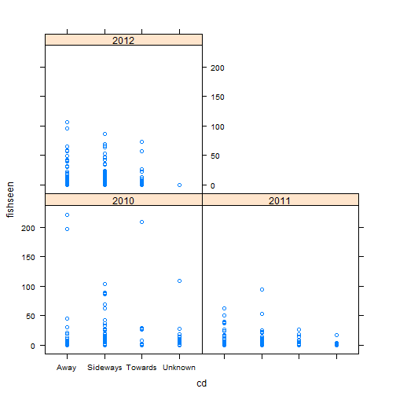

Red Snapper Video Index Using Poisson GLM
========


 

```
##    Min. 1st Qu.  Median    Mean 3rd Qu.    Max. 
##    15.0    28.0    38.0    40.7    52.0    98.0
```

 

```
##    Min. 1st Qu.  Median    Mean 3rd Qu.    Max. 
##    27.2    29.7    31.3    31.3    32.8    35.0
```

 

```
##    Min. 1st Qu.  Median    Mean 3rd Qu.    Max. 
##     115     171     209     205     235     300
```

 

```
##    Min. 1st Qu.  Median    Mean 3rd Qu.    Max. 
##    12.4    19.6    22.2    22.1    24.8    29.1
```

 

```
##    Min. 1st Qu.  Median    Mean 3rd Qu.    Max. 
##   0.443   0.522   0.647   0.658   0.766   0.924
```

```
##   fishseen frames    y wc   cd     cm       sc   sr         ss       bd
## 1       14      1 2012  0 Away Strong     High High Continuous Moderate
## 2       11      1 2012  0 Away Strong Moderate High Continuous Moderate
## 3        0      1 2012  1 Away Strong     High High Continuous     High
## 4        0      1 2012  1 Away Strong     High High Continuous     High
## 5        0      1 2012  0 Away Strong      Low  Low     Coarse Moderate
## 6       13      1 2012  0 Away Strong      Low  Low     Coarse     High
##        bt   bh d t lat temp tod
## 1   Algae  Low 4 3   4    2   3
## 2   Algae  Low 4 3   4    1   2
## 3   Other High 3 1   2    1   2
## 4 Unknown  Low 3 1   3    1   2
## 5   Other High 3 2   2    2   2
## 6   Other  Low 2 2   1    2   3
```

        

 
 **Model**
 

```r

Poismod=glm(fishseen~ y + wc + cd + sc + bd + d + t + lat + temp + offset(frames),data=dat,  family = "poisson");summary(Poismod)
```

```
## 
## Call:
## glm(formula = fishseen ~ y + wc + cd + sc + bd + d + t + lat + 
##     temp + offset(frames), family = "poisson", data = dat)
## 
## Deviance Residuals: 
##     Min       1Q   Median       3Q      Max  
## -10.582   -2.050   -1.350   -0.781   29.245  
## 
## Coefficients:
##             Estimate Std. Error z value Pr(>|z|)    
## (Intercept)   2.1097     0.0696   30.32  < 2e-16 ***
## y2011        -1.2575     0.0487  -25.83  < 2e-16 ***
## y2012        -0.7250     0.0449  -16.15  < 2e-16 ***
## wc1          -0.2532     0.0312   -8.12  4.6e-16 ***
## wc2          -0.8897     0.0904   -9.85  < 2e-16 ***
## cdSideways   -0.6198     0.0299  -20.72  < 2e-16 ***
## cdTowards    -1.0173     0.0420  -24.24  < 2e-16 ***
## cdUnknown    -0.4718     0.0703   -6.71  2.0e-11 ***
## scLow        -0.0993     0.0349   -2.85   0.0044 ** 
## scModerate   -0.6940     0.0550  -12.61  < 2e-16 ***
## scNone       -0.7724     0.0497  -15.53  < 2e-16 ***
## scUnknown     0.0593     0.4079    0.15   0.8845    
## bdLow        -0.0357     0.0403   -0.89   0.3755    
## bdModerate    0.6049     0.0364   16.63  < 2e-16 ***
## bdNone        0.5181     0.0551    9.41  < 2e-16 ***
## bdUnknown    -1.7986     0.3412   -5.27  1.4e-07 ***
## d2            0.5317     0.0390   13.64  < 2e-16 ***
## d3           -0.2311     0.0447   -5.17  2.3e-07 ***
## d4           -0.7467     0.0584  -12.78  < 2e-16 ***
## t2            0.1740     0.0438    3.97  7.1e-05 ***
## t3            0.3546     0.0546    6.50  8.2e-11 ***
## t4            0.2270     0.0502    4.52  6.0e-06 ***
## lat2         -1.1060     0.0350  -31.59  < 2e-16 ***
## lat3         -1.8422     0.0503  -36.60  < 2e-16 ***
## lat4         -1.8423     0.0560  -32.93  < 2e-16 ***
## temp2        -0.0218     0.0482   -0.45   0.6506    
## temp3         0.2743     0.0520    5.27  1.3e-07 ***
## temp4         0.4110     0.0570    7.21  5.4e-13 ***
## ---
## Signif. codes:  0 '***' 0.001 '**' 0.01 '*' 0.05 '.' 0.1 ' ' 1
## 
## (Dispersion parameter for poisson family taken to be 1)
## 
##     Null deviance: 26755  on 1887  degrees of freedom
## Residual deviance: 18307  on 1860  degrees of freedom
## AIC: 19990
## 
## Number of Fisher Scoring iterations: 7
```

```r


Pois.step = stepAIC(Poismod,direction="backward");summary(Pois.step)
```

```
## Start:  AIC=19990
## fishseen ~ y + wc + cd + sc + bd + d + t + lat + temp + offset(frames)
## 
##        Df Deviance   AIC
## <none>       18307 19990
## - t     3    18352 20029
## - temp  3    18409 20086
## - wc    2    18460 20139
## - sc    4    18743 20418
## - bd    4    18840 20515
## - y     2    19024 20703
## - cd    3    19042 20719
## - d     3    19091 20768
## - lat   3    20654 22331
```

```
## 
## Call:
## glm(formula = fishseen ~ y + wc + cd + sc + bd + d + t + lat + 
##     temp + offset(frames), family = "poisson", data = dat)
## 
## Deviance Residuals: 
##     Min       1Q   Median       3Q      Max  
## -10.582   -2.050   -1.350   -0.781   29.245  
## 
## Coefficients:
##             Estimate Std. Error z value Pr(>|z|)    
## (Intercept)   2.1097     0.0696   30.32  < 2e-16 ***
## y2011        -1.2575     0.0487  -25.83  < 2e-16 ***
## y2012        -0.7250     0.0449  -16.15  < 2e-16 ***
## wc1          -0.2532     0.0312   -8.12  4.6e-16 ***
## wc2          -0.8897     0.0904   -9.85  < 2e-16 ***
## cdSideways   -0.6198     0.0299  -20.72  < 2e-16 ***
## cdTowards    -1.0173     0.0420  -24.24  < 2e-16 ***
## cdUnknown    -0.4718     0.0703   -6.71  2.0e-11 ***
## scLow        -0.0993     0.0349   -2.85   0.0044 ** 
## scModerate   -0.6940     0.0550  -12.61  < 2e-16 ***
## scNone       -0.7724     0.0497  -15.53  < 2e-16 ***
## scUnknown     0.0593     0.4079    0.15   0.8845    
## bdLow        -0.0357     0.0403   -0.89   0.3755    
## bdModerate    0.6049     0.0364   16.63  < 2e-16 ***
## bdNone        0.5181     0.0551    9.41  < 2e-16 ***
## bdUnknown    -1.7986     0.3412   -5.27  1.4e-07 ***
## d2            0.5317     0.0390   13.64  < 2e-16 ***
## d3           -0.2311     0.0447   -5.17  2.3e-07 ***
## d4           -0.7467     0.0584  -12.78  < 2e-16 ***
## t2            0.1740     0.0438    3.97  7.1e-05 ***
## t3            0.3546     0.0546    6.50  8.2e-11 ***
## t4            0.2270     0.0502    4.52  6.0e-06 ***
## lat2         -1.1060     0.0350  -31.59  < 2e-16 ***
## lat3         -1.8422     0.0503  -36.60  < 2e-16 ***
## lat4         -1.8423     0.0560  -32.93  < 2e-16 ***
## temp2        -0.0218     0.0482   -0.45   0.6506    
## temp3         0.2743     0.0520    5.27  1.3e-07 ***
## temp4         0.4110     0.0570    7.21  5.4e-13 ***
## ---
## Signif. codes:  0 '***' 0.001 '**' 0.01 '*' 0.05 '.' 0.1 ' ' 1
## 
## (Dispersion parameter for poisson family taken to be 1)
## 
##     Null deviance: 26755  on 1887  degrees of freedom
## Residual deviance: 18307  on 1860  degrees of freedom
## AIC: 19990
## 
## Number of Fisher Scoring iterations: 7
```

```r
Poismod=Pois.step

windows(width=8,height=6,record=T)
resids=residuals(Poismod)

plot(fitted(Poismod),resids)
```

 

```r
qr.Poismod=qres.pois(Poismod)
```

```
## Warning: NAs produced
```

```r
qqnorm(qr.Poismod,ylim=c(-4,10),main='QQplot residuals (qr.Poismod)',  cex=0.5)
qqline(qr.Poismod)
```

 

```r
plot(dat$y,resids,xlab="Year",main="Residuals (Poismod)")
```

 

```r
plot(dat$wc,resids,xlab="Water Clarity",main="Residuals (Poismod)")
```

 

```r
plot(dat$cd,resids,xlab="Current Direction",main="Residuals (Poismod)")
```

 

```r
plot(dat$bt,resids,xlab="Biotic Type",main="Residuals (Poismod)")
```

 

```r
plot(dat$lat,resids,xlab="Latitude",main="Residuals (Poismod)")
```

 

```r


hist(dat$fishseen,breaks=0:max(dat$fishseen),freq=T,right=TRUE,xlab='Aggregate Fish Counted', main='Poisson GLM')  
d=hist(predict(Poismod,type='response'),breaks=0:max(dat$fishseen),plot=FALSE)
lines(seq(0.5,max(dat$fishseen),by=1),d$counts, col="blue",type='l')      
```

 

```r
hist(dat$fishseen,breaks=0:max(dat$fishseen),freq=T,right=TRUE,xlab='Aggregate Fish Counted', main='Poisson GLM',ylim=c(0,200))  
lines(seq(0.5,max(dat$fishseen),by=1),d$counts, col="blue",type='b')      
```

 

```r


new.dat=expand.grid(y=levels(dat$y),
                    wc=levels(dat$wc),
                    #cm=levels(dat$cm),
                    cd=levels(dat$cd),
                    sc=levels(dat$sc),
                    #ss=levels(dat$ss),
                    #bt=levels(dat$bt),
                    #bh=levels(dat$bh),
                    bd=levels(dat$bd),
                    d=levels(dat$d),
                    t=levels(dat$t),
                    lat=levels(dat$lat),
                    temp=levels(dat$temp),
                    #tod=levels(dat$tod),
                    frames=1)

new.dat=cbind(new.dat,predict(Poismod,new.dat))
names(new.dat)[dim(new.dat)[2]]="Predicted"
resvec=summaryBy(Predicted~y,data=new.dat,FUN=mean)[,2]
index = resvec/mean(resvec)
plot(index,type='b')
```

 

```r

```

 
 
THIS quasipoisson model seems to return the same results as the poisson 
 

```r

QPoismod=glm(fishseen~ y + wc + cd + sc + bd + d + t + lat + temp + offset(frames),data=dat,  family = "quasipoisson");summary(QPoismod)


#QPois.step = stepAIC(QPoismod,direction="backward");summary(QPois.step)
#QPoismod=QPois.step

windows(width=8,height=6,record=T)
resids=residuals(QPoismod)

plot(fitted(QPoismod),resids)
#qr.QPoismod=qres.QPois(QPoismod)
#qqnorm(qr.QPoismod,ylim=c(-4,10),main='QQplot residuals (qr.QPoismod)',  cex=0.5)
#qqline(qr.QPoismod)
plot(dat$y,resids,xlab="Year",main="Residuals (QPoismod)")
plot(dat$wc,resids,xlab="Water Clarity",main="Residuals (QPoismod)")
plot(dat$cd,resids,xlab="Current Direction",main="Residuals (QPoismod)")
plot(dat$bt,resids,xlab="Biotic Type",main="Residuals (QPoismod)")
plot(dat$lat,resids,xlab="Latitude",main="Residuals (QPoismod)")


hist(dat$fishseen,breaks=0:max(dat$fishseen),freq=T,right=TRUE,xlab='Aggregate Fish Counted', main='QPoisson GLM')  
d=hist(predict(QPoismod,type='response'),breaks=0:max(dat$fishseen),plot=FALSE)
lines(seq(0.5,max(dat$fishseen),by=1),d$counts, col="blue",type='l')      
hist(dat$fishseen,breaks=0:max(dat$fishseen),freq=T,right=TRUE,xlab='Aggregate Fish Counted', main='QPoisson GLM',ylim=c(0,200))  
lines(seq(0.5,max(dat$fishseen),by=1),d$counts, col="blue",type='b')      


new.dat=expand.grid(y=levels(dat$y),
                    wc=levels(dat$wc),
                    #cm=levels(dat$cm),
                    cd=levels(dat$cd),
                    sc=levels(dat$sc),
                    #ss=levels(dat$ss),
                    #bt=levels(dat$bt),
                    #bh=levels(dat$bh),
                    bd=levels(dat$bd),
                    d=levels(dat$d),
                    t=levels(dat$t),
                    lat=levels(dat$lat),
                    temp=levels(dat$temp),
                    #tod=levels(dat$tod),
                    frames=1)

new.dat=cbind(new.dat,predict(QPoismod,new.dat))
names(new.dat)[dim(new.dat)[2]]="Predicted"
resvec=summaryBy(Predicted~y,data=new.dat,FUN=mean)[,2]
index = resvec/mean(resvec)
plot(index,type='b')

```

 
 
