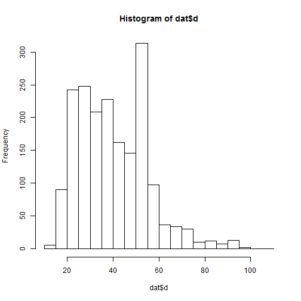
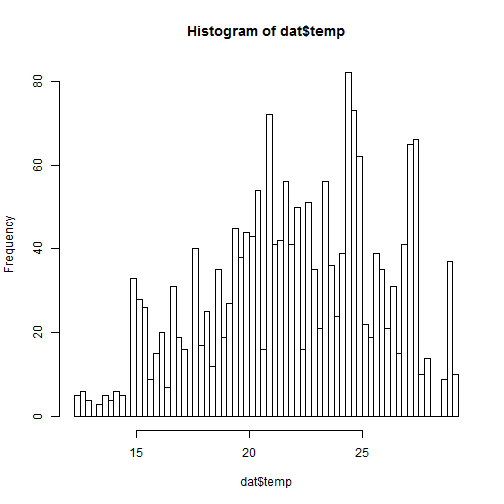
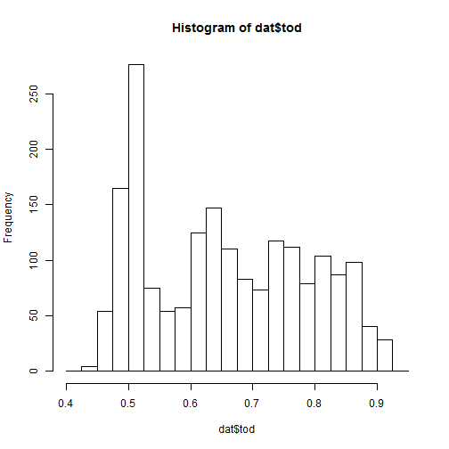
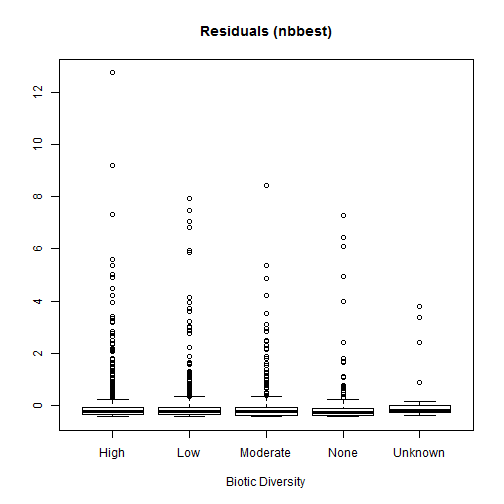

Red Snapper Video Index Using Delta GLM
========

This analysis generates a red snapper video index using a zero-inflated negative Binomial and Poisson model structure as implemented in the R package pscl.


 

```
##    Min. 1st Qu.  Median    Mean 3rd Qu.    Max. 
##    15.0    28.0    38.0    40.7    52.0    98.0
```

 

```
##    Min. 1st Qu.  Median    Mean 3rd Qu.    Max. 
##    27.2    29.7    31.3    31.3    32.8    35.0
```

 

```
##    Min. 1st Qu.  Median    Mean 3rd Qu.    Max. 
##     115     171     209     205     235     300
```

 

```
##    Min. 1st Qu.  Median    Mean 3rd Qu.    Max. 
##    12.4    19.6    22.2    22.1    24.8    29.1
```

 

```
##    Min. 1st Qu.  Median    Mean 3rd Qu.    Max. 
##   0.443   0.522   0.647   0.658   0.766   0.924
```

   


**So this bit evaluates the ZIP versus the ZINB **

The ZINB is clearly preferred in the likelihood ratio test and fits the data better.  But you can see that neither model fit the data particularly well.


```r

zipform = formula(fishseen ~ y + wc + cd + sc + bd + d + t + lat + temp + offset(frames) | 
    y + wc + cd + sc + bd + d + t + lat + temp + offset(frames))
zipmod = zeroinfl(zipform, dist = "poisson", link = "logit", data = dat)
summary(zipmod)
```

```
## 
## Call:
## zeroinfl(formula = zipform, data = dat, dist = "poisson", link = "logit")
## 
## Pearson residuals:
##    Min     1Q Median     3Q    Max 
## -1.920 -0.513 -0.364 -0.227 25.331 
## 
## Count model coefficients (poisson with log link):
##             Estimate Std. Error z value Pr(>|z|)    
## (Intercept)  3.71553    0.07541   49.27  < 2e-16 ***
## y2011       -1.10004    0.05153  -21.35  < 2e-16 ***
## y2012       -0.80313    0.04567  -17.59  < 2e-16 ***
## wc1         -0.34895    0.03358  -10.39  < 2e-16 ***
## wc2         -0.91733    0.09225   -9.94  < 2e-16 ***
## cdSideways  -0.44839    0.03091  -14.50  < 2e-16 ***
## cdTowards   -0.55202    0.04356  -12.67  < 2e-16 ***
## cdUnknown   -0.39631    0.07421   -5.34  9.3e-08 ***
## scLow       -0.00887    0.03410   -0.26  0.79483    
## scModerate  -0.56901    0.05547  -10.26  < 2e-16 ***
## scNone      -0.16207    0.05277   -3.07  0.00213 ** 
## scUnknown    1.56517    0.46903    3.34  0.00085 ***
## bdLow       -0.18040    0.04127   -4.37  1.2e-05 ***
## bdModerate   0.27859    0.03682    7.57  3.9e-14 ***
## bdNone       0.51977    0.05806    8.95  < 2e-16 ***
## bdUnknown   -1.59828    0.39774   -4.02  5.9e-05 ***
## d2           0.10847    0.04134    2.62  0.00869 ** 
## d3          -0.00399    0.04728   -0.08  0.93275    
## d4          -0.54116    0.05990   -9.03  < 2e-16 ***
## t2           0.29268    0.04533    6.46  1.1e-10 ***
## t3           0.12034    0.06391    1.88  0.05971 .  
## t4          -0.08173    0.05450   -1.50  0.13370    
## lat2        -0.20672    0.03608   -5.73  1.0e-08 ***
## lat3        -0.56653    0.05415  -10.46  < 2e-16 ***
## lat4        -0.37602    0.06972   -5.39  6.9e-08 ***
## temp2       -0.13365    0.04935   -2.71  0.00677 ** 
## temp3        0.12409    0.05276    2.35  0.01867 *  
## temp4        0.42828    0.06259    6.84  7.8e-12 ***
## 
## Zero-inflation model coefficients (binomial with logit link):
##             Estimate Std. Error z value Pr(>|z|)    
## (Intercept)  -0.3768     0.3335   -1.13  0.25845    
## y2011         0.4816     0.2328    2.07  0.03858 *  
## y2012         0.0444     0.2380    0.19  0.85193    
## wc1          -0.2202     0.1395   -1.58  0.11434    
## wc2          -0.1632     0.2902   -0.56  0.57396    
## cdSideways    0.3844     0.1411    2.72  0.00645 ** 
## cdTowards     0.8436     0.1789    4.72  2.4e-06 ***
## cdUnknown     0.3834     0.3382    1.13  0.25700    
## scLow         0.1168     0.1687    0.69  0.48855    
## scModerate    0.0832     0.2067    0.40  0.68712    
## scNone        0.8154     0.2221    3.67  0.00024 ***
## scUnknown     0.9729     1.1478    0.85  0.39668    
## bdLow         0.0707     0.1734    0.41  0.68329    
## bdModerate   -0.2972     0.1648   -1.80  0.07131 .  
## bdNone        0.0380     0.2626    0.14  0.88502    
## bdUnknown     1.3199     1.0065    1.31  0.18976    
## d2           -0.8353     0.1794   -4.66  3.2e-06 ***
## d3            0.1652     0.1904    0.87  0.38555    
## d4           -0.0461     0.2164   -0.21  0.83141    
## t2            0.0682     0.1805    0.38  0.70542    
## t3           -0.4889     0.2035   -2.40  0.01627 *  
## t4           -0.1856     0.2212   -0.84  0.40155    
## lat2          1.8006     0.1796   10.03  < 2e-16 ***
## lat3          2.1558     0.1894   11.38  < 2e-16 ***
## lat4          2.3588     0.2245   10.51  < 2e-16 ***
## temp2        -0.3270     0.1920   -1.70  0.08857 .  
## temp3        -0.4198     0.2068   -2.03  0.04240 *  
## temp4        -0.3356     0.2477   -1.35  0.17552    
## ---
## Signif. codes:  0 '***' 0.001 '**' 0.01 '*' 0.05 '.' 0.1 ' ' 1 
## 
## Number of iterations in BFGS optimization: 63 
## Log-likelihood: -5.48e+03 on 56 Df
```

```r

nbform = formula(fishseen ~ y + wc + cd + sc + bd + d + t + lat + temp + offset(frames) | 
    y + wc + cd + sc + bd + d + t + lat + temp + offset(frames))
nbmod = zeroinfl(nbform, dist = "negbin", link = "logit", data = dat)
summary(nbmod)
```

```
## 
## Call:
## zeroinfl(formula = nbform, data = dat, dist = "negbin", link = "logit")
## 
## Pearson residuals:
##     Min      1Q  Median      3Q     Max 
## -0.4422 -0.3729 -0.2436 -0.0875 18.4035 
## 
## Count model coefficients (negbin with log link):
##             Estimate Std. Error z value Pr(>|z|)    
## (Intercept)   3.6675     0.4360    8.41  < 2e-16 ***
## y2011        -1.9255     0.3051   -6.31  2.8e-10 ***
## y2012        -1.3529     0.3117   -4.34  1.4e-05 ***
## wc1          -0.2744     0.1828   -1.50  0.13342    
## wc2          -0.9111     0.3703   -2.46  0.01386 *  
## cdSideways   -0.5469     0.1901   -2.88  0.00401 ** 
## cdTowards    -1.0616     0.2293   -4.63  3.7e-06 ***
## cdUnknown    -0.8973     0.4708   -1.91  0.05669 .  
## scLow        -0.3906     0.2099   -1.86  0.06279 .  
## scModerate   -0.8607     0.2614   -3.29  0.00099 ***
## scNone       -0.9964     0.3027   -3.29  0.00099 ***
## scUnknown     1.2054     1.1594    1.04  0.29851    
## bdLow        -0.1640     0.2115   -0.78  0.43806    
## bdModerate    0.4969     0.2047    2.43  0.01524 *  
## bdNone        0.7896     0.3694    2.14  0.03258 *  
## bdUnknown    -3.0309     0.9705   -3.12  0.00179 ** 
## d2            1.0005     0.2420    4.13  3.6e-05 ***
## d3            0.3182     0.2643    1.20  0.22867    
## d4            0.2989     0.3016    0.99  0.32174    
## t2            0.0731     0.2669    0.27  0.78423    
## t3           -1.8318     0.3152   -5.81  6.2e-09 ***
## t4           -0.6782     0.3429   -1.98  0.04798 *  
## lat2         -1.0589     0.2296   -4.61  4.0e-06 ***
## lat3         -0.7828     0.2877   -2.72  0.00652 ** 
## lat4          0.3223     0.3860    0.83  0.40375    
## temp2         0.2820     0.2474    1.14  0.25427    
## temp3         0.4463     0.2606    1.71  0.08682 .  
## temp4         1.1740     0.3897    3.01  0.00259 ** 
## Log(theta)   -1.6305     0.0750  -21.74  < 2e-16 ***
## 
## Zero-inflation model coefficients (binomial with logit link):
##             Estimate Std. Error z value Pr(>|z|)    
## (Intercept)  -20.616   1942.607   -0.01    0.992    
## y2011          1.051      0.646    1.63    0.104    
## y2012          0.857      0.607    1.41    0.158    
## wc1           -0.979      0.421   -2.33    0.020 *  
## wc2           -1.114      0.801   -1.39    0.165    
## cdSideways     0.232      0.406    0.57    0.568    
## cdTowards      1.256      0.546    2.30    0.022 *  
## cdUnknown      0.592      0.841    0.70    0.481    
## scLow         -0.530      0.475   -1.12    0.264    
## scModerate    -1.274      0.563   -2.26    0.024 *  
## scNone        -0.504      0.684   -0.74    0.461    
## scUnknown      6.965      3.390    2.05    0.040 *  
## bdLow          0.714      0.572    1.25    0.212    
## bdModerate     0.208      0.483    0.43    0.666    
## bdNone         1.611      0.810    1.99    0.047 *  
## bdUnknown     -1.178      2.785   -0.42    0.672    
## d2            -1.212      0.550   -2.20    0.027 *  
## d3             0.526      0.563    0.93    0.350    
## d4             1.781      0.731    2.44    0.015 *  
## t2             0.505      0.477    1.06    0.290    
## t3            -6.341      1.346   -4.71  2.5e-06 ***
## t4            -0.332      0.688   -0.48    0.629    
## lat2          18.795   1942.607    0.01    0.992    
## lat3          19.920   1942.607    0.01    0.992    
## lat4          22.459   1942.607    0.01    0.991    
## temp2          0.554      0.643    0.86    0.388    
## temp3         -0.182      0.719   -0.25    0.800    
## temp4          1.620      0.798    2.03    0.042 *  
## ---
## Signif. codes:  0 '***' 0.001 '**' 0.01 '*' 0.05 '.' 0.1 ' ' 1 
## 
## Theta = 0.196 
## Number of iterations in BFGS optimization: 94 
## Log-likelihood: -2.31e+03 on 57 Df
```

```r

lrtest(zipmod, nbmod)
```

```
## Likelihood ratio test
## 
## Model 1: fishseen ~ y + wc + cd + sc + bd + d + t + lat + temp + offset(frames) | 
##     y + wc + cd + sc + bd + d + t + lat + temp + offset(frames)
## Model 2: fishseen ~ y + wc + cd + sc + bd + d + t + lat + temp + offset(frames) | 
##     y + wc + cd + sc + bd + d + t + lat + temp + offset(frames)
##   #Df LogLik Df Chisq Pr(>Chisq)    
## 1  56  -5481                        
## 2  57  -2307  1  6349     <2e-16 ***
## ---
## Signif. codes:  0 '***' 0.001 '**' 0.01 '*' 0.05 '.' 0.1 ' ' 1
```

```r

windows(width = 8, height = 6, record = T)
resids = residuals(zipmod)
# cbind(fitted(zipmod),dat$fishseen,fitted(zipmod)-dat$fishseen,resids)
plot(fitted(zipmod), resids)
```

 

```r
plot(dat$y, resids, xlab = "Year", main = "Residuals (zipmod)")
```

 

```r
plot(dat$wc, resids, xlab = "Water Clarity", main = "Residuals (zipmod)")
```

 

```r
plot(dat$cd, resids, xlab = "Current Direction", main = "Residuals (zipmod)")
```

 

```r
plot(dat$bd, resids, xlab = "Biotic Diversity", main = "Residuals (zipmod)")
```

 

```r
plot(dat$lat, resids, xlab = "Latitude", main = "Residuals (zipmod)")
```

 

```r

plot(dat$fishseen, fitted(zipmod))
```

 

```r

hist(dat$fishseen, breaks = 0:max(dat$fishseen), freq = T, right = TRUE, xlab = "Aggregate Fish Counted", 
    main = "ZIP")
d = hist(predict(zipmod), breaks = 0:max(dat$fishseen), plot = FALSE)
lines(seq(0.5, max(dat$fishseen), by = 1), d$counts, col = "blue", type = "l")
```

 

```r
hist(dat$fishseen, breaks = 0:max(dat$fishseen), freq = T, right = TRUE, xlab = "Aggregate Fish Counted", 
    main = "ZIP", ylim = c(0, 50))
lines(seq(0.5, max(dat$fishseen), by = 1), d$counts, col = "blue", type = "b")
```

 

```r


windows(width = 8, height = 6, record = T)
resids = residuals(nbmod)
# cbind(fitted(nbmod),dat$fishseen,fitted(nbmod)-dat$fishseen,resids)
plot(fitted(nbmod), resids)
```

 

```r
plot(dat$fishseen, fitted(nbmod))
```

 

```r

plot(dat$y, resids, xlab = "Year", main = "Residuals (nbmod)")
```

 

```r
plot(dat$wc, resids, xlab = "Water Clarity", main = "Residuals (nbmod)")
```

 

```r
plot(dat$cd, resids, xlab = "Current Direction", main = "Residuals (nbmod)")
```

 

```r
plot(dat$bd, resids, xlab = "Biotic Diversity", main = "Residuals (nbmod)")
```

 

```r
plot(dat$lat, resids, xlab = "Latitude", main = "Residuals (nbmod)")
```

 

```r

hist(dat$fishseen, breaks = 0:max(dat$fishseen), freq = T, right = TRUE, xlab = "Aggregate Fish Counted", 
    main = "NB")
d2 = hist(predict(nbmod), breaks = 0:max(dat$fishseen), plot = FALSE)
lines(seq(0.5, max(dat$fishseen), by = 1), d2$counts, col = "blue", type = "l")
```

 

```r
hist(dat$fishseen, breaks = 0:max(dat$fishseen), freq = T, right = TRUE, xlab = "Aggregate Fish Counted", 
    main = "NB", ylim = c(0, 50))
lines(seq(0.5, max(dat$fishseen), by = 1), d2$counts, col = "blue", type = "b")
```

 

```r

plot(dat$fishseen, fitted(nbmod))
points(dat$fishseen, fitted(zipmod), col = "red", pch = 19)
```

 

```r

```


**So this bit allows variable selection within the ZINB**


```
## 
## Call:
## zeroinfl(formula = nbform1, data = dat, dist = "negbin", link = "logit")
## 
## Pearson residuals:
##     Min      1Q  Median      3Q     Max 
## -0.4386 -0.3728 -0.2409 -0.0857 16.8849 
## 
## Count model coefficients (negbin with log link):
##             Estimate Std. Error z value Pr(>|z|)    
## (Intercept)   3.4258     0.4161    8.23  < 2e-16 ***
## y2011        -2.0057     0.3053   -6.57  5.0e-11 ***
## y2012        -1.4447     0.3090   -4.67  2.9e-06 ***
## cdSideways   -0.4837     0.1889   -2.56  0.01044 *  
## cdTowards    -1.0225     0.2285   -4.47  7.7e-06 ***
## cdUnknown    -0.7676     0.4739   -1.62  0.10529    
## scLow        -0.4252     0.2103   -2.02  0.04318 *  
## scModerate   -0.8873     0.2612   -3.40  0.00068 ***
## scNone       -1.1933     0.2937   -4.06  4.9e-05 ***
## scUnknown     0.6386     1.1118    0.57  0.56571    
## bdLow        -0.1186     0.2138   -0.55  0.57907    
## bdModerate    0.5159     0.2042    2.53  0.01150 *  
## bdNone        0.8586     0.3720    2.31  0.02101 *  
## bdUnknown    -3.2578     0.9722   -3.35  0.00081 ***
## d2            1.0947     0.2395    4.57  4.9e-06 ***
## d3            0.4488     0.2577    1.74  0.08158 .  
## d4            0.4692     0.2905    1.62  0.10627    
## t2            0.0747     0.2724    0.27  0.78406    
## t3           -1.8040     0.3246   -5.56  2.7e-08 ***
## t4           -0.6506     0.3418   -1.90  0.05702 .  
## lat2         -0.9798     0.2279   -4.30  1.7e-05 ***
## lat3         -0.8715     0.2929   -2.98  0.00293 ** 
## lat4          0.3284     0.3812    0.86  0.38900    
## temp2         0.3298     0.2438    1.35  0.17614    
## temp3         0.4939     0.2633    1.88  0.06071 .  
## temp4         1.1593     0.3869    3.00  0.00273 ** 
## Log(theta)   -1.6466     0.0751  -21.94  < 2e-16 ***
## 
## Zero-inflation model coefficients (binomial with logit link):
##             Estimate Std. Error z value Pr(>|z|)    
## (Intercept)  -22.426   2076.567   -0.01    0.991    
## y2011          1.040      0.638    1.63    0.103    
## y2012          0.791      0.597    1.33    0.185    
## wc1           -0.877      0.413   -2.12    0.034 *  
## wc2           -0.628      0.719   -0.87    0.382    
## cdSideways     0.281      0.417    0.67    0.501    
## cdTowards      1.308      0.562    2.33    0.020 *  
## cdUnknown      0.697      0.826    0.84    0.398    
## scLow         -0.546      0.479   -1.14    0.254    
## scModerate    -1.338      0.570   -2.35    0.019 *  
## scNone        -0.645      0.700   -0.92    0.357    
## scUnknown      6.713      3.334    2.01    0.044 *  
## bdLow          0.734      0.584    1.26    0.209    
## bdModerate     0.186      0.489    0.38    0.704    
## bdNone         1.646      0.810    2.03    0.042 *  
## bdUnknown     -1.290      2.614   -0.49    0.622    
## d2            -1.149      0.552   -2.08    0.037 *  
## d3             0.629      0.560    1.12    0.261    
## d4             1.874      0.743    2.52    0.012 *  
## t2             0.564      0.485    1.16    0.245    
## t3            -6.478      1.462   -4.43  9.4e-06 ***
## t4            -0.277      0.701   -0.40    0.693    
## lat2          20.459   2076.567    0.01    0.992    
## lat3          21.464   2076.567    0.01    0.992    
## lat4          24.194   2076.568    0.01    0.991    
## temp2          0.636      0.653    0.97    0.330    
## temp3         -0.182      0.752   -0.24    0.809    
## temp4          1.655      0.806    2.05    0.040 *  
## ---
## Signif. codes:  0 '***' 0.001 '**' 0.01 '*' 0.05 '.' 0.1 ' ' 1 
## 
## Theta = 0.193 
## Number of iterations in BFGS optimization: 92 
## Log-likelihood: -2.31e+03 on 55 Df
```

```
## 
## Call:
## zeroinfl(formula = nbform2, data = dat, dist = "negbin", link = "logit")
## 
## Pearson residuals:
##     Min      1Q  Median      3Q     Max 
## -0.4355 -0.3646 -0.2387 -0.0848 10.1126 
## 
## Count model coefficients (negbin with log link):
##             Estimate Std. Error z value Pr(>|z|)    
## (Intercept)   2.9751     0.3837    7.75  8.9e-15 ***
## y2011        -1.8177     0.2945   -6.17  6.8e-10 ***
## y2012        -1.2060     0.2946   -4.09  4.2e-05 ***
## wc1          -0.2742     0.1864   -1.47  0.14144    
## wc2          -0.7066     0.3695   -1.91  0.05585 .  
## scLow        -0.3673     0.2132   -1.72  0.08491 .  
## scModerate   -0.8321     0.2627   -3.17  0.00154 ** 
## scNone       -1.1028     0.3006   -3.67  0.00024 ***
## scUnknown     1.0077     1.2267    0.82  0.41135    
## bdLow        -0.1002     0.2112   -0.47  0.63525    
## bdModerate    0.5263     0.2054    2.56  0.01041 *  
## bdNone        1.0429     0.3621    2.88  0.00397 ** 
## bdUnknown    -2.8352     0.9704   -2.92  0.00348 ** 
## d2            1.0509     0.2489    4.22  2.4e-05 ***
## d3            0.5569     0.2679    2.08  0.03766 *  
## d4            0.5284     0.3122    1.69  0.09055 .  
## t2            0.0180     0.2639    0.07  0.94559    
## t3           -1.9347     0.3134   -6.17  6.7e-10 ***
## t4           -0.7824     0.3453   -2.27  0.02345 *  
## lat2         -0.8722     0.2314   -3.77  0.00016 ***
## lat3         -0.8654     0.2791   -3.10  0.00193 ** 
## lat4          0.4252     0.3938    1.08  0.28029    
## temp2         0.2079     0.2514    0.83  0.40829    
## temp3         0.4293     0.2726    1.57  0.11530    
## temp4         1.1974     0.3961    3.02  0.00250 ** 
## Log(theta)   -1.6597     0.0767  -21.64  < 2e-16 ***
## 
## Zero-inflation model coefficients (binomial with logit link):
##             Estimate Std. Error z value Pr(>|z|)    
## (Intercept)   -9.296      4.279   -2.17  0.02983 *  
## y2011          1.162      0.651    1.79  0.07404 .  
## y2012          0.928      0.615    1.51  0.13157    
## wc1           -1.020      0.426   -2.39  0.01669 *  
## wc2           -1.064      0.772   -1.38  0.16814    
## cdSideways     0.559      0.409    1.37  0.17212    
## cdTowards      1.831      0.536    3.42  0.00064 ***
## cdUnknown      1.221      0.819    1.49  0.13580    
## scLow         -0.501      0.476   -1.05  0.29337    
## scModerate    -1.181      0.552   -2.14  0.03237 *  
## scNone        -0.590      0.694   -0.85  0.39494    
## scUnknown      6.289      3.348    1.88  0.06033 .  
## bdLow          0.776      0.591    1.31  0.18937    
## bdModerate     0.179      0.479    0.37  0.70837    
## bdNone         1.799      0.792    2.27  0.02318 *  
## bdUnknown     -0.687      2.847   -0.24  0.80933    
## d2            -1.245      0.565   -2.20  0.02769 *  
## d3             0.543      0.600    0.90  0.36550    
## d4             1.852      0.792    2.34  0.01939 *  
## t2             0.453      0.476    0.95  0.34105    
## t3            -6.224      1.391   -4.47  7.7e-06 ***
## t4            -0.421      0.688   -0.61  0.54033    
## lat2           7.257      3.807    1.91  0.05660 .  
## lat3           8.150      3.899    2.09  0.03658 *  
## lat4          10.933      4.153    2.63  0.00847 ** 
## temp2          0.451      0.658    0.68  0.49384    
## temp3         -0.330      0.737   -0.45  0.65470    
## temp4          1.617      0.779    2.08  0.03790 *  
## ---
## Signif. codes:  0 '***' 0.001 '**' 0.01 '*' 0.05 '.' 0.1 ' ' 1 
## 
## Theta = 0.19 
## Number of iterations in BFGS optimization: 76 
## Log-likelihood: -2.32e+03 on 54 Df
```

```
## 
## Call:
## zeroinfl(formula = nbform3, data = dat, dist = "negbin", link = "logit")
## 
## Pearson residuals:
##     Min      1Q  Median      3Q     Max 
## -0.4341 -0.3694 -0.2417 -0.0869 21.9156 
## 
## Count model coefficients (negbin with log link):
##             Estimate Std. Error z value Pr(>|z|)    
## (Intercept)  3.63037    0.43893    8.27  < 2e-16 ***
## y2011       -1.99588    0.30673   -6.51  7.7e-11 ***
## y2012       -1.61219    0.30270   -5.33  1.0e-07 ***
## wc1         -0.40472    0.18228   -2.22   0.0264 *  
## wc2         -1.12551    0.36897   -3.05   0.0023 ** 
## cdSideways  -0.54596    0.19339   -2.82   0.0048 ** 
## cdTowards   -1.11093    0.23187   -4.79  1.7e-06 ***
## cdUnknown   -0.91513    0.47746   -1.92   0.0553 .  
## bdLow       -0.31282    0.19786   -1.58   0.1139    
## bdModerate   0.37609    0.20444    1.84   0.0658 .  
## bdNone       0.21552    0.30548    0.71   0.4805    
## bdUnknown   -1.64107    0.64277   -2.55   0.0107 *  
## d2           1.06733    0.24983    4.27  1.9e-05 ***
## d3           0.30265    0.27137    1.12   0.2647    
## d4           0.25286    0.30581    0.83   0.4083    
## t2           0.00795    0.27675    0.03   0.9771    
## t3          -1.87794    0.31442   -5.97  2.3e-09 ***
## t4          -0.85253    0.34002   -2.51   0.0122 *  
## lat2        -1.22182    0.23020   -5.31  1.1e-07 ***
## lat3        -0.92123    0.28862   -3.19   0.0014 ** 
## lat4         0.34351    0.38109    0.90   0.3674    
## temp2        0.40031    0.25305    1.58   0.1137    
## temp3        0.57855    0.26889    2.15   0.0314 *  
## temp4        1.18130    0.39264    3.01   0.0026 ** 
## Log(theta)  -1.66811    0.07470  -22.33  < 2e-16 ***
## 
## Zero-inflation model coefficients (binomial with logit link):
##              Estimate Std. Error z value Pr(>|z|)    
## (Intercept)  -22.5513  1995.9000   -0.01    0.991    
## y2011          1.0419     0.6883    1.51    0.130    
## y2012          0.7835     0.6426    1.22    0.223    
## wc1           -1.0953     0.4425   -2.48    0.013 *  
## wc2           -1.3400     0.8323   -1.61    0.107    
## cdSideways     0.2633     0.4140    0.64    0.525    
## cdTowards      1.3001     0.5560    2.34    0.019 *  
## cdUnknown      0.6930     0.8894    0.78    0.436    
## scLow         -0.3589     0.4840   -0.74    0.458    
## scModerate    -0.7812     0.5550   -1.41    0.159    
## scNone         0.0174     0.6510    0.03    0.979    
## scUnknown      4.9855     3.5670    1.40    0.162    
## bdLow          0.7806     0.5787    1.35    0.177    
## bdModerate     0.2859     0.4919    0.58    0.561    
## bdNone         1.4086     0.8118    1.74    0.083 .  
## bdUnknown      1.0921     2.6974    0.40    0.686    
## d2            -1.1268     0.5662   -1.99    0.047 *  
## d3             0.4820     0.5809    0.83    0.407    
## d4             1.7600     0.7504    2.35    0.019 *  
## t2             0.4343     0.4823    0.90    0.368    
## t3            -6.3257     1.3637   -4.64  3.5e-06 ***
## t4            -0.4812     0.7250   -0.66    0.507    
## lat2          20.5181  1995.8996    0.01    0.992    
## lat3          21.6698  1995.8997    0.01    0.991    
## lat4          24.1139  1995.8999    0.01    0.990    
## temp2          0.5411     0.6786    0.80    0.425    
## temp3         -0.0714     0.7273   -0.10    0.922    
## temp4          1.6336     0.8667    1.88    0.059 .  
## ---
## Signif. codes:  0 '***' 0.001 '**' 0.01 '*' 0.05 '.' 0.1 ' ' 1 
## 
## Theta = 0.189 
## Number of iterations in BFGS optimization: 90 
## Log-likelihood: -2.32e+03 on 53 Df
```

```
## 
## Call:
## zeroinfl(formula = nbform4, data = dat, dist = "negbin", link = "logit")
## 
## Pearson residuals:
##     Min      1Q  Median      3Q     Max 
## -0.4332 -0.3670 -0.2439 -0.0862 16.3356 
## 
## Count model coefficients (negbin with log link):
##             Estimate Std. Error z value Pr(>|z|)    
## (Intercept)   4.0352     0.4278    9.43  < 2e-16 ***
## y2011        -1.9917     0.3056   -6.52  7.1e-11 ***
## y2012        -1.5076     0.3053   -4.94  7.9e-07 ***
## wc1          -0.3881     0.1848   -2.10   0.0358 *  
## wc2          -0.9226     0.3734   -2.47   0.0135 *  
## cdSideways   -0.6162     0.1922   -3.21   0.0013 ** 
## cdTowards    -1.1072     0.2316   -4.78  1.7e-06 ***
## cdUnknown    -0.9906     0.4696   -2.11   0.0349 *  
## scLow        -0.3527     0.2005   -1.76   0.0786 .  
## scModerate   -0.6887     0.2631   -2.62   0.0088 ** 
## scNone       -0.6321     0.2595   -2.44   0.0148 *  
## scUnknown    -1.9085     0.7015   -2.72   0.0065 ** 
## d2            1.0246     0.2421    4.23  2.3e-05 ***
## d3            0.2440     0.2681    0.91   0.3629    
## d4            0.1165     0.3047    0.38   0.7022    
## t2            0.0447     0.2749    0.16   0.8708    
## t3           -1.8160     0.3175   -5.72  1.1e-08 ***
## t4           -0.5939     0.3415   -1.74   0.0820 .  
## lat2         -1.1433     0.2354   -4.86  1.2e-06 ***
## lat3         -0.7932     0.2927   -2.71   0.0067 ** 
## lat4          0.4072     0.3901    1.04   0.2967    
## temp2         0.2305     0.2512    0.92   0.3588    
## temp3         0.4312     0.2681    1.61   0.1077    
## temp4         0.9201     0.3831    2.40   0.0163 *  
## Log(theta)   -1.6717     0.0751  -22.27  < 2e-16 ***
## 
## Zero-inflation model coefficients (binomial with logit link):
##              Estimate Std. Error z value Pr(>|z|)    
## (Intercept)  -21.6072  2219.9882   -0.01    0.992    
## y2011          1.0301     0.6626    1.55    0.120    
## y2012          0.8190     0.6254    1.31    0.190    
## wc1           -1.1050     0.4464   -2.48    0.013 *  
## wc2           -1.1980     0.8177   -1.47    0.143    
## cdSideways     0.2486     0.4141    0.60    0.548    
## cdTowards      1.3309     0.5513    2.41    0.016 *  
## cdUnknown      0.6616     0.8832    0.75    0.454    
## scLow         -0.5056     0.4816   -1.05    0.294    
## scModerate    -1.0698     0.5615   -1.91    0.057 .  
## scNone        -0.2341     0.6669   -0.35    0.726    
## scUnknown      3.6892     3.1052    1.19    0.235    
## bdLow          0.8398     0.5657    1.48    0.138    
## bdModerate     0.0199     0.4894    0.04    0.968    
## bdNone         1.2251     0.8100    1.51    0.130    
## bdUnknown      2.1659     1.8153    1.19    0.233    
## d2            -1.1043     0.5607   -1.97    0.049 *  
## d3             0.4783     0.5876    0.81    0.416    
## d4             1.6883     0.7482    2.26    0.024 *  
## t2             0.5052     0.4821    1.05    0.295    
## t3            -6.2984     1.3478   -4.67    3e-06 ***
## t4            -0.2647     0.7104   -0.37    0.709    
## lat2          19.7891  2219.9878    0.01    0.993    
## lat3          20.9839  2219.9880    0.01    0.992    
## lat4          23.4622  2219.9882    0.01    0.992    
## temp2          0.4882     0.6495    0.75    0.452    
## temp3         -0.2240     0.7203   -0.31    0.756    
## temp4          1.4029     0.8305    1.69    0.091 .  
## ---
## Signif. codes:  0 '***' 0.001 '**' 0.01 '*' 0.05 '.' 0.1 ' ' 1 
## 
## Theta = 0.188 
## Number of iterations in BFGS optimization: 90 
## Log-likelihood: -2.32e+03 on 53 Df
```

```
## 
## Call:
## zeroinfl(formula = nbform5, data = dat, dist = "negbin", link = "logit")
## 
## Pearson residuals:
##     Min      1Q  Median      3Q     Max 
## -0.4370 -0.3725 -0.2397 -0.0838 15.3516 
## 
## Count model coefficients (negbin with log link):
##             Estimate Std. Error z value Pr(>|z|)    
## (Intercept)   3.9062     0.4013    9.73  < 2e-16 ***
## y2011        -1.9441     0.3015   -6.45  1.1e-10 ***
## y2012        -1.3461     0.3128   -4.30  1.7e-05 ***
## wc1          -0.3584     0.1834   -1.95  0.05067 .  
## wc2          -0.9731     0.3736   -2.60  0.00921 ** 
## cdSideways   -0.5237     0.1874   -2.79  0.00520 ** 
## cdTowards    -1.0122     0.2293   -4.42  1.0e-05 ***
## cdUnknown    -0.6766     0.4842   -1.40  0.16235    
## scLow        -0.4433     0.2165   -2.05  0.04060 *  
## scModerate   -0.8989     0.2602   -3.45  0.00055 ***
## scNone       -1.0934     0.3099   -3.53  0.00042 ***
## scUnknown     1.8612     1.2825    1.45  0.14670    
## bdLow         0.0399     0.2123    0.19  0.85077    
## bdModerate    0.5630     0.2063    2.73  0.00636 ** 
## bdNone        1.2359     0.3633    3.40  0.00067 ***
## bdUnknown    -3.2349     0.9649   -3.35  0.00080 ***
## t2            0.3427     0.2496    1.37  0.16971    
## t3           -1.6902     0.3148   -5.37  7.9e-08 ***
## t4           -0.5599     0.3561   -1.57  0.11588    
## lat2         -0.8468     0.2233   -3.79  0.00015 ***
## lat3         -0.7578     0.2804   -2.70  0.00689 ** 
## lat4          0.3305     0.4043    0.82  0.41365    
## temp2         0.3054     0.2357    1.30  0.19507    
## temp3         0.3677     0.2423    1.52  0.12917    
## temp4         1.2787     0.3849    3.32  0.00089 ***
## Log(theta)   -1.6524     0.0803  -20.59  < 2e-16 ***
## 
## Zero-inflation model coefficients (binomial with logit link):
##             Estimate Std. Error z value Pr(>|z|)    
## (Intercept)   -7.289      3.450   -2.11   0.0346 *  
## y2011          1.084      0.645    1.68   0.0931 .  
## y2012          0.931      0.611    1.52   0.1276    
## wc1           -1.075      0.421   -2.56   0.0106 *  
## wc2           -1.244      0.796   -1.56   0.1179    
## cdSideways     0.327      0.408    0.80   0.4233    
## cdTowards      1.298      0.532    2.44   0.0147 *  
## cdUnknown      0.758      0.835    0.91   0.3643    
## scLow         -0.577      0.482   -1.20   0.2315    
## scModerate    -1.304      0.546   -2.39   0.0169 *  
## scNone        -0.581      0.714   -0.81   0.4156    
## scUnknown      7.187      3.681    1.95   0.0509 .  
## bdLow          0.719      0.605    1.19   0.2343    
## bdModerate     0.250      0.486    0.52   0.6061    
## bdNone         1.798      0.793    2.27   0.0233 *  
## bdUnknown     -1.560      3.064   -0.51   0.6108    
## d2            -1.788      0.553   -3.23   0.0012 ** 
## d3             0.163      0.571    0.29   0.7754    
## d4             1.389      0.765    1.82   0.0693 .  
## t2             0.540      0.475    1.14   0.2561    
## t3            -6.064      1.482   -4.09  4.3e-05 ***
## t4            -0.264      0.690   -0.38   0.7019    
## lat2           5.941      2.867    2.07   0.0383 *  
## lat3           6.865      3.006    2.28   0.0224 *  
## lat4           9.513      3.282    2.90   0.0038 ** 
## temp2          0.323      0.643    0.50   0.6148    
## temp3         -0.420      0.732   -0.57   0.5662    
## temp4          1.544      0.750    2.06   0.0396 *  
## ---
## Signif. codes:  0 '***' 0.001 '**' 0.01 '*' 0.05 '.' 0.1 ' ' 1 
## 
## Theta = 0.192 
## Number of iterations in BFGS optimization: 70 
## Log-likelihood: -2.32e+03 on 54 Df
```

```
## Warning: NaNs produced
```

```
## 
## Call:
## zeroinfl(formula = nbform6, data = dat, dist = "negbin", link = "logit")
## 
## Pearson residuals:
##    Min     1Q Median     3Q    Max 
## -0.502 -0.332 -0.235 -0.140 23.226 
## 
## Count model coefficients (negbin with log link):
##             Estimate Std. Error z value Pr(>|z|)    
## (Intercept)  3.71480    0.52044    7.14  9.5e-13 ***
## y2011       -1.28519    0.32993   -3.90  9.8e-05 ***
## y2012       -0.72731    0.31471   -2.31  0.02083 *  
## wc1         -0.25014    0.19409   -1.29  0.19748    
## wc2         -0.86483    0.41007   -2.11  0.03494 *  
## cdSideways  -0.68936    0.20149   -3.42  0.00062 ***
## cdTowards   -0.97931    0.24836   -3.94  8.0e-05 ***
## cdUnknown   -0.89288    0.52388   -1.70  0.08832 .  
## scLow       -0.43515    0.21341   -2.04  0.04145 *  
## scModerate  -1.13980    0.26819   -4.25  2.1e-05 ***
## scNone      -0.83764    0.34093   -2.46  0.01401 *  
## scUnknown    2.49964    1.24283    2.01  0.04430 *  
## bdLow       -0.47893    0.22454   -2.13  0.03293 *  
## bdModerate   0.18248    0.21336    0.86  0.39243    
## bdNone       0.35675    0.39274    0.91  0.36369    
## bdUnknown   -3.51331    0.80145   -4.38  1.2e-05 ***
## d2           0.57388    0.24551    2.34  0.01941 *  
## d3           0.03078    0.28594    0.11  0.91428    
## d4          -0.28797    0.34467   -0.84  0.40345    
## lat2        -0.56521    0.24833   -2.28  0.02284 *  
## lat3        -0.92155    0.31293   -2.94  0.00323 ** 
## lat4        -0.68713    0.32501   -2.11  0.03450 *  
## temp2       -0.00901    0.27489   -0.03  0.97387    
## temp3        0.12452    0.29489    0.42  0.67283    
## temp4        0.64698    0.34314    1.89  0.05936 .  
## Log(theta)  -1.35147    0.15624   -8.65  < 2e-16 ***
## 
## Zero-inflation model coefficients (binomial with logit link):
##              Estimate Std. Error z value Pr(>|z|)    
## (Intercept)  -1.93651    1.36530   -1.42  0.15608    
## y2011         0.35120    0.52708    0.67  0.50521    
## y2012        -0.00238    0.49899    0.00  0.99620    
## wc1          -0.68089    0.30029   -2.27  0.02336 *  
## wc2          -0.70305    0.54409   -1.29  0.19631    
## cdSideways    0.02383    0.27756    0.09  0.93159    
## cdTowards     0.79098    0.33013    2.40  0.01657 *  
## cdUnknown    -0.13115    0.65158   -0.20  0.84048    
## scLow        -0.08099    0.29803   -0.27  0.78581    
## scModerate   -1.09204    0.54260   -2.01  0.04416 *  
## scNone        0.63181    0.47768    1.32  0.18594    
## scUnknown    13.79101         NA      NA       NA    
## bdLow        -0.51158    0.36495   -1.40  0.16097    
## bdModerate   -0.53649    0.30798   -1.74  0.08152 .  
## bdNone       -0.02962    0.52475   -0.06  0.95498    
## bdUnknown   -10.93700         NA      NA       NA    
## d2           -1.31496    0.40555   -3.24  0.00119 ** 
## d3           -0.09778    0.40556   -0.24  0.80947    
## d4           -0.38866    0.48636   -0.80  0.42422    
## t2            0.40516    0.34936    1.16  0.24616    
## t3           -0.73374    0.39764   -1.85  0.06500 .  
## t4           -0.42988    0.43815   -0.98  0.32653    
## lat2          3.45728    0.93232    3.71  0.00021 ***
## lat3          3.74506    0.90167    4.15  3.3e-05 ***
## lat4          4.08626    0.99552    4.10  4.0e-05 ***
## temp2        -0.36139    0.43649   -0.83  0.40771    
## temp3        -0.38228    0.44515   -0.86  0.39047    
## temp4         0.42642    0.59201    0.72  0.47134    
## ---
## Signif. codes:  0 '***' 0.001 '**' 0.01 '*' 0.05 '.' 0.1 ' ' 1 
## 
## Theta = 0.259 
## Number of iterations in BFGS optimization: 76 
## Log-likelihood: -2.32e+03 on 54 Df
```

```
## Warning: NaNs produced
```

```
## 
## Call:
## zeroinfl(formula = nbform7, data = dat, dist = "negbin", link = "logit")
## 
## Pearson residuals:
##     Min      1Q  Median      3Q     Max 
## -0.4382 -0.3770 -0.2266 -0.0893 22.3929 
## 
## Count model coefficients (negbin with log link):
##             Estimate Std. Error z value Pr(>|z|)    
## (Intercept)   3.3051     0.4264    7.75  9.1e-15 ***
## y2011        -1.8103     0.3105   -5.83  5.5e-09 ***
## y2012        -0.9498     0.2880   -3.30  0.00097 ***
## wc1          -0.2224     0.1807   -1.23  0.21837    
## wc2          -0.7544     0.3715   -2.03  0.04228 *  
## cdSideways   -0.4923     0.1865   -2.64  0.00829 ** 
## cdTowards    -0.9456     0.2257   -4.19  2.8e-05 ***
## cdUnknown    -0.9578     0.4406   -2.17  0.02972 *  
## scLow        -0.5462     0.2035   -2.68  0.00729 ** 
## scModerate   -1.1185     0.2552   -4.38  1.2e-05 ***
## scNone       -1.2154     0.2948   -4.12  3.7e-05 ***
## scUnknown     1.8808     1.0919    1.72  0.08498 .  
## bdLow        -0.1501     0.2093   -0.72  0.47310    
## bdModerate    0.6023     0.2046    2.94  0.00324 ** 
## bdNone        0.7808     0.3551    2.20  0.02788 *  
## bdUnknown    -3.6739     0.9059   -4.06  5.0e-05 ***
## d2            0.8021     0.2315    3.46  0.00053 ***
## d3            0.3779     0.2613    1.45  0.14808    
## d4            0.2613     0.2983    0.88  0.38104    
## t2            0.0929     0.2567    0.36  0.71755    
## t3           -1.6963     0.2425   -6.99  2.7e-12 ***
## t4           -0.6176     0.3483   -1.77  0.07615 .  
## temp2         0.1857     0.2375    0.78  0.43420    
## temp3         0.2873     0.2561    1.12  0.26201    
## temp4         1.0200     0.3996    2.55  0.01070 *  
## Log(theta)   -1.6470     0.0739  -22.29  < 2e-16 ***
## 
## Zero-inflation model coefficients (binomial with logit link):
##             Estimate Std. Error z value Pr(>|z|)    
## (Intercept)  -21.394   1772.688   -0.01    0.990    
## y2011          0.998      0.588    1.70    0.090 .  
## y2012          0.937      0.552    1.70    0.090 .  
## wc1           -0.841      0.371   -2.27    0.023 *  
## wc2           -0.986      0.726   -1.36    0.175    
## cdSideways     0.218      0.363    0.60    0.548    
## cdTowards      1.191      0.491    2.43    0.015 *  
## cdUnknown      0.510      0.745    0.68    0.494    
## scLow         -0.538      0.435   -1.24    0.216    
## scModerate    -1.260      0.514   -2.45    0.014 *  
## scNone        -0.467      0.610   -0.77    0.444    
## scUnknown     24.548         NA      NA       NA    
## bdLow          0.633      0.511    1.24    0.215    
## bdModerate     0.213      0.446    0.48    0.633    
## bdNone         1.446      0.730    1.98    0.048 *  
## bdUnknown    -19.387         NA      NA       NA    
## d2            -1.190      0.510   -2.33    0.020 *  
## d3             0.612      0.511    1.20    0.231    
## d4             1.628      0.651    2.50    0.012 *  
## t2             0.542      0.439    1.24    0.216    
## t3            -6.172      1.421   -4.34  1.4e-05 ***
## t4            -0.201      0.620   -0.32    0.745    
## lat2          19.923   1772.687    0.01    0.991    
## lat3          20.943   1772.687    0.01    0.991    
## lat4          22.953   1772.687    0.01    0.990    
## temp2          0.422      0.574    0.74    0.462    
## temp3         -0.151      0.621   -0.24    0.808    
## temp4          1.339      0.710    1.89    0.059 .  
## ---
## Signif. codes:  0 '***' 0.001 '**' 0.01 '*' 0.05 '.' 0.1 ' ' 1 
## 
## Theta = 0.193 
## Number of iterations in BFGS optimization: 86 
## Log-likelihood: -2.32e+03 on 54 Df
```

```
## 
## Call:
## zeroinfl(formula = nbform8, data = dat, dist = "negbin", link = "logit")
## 
## Pearson residuals:
##     Min      1Q  Median      3Q     Max 
## -0.4381 -0.3699 -0.2432 -0.0909 21.3396 
## 
## Count model coefficients (negbin with log link):
##             Estimate Std. Error z value Pr(>|z|)    
## (Intercept)   4.0517     0.4220    9.60  < 2e-16 ***
## y2011        -1.8816     0.3013   -6.25  4.2e-10 ***
## y2012        -1.2562     0.3057   -4.11  4.0e-05 ***
## wc1          -0.2743     0.1839   -1.49  0.13579    
## wc2          -0.9568     0.3759   -2.55  0.01091 *  
## cdSideways   -0.5795     0.1955   -2.96  0.00304 ** 
## cdTowards    -1.1012     0.2359   -4.67  3.0e-06 ***
## cdUnknown    -0.9480     0.5094   -1.86  0.06275 .  
## scLow        -0.4482     0.2082   -2.15  0.03135 *  
## scModerate   -0.8276     0.2624   -3.15  0.00161 ** 
## scNone       -1.0643     0.3042   -3.50  0.00047 ***
## scUnknown     1.5746     1.2812    1.23  0.21905    
## bdLow        -0.0896     0.2143   -0.42  0.67566    
## bdModerate    0.5195     0.2078    2.50  0.01240 *  
## bdNone        0.7424     0.3696    2.01  0.04456 *  
## bdUnknown    -2.7852     0.9663   -2.88  0.00395 ** 
## d2            0.8804     0.2448    3.60  0.00032 ***
## d3            0.0394     0.2614    0.15  0.88004    
## d4           -0.0496     0.2902   -0.17  0.86425    
## t2           -0.0196     0.2646   -0.07  0.94084    
## t3           -1.7568     0.3191   -5.50  3.7e-08 ***
## t4            0.0661     0.2638    0.25  0.80209    
## lat2         -1.0928     0.2319   -4.71  2.4e-06 ***
## lat3         -0.6850     0.2907   -2.36  0.01844 *  
## lat4          0.3599     0.3752    0.96  0.33744    
## Log(theta)   -1.6484     0.0766  -21.51  < 2e-16 ***
## 
## Zero-inflation model coefficients (binomial with logit link):
##             Estimate Std. Error z value Pr(>|z|)    
## (Intercept)   -8.356      3.123   -2.68  0.00745 ** 
## y2011          1.010      0.651    1.55  0.12086    
## y2012          0.989      0.626    1.58  0.11423    
## wc1           -1.076      0.446   -2.42  0.01571 *  
## wc2           -1.473      0.911   -1.62  0.10585    
## cdSideways     0.214      0.417    0.51  0.60793    
## cdTowards      1.181      0.556    2.12  0.03361 *  
## cdUnknown      0.511      0.918    0.56  0.57770    
## scLow         -0.683      0.494   -1.38  0.16663    
## scModerate    -1.240      0.584   -2.12  0.03371 *  
## scNone        -0.687      0.715   -0.96  0.33653    
## scUnknown      7.535      3.325    2.27  0.02342 *  
## bdLow          0.870      0.579    1.50  0.13284    
## bdModerate     0.335      0.490    0.68  0.49338    
## bdNone         1.748      0.857    2.04  0.04128 *  
## bdUnknown     -0.629      2.832   -0.22  0.82427    
## d2            -1.417      0.601   -2.36  0.01840 *  
## d3             0.172      0.657    0.26  0.79375    
## d4             1.373      0.782    1.76  0.07922 .  
## t2             0.447      0.477    0.94  0.34862    
## t3            -6.543      1.381   -4.74  2.1e-06 ***
## t4             0.264      0.684    0.39  0.69924    
## lat2           6.936      2.687    2.58  0.00983 ** 
## lat3           8.272      2.759    3.00  0.00271 ** 
## lat4          10.824      2.974    3.64  0.00027 ***
## temp2          0.200      0.632    0.32  0.75125    
## temp3         -0.725      0.744   -0.97  0.33015    
## temp4          0.753      0.793    0.95  0.34267    
## ---
## Signif. codes:  0 '***' 0.001 '**' 0.01 '*' 0.05 '.' 0.1 ' ' 1 
## 
## Theta = 0.192 
## Number of iterations in BFGS optimization: 73 
## Log-likelihood: -2.31e+03 on 54 Df
```

```
## Likelihood ratio test
## 
## Model 1: fishseen ~ y + cd + sc + bd + d + t + lat + temp + offset(frames) | 
##     y + wc + cd + sc + bd + d + t + lat + temp + offset(frames)
## Model 2: fishseen ~ y + wc + cd + sc + bd + d + t + lat + temp + offset(frames) | 
##     y + wc + cd + sc + bd + d + t + lat + temp + offset(frames)
##   #Df LogLik Df Chisq Pr(>Chisq)  
## 1  55  -2310                      
## 2  57  -2307  2   6.3      0.043 *
## ---
## Signif. codes:  0 '***' 0.001 '**' 0.01 '*' 0.05 '.' 0.1 ' ' 1
```

```
## Likelihood ratio test
## 
## Model 1: fishseen ~ y + wc + sc + bd + d + t + lat + temp + offset(frames) | 
##     y + wc + cd + sc + bd + d + t + lat + temp + offset(frames)
## Model 2: fishseen ~ y + wc + cd + sc + bd + d + t + lat + temp + offset(frames) | 
##     y + wc + cd + sc + bd + d + t + lat + temp + offset(frames)
##   #Df LogLik Df Chisq Pr(>Chisq)    
## 1  54  -2317                        
## 2  57  -2307  3  21.1    9.8e-05 ***
## ---
## Signif. codes:  0 '***' 0.001 '**' 0.01 '*' 0.05 '.' 0.1 ' ' 1
```

```
## Likelihood ratio test
## 
## Model 1: fishseen ~ y + wc + cd + bd + d + t + lat + temp + offset(frames) | 
##     y + wc + cd + sc + bd + d + t + lat + temp + offset(frames)
## Model 2: fishseen ~ y + wc + cd + sc + bd + d + t + lat + temp + offset(frames) | 
##     y + wc + cd + sc + bd + d + t + lat + temp + offset(frames)
##   #Df LogLik Df Chisq Pr(>Chisq)   
## 1  53  -2315                       
## 2  57  -2307  4  17.2     0.0018 **
## ---
## Signif. codes:  0 '***' 0.001 '**' 0.01 '*' 0.05 '.' 0.1 ' ' 1
```

```
## Likelihood ratio test
## 
## Model 1: fishseen ~ y + wc + cd + sc + d + t + lat + temp + offset(frames) | 
##     y + wc + cd + sc + bd + d + t + lat + temp + offset(frames)
## Model 2: fishseen ~ y + wc + cd + sc + bd + d + t + lat + temp + offset(frames) | 
##     y + wc + cd + sc + bd + d + t + lat + temp + offset(frames)
##   #Df LogLik Df Chisq Pr(>Chisq)    
## 1  53  -2318                        
## 2  57  -2307  4  21.9    0.00021 ***
## ---
## Signif. codes:  0 '***' 0.001 '**' 0.01 '*' 0.05 '.' 0.1 ' ' 1
```

```
## Likelihood ratio test
## 
## Model 1: fishseen ~ y + wc + cd + sc + bd + t + lat + temp + offset(frames) | 
##     y + wc + cd + sc + bd + d + t + lat + temp + offset(frames)
## Model 2: fishseen ~ y + wc + cd + sc + bd + d + t + lat + temp + offset(frames) | 
##     y + wc + cd + sc + bd + d + t + lat + temp + offset(frames)
##   #Df LogLik Df Chisq Pr(>Chisq)    
## 1  54  -2317                        
## 2  57  -2307  3  20.7    0.00012 ***
## ---
## Signif. codes:  0 '***' 0.001 '**' 0.01 '*' 0.05 '.' 0.1 ' ' 1
```

```
## Likelihood ratio test
## 
## Model 1: fishseen ~ y + wc + cd + sc + bd + d + lat + temp + offset(frames) | 
##     y + wc + cd + sc + bd + d + t + lat + temp + offset(frames)
## Model 2: fishseen ~ y + wc + cd + sc + bd + d + t + lat + temp + offset(frames) | 
##     y + wc + cd + sc + bd + d + t + lat + temp + offset(frames)
##   #Df LogLik Df Chisq Pr(>Chisq)    
## 1  54  -2324                        
## 2  57  -2307  3  35.5    9.7e-08 ***
## ---
## Signif. codes:  0 '***' 0.001 '**' 0.01 '*' 0.05 '.' 0.1 ' ' 1
```

```
## Likelihood ratio test
## 
## Model 1: fishseen ~ y + wc + cd + sc + bd + d + t + temp + offset(frames) | 
##     y + wc + cd + sc + bd + d + t + lat + temp + offset(frames)
## Model 2: fishseen ~ y + wc + cd + sc + bd + d + t + lat + temp + offset(frames) | 
##     y + wc + cd + sc + bd + d + t + lat + temp + offset(frames)
##   #Df LogLik Df Chisq Pr(>Chisq)    
## 1  54  -2325                        
## 2  57  -2307  3  35.9    7.8e-08 ***
## ---
## Signif. codes:  0 '***' 0.001 '**' 0.01 '*' 0.05 '.' 0.1 ' ' 1
```

```
## Likelihood ratio test
## 
## Model 1: fishseen ~ y + wc + cd + sc + bd + d + t + lat + offset(frames) | 
##     y + wc + cd + sc + bd + d + t + lat + temp + offset(frames)
## Model 2: fishseen ~ y + wc + cd + sc + bd + d + t + lat + temp + offset(frames) | 
##     y + wc + cd + sc + bd + d + t + lat + temp + offset(frames)
##   #Df LogLik Df Chisq Pr(>Chisq)  
## 1  54  -2311                      
## 2  57  -2307  3  8.64      0.035 *
## ---
## Signif. codes:  0 '***' 0.001 '**' 0.01 '*' 0.05 '.' 0.1 ' ' 1
```

```
## [1] 4728
```

```
## [1] 4730
```

```
## [1] 4743
```

```
## [1] 4737
```

```
## [1] 4741
```

```
## [1] 4742
```

```
## [1] 4757
```

```
## [1] 4757
```

```
## [1] 4730
```

```
## [1] -2.297
```

```
## [1] -15.15
```

```
## [1] -9.198
```

```
## [1] -13.86
```

```
## [1] -14.71
```

```
## [1] -29.47
```

```
## [1] -29.91
```

```
## [1] -2.637
```

```
## 
## Call:
## zeroinfl(formula = nbform1, data = dat, dist = "negbin", link = "logit")
## 
## Pearson residuals:
##     Min      1Q  Median      3Q     Max 
## -0.4489 -0.3662 -0.2417 -0.0936 22.9893 
## 
## Count model coefficients (negbin with log link):
##             Estimate Std. Error z value Pr(>|z|)    
## (Intercept)   3.6017     0.4324    8.33  < 2e-16 ***
## y2011        -1.9347     0.3045   -6.35  2.1e-10 ***
## y2012        -1.3790     0.3098   -4.45  8.6e-06 ***
## wc1          -0.1663     0.1770   -0.94  0.34733    
## wc2          -0.8024     0.3566   -2.25  0.02442 *  
## cdSideways   -0.5437     0.1905   -2.85  0.00431 ** 
## cdTowards    -1.0649     0.2297   -4.64  3.5e-06 ***
## cdUnknown    -0.9145     0.4641   -1.97  0.04879 *  
## scLow        -0.4023     0.2098   -1.92  0.05515 .  
## scModerate   -0.9089     0.2600   -3.50  0.00047 ***
## scNone       -1.0012     0.3046   -3.29  0.00101 ** 
## scUnknown     1.2578     1.1514    1.09  0.27465    
## bdLow        -0.1881     0.2114   -0.89  0.37368    
## bdModerate    0.4979     0.2049    2.43  0.01512 *  
## bdNone        0.7624     0.3706    2.06  0.03967 *  
## bdUnknown    -3.1384     0.9659   -3.25  0.00116 ** 
## d2            1.0186     0.2447    4.16  3.2e-05 ***
## d3            0.3208     0.2676    1.20  0.23060    
## d4            0.3183     0.3028    1.05  0.29312    
## t2            0.0979     0.2656    0.37  0.71253    
## t3           -1.8155     0.3193   -5.69  1.3e-08 ***
## t4           -0.6653     0.3459   -1.92  0.05440 .  
## lat2         -1.0003     0.2291   -4.37  1.3e-05 ***
## lat3         -0.7506     0.2876   -2.61  0.00905 ** 
## lat4          0.4512     0.3944    1.14  0.25262    
## temp2         0.2596     0.2476    1.05  0.29441    
## temp3         0.4696     0.2609    1.80  0.07187 .  
## temp4         1.2100     0.3915    3.09  0.00200 ** 
## Log(theta)   -1.6007     0.0770  -20.78  < 2e-16 ***
## 
## Zero-inflation model coefficients (binomial with logit link):
##              Estimate Std. Error z value Pr(>|z|)    
## (Intercept) -2.17e+01   1.77e+03   -0.01    0.990    
## y2011        9.19e-01   6.10e-01    1.51    0.132    
## y2012        6.78e-01   5.75e-01    1.18    0.238    
## cdSideways   1.35e-01   3.78e-01    0.36    0.721    
## cdTowards    1.02e+00   4.82e-01    2.12    0.034 *  
## cdUnknown    2.61e-01   7.65e-01    0.34    0.733    
## scLow       -4.82e-01   4.40e-01   -1.10    0.273    
## scModerate  -1.33e+00   5.46e-01   -2.43    0.015 *  
## scNone      -3.95e-01   6.24e-01   -0.63    0.527    
## scUnknown    5.60e+00   3.10e+00    1.81    0.071 .  
## bdLow        3.96e-01   5.17e-01    0.77    0.444    
## bdModerate   9.49e-03   4.44e-01    0.02    0.983    
## bdNone       1.19e+00   7.06e-01    1.68    0.093 .  
## bdUnknown   -1.93e+00   2.53e+00   -0.76    0.445    
## d2          -7.87e-01   4.82e-01   -1.63    0.102    
## d3           7.69e-01   5.37e-01    1.43    0.153    
## d4           1.83e+00   7.18e-01    2.54    0.011 *  
## t2           5.77e-01   4.51e-01    1.28    0.201    
## t3          -5.23e+00   1.19e+00   -4.39  1.1e-05 ***
## t4          -1.99e-01   6.34e-01   -0.31    0.753    
## lat2         1.98e+01   1.77e+03    0.01    0.991    
## lat3         2.07e+01   1.77e+03    0.01    0.991    
## lat4         2.33e+01   1.77e+03    0.01    0.989    
## temp2        4.34e-01   5.94e-01    0.73    0.465    
## temp3        6.70e-03   6.25e-01    0.01    0.991    
## temp4        1.43e+00   7.18e-01    1.99    0.047 *  
## ---
## Signif. codes:  0 '***' 0.001 '**' 0.01 '*' 0.05 '.' 0.1 ' ' 1 
## 
## Theta = 0.202 
## Number of iterations in BFGS optimization: 84 
## Log-likelihood: -2.31e+03 on 55 Df
```

```
## 
## Call:
## zeroinfl(formula = nbform2, data = dat, dist = "negbin", link = "logit")
## 
## Pearson residuals:
##     Min      1Q  Median      3Q     Max 
## -0.4440 -0.3719 -0.2403 -0.0896 13.8173 
## 
## Count model coefficients (negbin with log link):
##             Estimate Std. Error z value Pr(>|z|)    
## (Intercept)   3.7471     0.4326    8.66  < 2e-16 ***
## y2011        -1.8903     0.3124   -6.05  1.4e-09 ***
## y2012        -1.3212     0.3180   -4.15  3.3e-05 ***
## wc1          -0.2716     0.1836   -1.48  0.13914    
## wc2          -0.9709     0.3732   -2.60  0.00927 ** 
## cdSideways   -0.5785     0.1865   -3.10  0.00192 ** 
## cdTowards    -1.2170     0.2193   -5.55  2.9e-08 ***
## cdUnknown    -0.9911     0.4578   -2.16  0.03041 *  
## scLow        -0.4070     0.2092   -1.95  0.05169 .  
## scModerate   -0.8743     0.2611   -3.35  0.00081 ***
## scNone       -0.9678     0.3038   -3.19  0.00144 ** 
## scUnknown     1.5744     1.3504    1.17  0.24366    
## bdLow        -0.1786     0.2106   -0.85  0.39636    
## bdModerate    0.5062     0.2049    2.47  0.01350 *  
## bdNone        0.7246     0.3682    1.97  0.04907 *  
## bdUnknown    -3.0388     0.9621   -3.16  0.00159 ** 
## d2            0.9759     0.2527    3.86  0.00011 ***
## d3            0.2576     0.2803    0.92  0.35794    
## d4            0.2045     0.3242    0.63  0.52820    
## t2            0.0979     0.2693    0.36  0.71610    
## t3           -1.8066     0.3208   -5.63  1.8e-08 ***
## t4           -0.6053     0.3538   -1.71  0.08710 .  
## lat2         -1.0953     0.2295   -4.77  1.8e-06 ***
## lat3         -0.7327     0.2828   -2.59  0.00957 ** 
## lat4          0.3291     0.3839    0.86  0.39127    
## temp2         0.2302     0.2569    0.90  0.37012    
## temp3         0.4043     0.2727    1.48  0.13824    
## temp4         1.1121     0.3978    2.80  0.00518 ** 
## Log(theta)   -1.6213     0.0765  -21.21  < 2e-16 ***
## 
## Zero-inflation model coefficients (binomial with logit link):
##             Estimate Std. Error z value Pr(>|z|)    
## (Intercept)  -7.7768     3.5251   -2.21   0.0274 *  
## y2011         0.9542     0.6057    1.58   0.1152    
## y2012         0.8722     0.5552    1.57   0.1162    
## wc1          -0.9283     0.4229   -2.20   0.0282 *  
## wc2          -1.0597     0.8326   -1.27   0.2031    
## scLow        -0.5669     0.4608   -1.23   0.2186    
## scModerate   -1.3515     0.5635   -2.40   0.0165 *  
## scNone       -0.3816     0.6306   -0.61   0.5451    
## scUnknown     7.3712     3.1918    2.31   0.0209 *  
## bdLow         0.5938     0.5302    1.12   0.2627    
## bdModerate    0.2382     0.4715    0.51   0.6134    
## bdNone        1.2969     0.7651    1.70   0.0901 .  
## bdUnknown    -1.6052     2.5846   -0.62   0.5346    
## d2           -1.2518     0.5701   -2.20   0.0281 *  
## d3            0.3963     0.6512    0.61   0.5427    
## d4            1.5219     0.7904    1.93   0.0542 .  
## t2            0.6045     0.4626    1.31   0.1913    
## t3           -6.0057     1.3317   -4.51  6.5e-06 ***
## t4           -0.0715     0.6782   -0.11   0.9160    
## lat2          6.4624     3.0846    2.10   0.0362 *  
## lat3          7.6576     3.1745    2.41   0.0159 *  
## lat4         10.0353     3.2739    3.07   0.0022 ** 
## temp2         0.3143     0.6822    0.46   0.6450    
## temp3        -0.2057     0.7224   -0.28   0.7758    
## temp4         1.3723     0.7905    1.74   0.0826 .  
## ---
## Signif. codes:  0 '***' 0.001 '**' 0.01 '*' 0.05 '.' 0.1 ' ' 1 
## 
## Theta = 0.198 
## Number of iterations in BFGS optimization: 74 
## Log-likelihood: -2.31e+03 on 54 Df
```

```
## 
## Call:
## zeroinfl(formula = nbform3, data = dat, dist = "negbin", link = "logit")
## 
## Pearson residuals:
##     Min      1Q  Median      3Q     Max 
## -0.4396 -0.3723 -0.2406 -0.0939 15.5011 
## 
## Count model coefficients (negbin with log link):
##             Estimate Std. Error z value Pr(>|z|)    
## (Intercept)   3.5926     0.4363    8.23  < 2e-16 ***
## y2011        -1.9203     0.3079   -6.24  4.5e-10 ***
## y2012        -1.3472     0.3132   -4.30  1.7e-05 ***
## wc1          -0.3052     0.1834   -1.66   0.0961 .  
## wc2          -0.9189     0.3687   -2.49   0.0127 *  
## cdSideways   -0.5286     0.1900   -2.78   0.0054 ** 
## cdTowards    -1.0458     0.2303   -4.54  5.6e-06 ***
## cdUnknown    -0.8321     0.4738   -1.76   0.0790 .  
## scLow        -0.3208     0.2054   -1.56   0.1184    
## scModerate   -0.6855     0.2590   -2.65   0.0081 ** 
## scNone       -0.9273     0.2917   -3.18   0.0015 ** 
## scUnknown     0.3000     1.2771    0.23   0.8143    
## bdLow        -0.1341     0.2107   -0.64   0.5246    
## bdModerate    0.5116     0.2048    2.50   0.0125 *  
## bdNone        0.8230     0.3632    2.27   0.0235 *  
## bdUnknown    -2.3197     1.1724   -1.98   0.0479 *  
## d2            1.0169     0.2435    4.18  3.0e-05 ***
## d3            0.3302     0.2641    1.25   0.2112    
## d4            0.3077     0.3009    1.02   0.3065    
## t2            0.0666     0.2693    0.25   0.8046    
## t3           -1.8474     0.3145   -5.87  4.3e-09 ***
## t4           -0.7044     0.3477   -2.03   0.0428 *  
## lat2         -1.1214     0.2299   -4.88  1.1e-06 ***
## lat3         -0.8181     0.2899   -2.82   0.0048 ** 
## lat4          0.2610     0.3791    0.69   0.4911    
## temp2         0.3154     0.2476    1.27   0.2027    
## temp3         0.4764     0.2621    1.82   0.0691 .  
## temp4         1.1764     0.3930    2.99   0.0028 ** 
## Log(theta)   -1.6426     0.0746  -22.02  < 2e-16 ***
## 
## Zero-inflation model coefficients (binomial with logit link):
##             Estimate Std. Error z value Pr(>|z|)    
## (Intercept)  -18.055   2127.343   -0.01    0.993    
## y2011          1.000      0.664    1.51    0.132    
## y2012          0.825      0.606    1.36    0.174    
## wc1           -1.081      0.426   -2.53    0.011 *  
## wc2           -1.321      0.808   -1.63    0.102    
## cdSideways     0.352      0.399    0.88    0.378    
## cdTowards      1.405      0.546    2.57    0.010 *  
## cdUnknown      0.915      0.828    1.11    0.269    
## bdLow          0.699      0.478    1.46    0.144    
## bdModerate     0.147      0.468    0.31    0.753    
## bdNone         1.596      0.652    2.45    0.014 *  
## bdUnknown      2.024      1.637    1.24    0.216    
## d2            -1.042      0.540   -1.93    0.054 .  
## d3             0.612      0.548    1.12    0.265    
## d4             1.853      0.721    2.57    0.010 *  
## t2             0.429      0.469    0.91    0.360    
## t3            -6.432      1.271   -5.06  4.2e-07 ***
## t4            -0.409      0.704   -0.58    0.562    
## lat2          15.699   2127.341    0.01    0.994    
## lat3          16.922   2127.342    0.01    0.994    
## lat4          19.301   2127.343    0.01    0.993    
## temp2          0.454      0.649    0.70    0.485    
## temp3         -0.176      0.690   -0.25    0.799    
## temp4          1.542      0.810    1.90    0.057 .  
## ---
## Signif. codes:  0 '***' 0.001 '**' 0.01 '*' 0.05 '.' 0.1 ' ' 1 
## 
## Theta = 0.193 
## Number of iterations in BFGS optimization: 84 
## Log-likelihood: -2.31e+03 on 53 Df
```

```
## 
## Call:
## zeroinfl(formula = nbform4, data = dat, dist = "negbin", link = "logit")
## 
## Pearson residuals:
##     Min      1Q  Median      3Q     Max 
## -0.4449 -0.3698 -0.2406 -0.0857 15.9831 
## 
## Count model coefficients (negbin with log link):
##             Estimate Std. Error z value Pr(>|z|)    
## (Intercept)   3.7178     0.4367    8.51  < 2e-16 ***
## y2011        -1.9169     0.3048   -6.29  3.2e-10 ***
## y2012        -1.3773     0.3099   -4.44  8.8e-06 ***
## wc1          -0.2796     0.1836   -1.52  0.12774    
## wc2          -0.9586     0.3717   -2.58  0.00991 ** 
## cdSideways   -0.5713     0.1917   -2.98  0.00288 ** 
## cdTowards    -1.0933     0.2305   -4.74  2.1e-06 ***
## cdUnknown    -1.0131     0.4726   -2.14  0.03208 *  
## scLow        -0.3690     0.2100   -1.76  0.07880 .  
## scModerate   -0.8922     0.2604   -3.43  0.00061 ***
## scNone       -0.8561     0.3024   -2.83  0.00464 ** 
## scUnknown     1.1312     1.1805    0.96  0.33793    
## bdLow        -0.2323     0.2060   -1.13  0.25939    
## bdModerate    0.4855     0.2020    2.40  0.01621 *  
## bdNone        0.5490     0.3510    1.56  0.11780    
## bdUnknown    -2.8870     0.9884   -2.92  0.00349 ** 
## d2            1.0147     0.2434    4.17  3.1e-05 ***
## d3            0.2803     0.2677    1.05  0.29512    
## d4            0.2539     0.3031    0.84  0.40227    
## t2            0.0714     0.2673    0.27  0.78930    
## t3           -1.8260     0.3172   -5.76  8.6e-09 ***
## t4           -0.6709     0.3438   -1.95  0.05097 .  
## lat2         -1.0481     0.2327   -4.50  6.7e-06 ***
## lat3         -0.7348     0.2863   -2.57  0.01028 *  
## lat4          0.4058     0.3877    1.05  0.29527    
## temp2         0.2701     0.2492    1.08  0.27844    
## temp3         0.4580     0.2622    1.75  0.08068 .  
## temp4         1.1640     0.3909    2.98  0.00290 ** 
## Log(theta)   -1.6182     0.0759  -21.32  < 2e-16 ***
## 
## Zero-inflation model coefficients (binomial with logit link):
##              Estimate Std. Error z value Pr(>|z|)    
## (Intercept) -2.12e+01   1.77e+03   -0.01    0.990    
## y2011        9.93e-01   6.32e-01    1.57    0.116    
## y2012        7.25e-01   5.85e-01    1.24    0.215    
## wc1         -9.41e-01   4.21e-01   -2.24    0.025 *  
## wc2         -8.43e-01   7.37e-01   -1.14    0.252    
## cdSideways   7.78e-02   3.77e-01    0.21    0.836    
## cdTowards    1.03e+00   4.93e-01    2.10    0.036 *  
## cdUnknown    1.94e-01   8.15e-01    0.24    0.812    
## scLow       -2.03e-01   3.91e-01   -0.52    0.603    
## scModerate  -1.28e+00   5.77e-01   -2.21    0.027 *  
## scNone       3.98e-01   4.83e-01    0.82    0.411    
## scUnknown    4.85e+00   2.09e+00    2.32    0.020 *  
## d2          -1.09e+00   5.39e-01   -2.02    0.044 *  
## d3           4.23e-01   5.77e-01    0.73    0.463    
## d4           1.52e+00   7.07e-01    2.15    0.031 *  
## t2           4.94e-01   4.66e-01    1.06    0.289    
## t3          -5.41e+00   1.08e+00   -5.00  5.9e-07 ***
## t4          -3.80e-01   6.57e-01   -0.58    0.563    
## lat2         1.98e+01   1.77e+03    0.01    0.991    
## lat3         2.08e+01   1.77e+03    0.01    0.991    
## lat4         2.31e+01   1.77e+03    0.01    0.990    
## temp2        6.24e-01   6.19e-01    1.01    0.313    
## temp3       -6.88e-03   6.42e-01   -0.01    0.991    
## temp4        1.68e+00   7.68e-01    2.18    0.029 *  
## ---
## Signif. codes:  0 '***' 0.001 '**' 0.01 '*' 0.05 '.' 0.1 ' ' 1 
## 
## Theta = 0.198 
## Number of iterations in BFGS optimization: 83 
## Log-likelihood: -2.31e+03 on 53 Df
```

```
## 
## Call:
## zeroinfl(formula = nbform5, data = dat, dist = "negbin", link = "logit")
## 
## Pearson residuals:
##    Min     1Q Median     3Q    Max 
## -0.448 -0.367 -0.257 -0.101 13.420 
## 
## Count model coefficients (negbin with log link):
##             Estimate Std. Error z value Pr(>|z|)    
## (Intercept)   3.7719     0.4318    8.74  < 2e-16 ***
## y2011        -1.7088     0.2995   -5.71  1.2e-08 ***
## y2012        -1.1916     0.3024   -3.94  8.1e-05 ***
## wc1          -0.2985     0.1895   -1.58  0.11524    
## wc2          -0.9592     0.4144   -2.31  0.02062 *  
## cdSideways   -0.6519     0.1956   -3.33  0.00086 ***
## cdTowards    -1.1557     0.2396   -4.82  1.4e-06 ***
## cdUnknown    -0.8330     0.5016   -1.66  0.09676 .  
## scLow        -0.2854     0.2122   -1.35  0.17861    
## scModerate   -0.8166     0.2598   -3.14  0.00167 ** 
## scNone       -0.7414     0.3246   -2.28  0.02236 *  
## scUnknown     1.6689     1.4183    1.18  0.23932    
## bdLow        -0.2149     0.2150   -1.00  0.31763    
## bdModerate    0.4387     0.2079    2.11  0.03479 *  
## bdNone        0.6741     0.3925    1.72  0.08587 .  
## bdUnknown    -2.4121     1.0190   -2.37  0.01793 *  
## d2            1.0626     0.2486    4.27  1.9e-05 ***
## d3            0.0505     0.2646    0.19  0.84863    
## d4           -0.1648     0.2963   -0.56  0.57818    
## t2            0.1276     0.2720    0.47  0.63880    
## t3           -1.6080     0.3197   -5.03  4.9e-07 ***
## t4           -0.8915     0.3483   -2.56  0.01048 *  
## lat2         -1.2261     0.2342   -5.24  1.6e-07 ***
## lat3         -0.8415     0.2995   -2.81  0.00495 ** 
## lat4          0.4183     0.4214    0.99  0.32094    
## temp2         0.0691     0.2565    0.27  0.78757    
## temp3         0.3602     0.2729    1.32  0.18682    
## temp4         1.2041     0.3981    3.02  0.00249 ** 
## Log(theta)   -1.5952     0.0977  -16.33  < 2e-16 ***
## 
## Zero-inflation model coefficients (binomial with logit link):
##             Estimate Std. Error z value Pr(>|z|)    
## (Intercept)  -4.3534     1.5146   -2.87  0.00405 ** 
## y2011         1.2785     0.8220    1.56  0.11986    
## y2012         1.1731     0.7892    1.49  0.13717    
## wc1          -0.7292     0.3933   -1.85  0.06374 .  
## wc2          -0.6493     0.7237   -0.90  0.36957    
## cdSideways   -0.2520     0.3818   -0.66  0.50924    
## cdTowards     0.8182     0.4583    1.79  0.07425 .  
## cdUnknown     0.8591     0.8594    1.00  0.31746    
## scLow        -0.1348     0.4690   -0.29  0.77375    
## scModerate   -1.0622     0.6058   -1.75  0.07955 .  
## scNone        0.3778     0.6197    0.61  0.54215    
## scUnknown     3.7365     2.7987    1.34  0.18185    
## bdLow        -0.0514     0.4975   -0.10  0.91773    
## bdModerate   -0.2566     0.4452   -0.58  0.56439    
## bdNone        0.5572     0.7175    0.78  0.43743    
## bdUnknown     0.2022     2.5447    0.08  0.93667    
## t2            0.3412     0.4388    0.78  0.43681    
## t3           -3.9769     1.1121   -3.58  0.00035 ***
## t4           -1.1196     0.7551   -1.48  0.13817    
## lat2          3.5605     1.0493    3.39  0.00069 ***
## lat3          4.5289     1.1119    4.07  4.6e-05 ***
## lat4          6.6400     1.2588    5.27  1.3e-07 ***
## temp2        -0.7868     0.5198   -1.51  0.13009    
## temp3        -0.8582     0.5935   -1.45  0.14817    
## temp4         1.0156     0.7635    1.33  0.18348    
## ---
## Signif. codes:  0 '***' 0.001 '**' 0.01 '*' 0.05 '.' 0.1 ' ' 1 
## 
## Theta = 0.203 
## Number of iterations in BFGS optimization: 70 
## Log-likelihood: -2.32e+03 on 54 Df
```

```
## Warning: NaNs produced
```

```
## 
## Call:
## zeroinfl(formula = nbform6, data = dat, dist = "negbin", link = "logit")
## 
## Pearson residuals:
##    Min     1Q Median     3Q    Max 
## -0.532 -0.323 -0.239 -0.152 14.493 
## 
## Count model coefficients (negbin with log link):
##             Estimate Std. Error z value Pr(>|z|)    
## (Intercept)  3.85652    0.48180    8.00  1.2e-15 ***
## y2011       -1.49067    0.32477   -4.59  4.4e-06 ***
## y2012       -0.89647    0.31720   -2.83  0.00471 ** 
## wc1         -0.28889    0.18920   -1.53  0.12679    
## wc2         -0.85189    0.40611   -2.10  0.03593 *  
## cdSideways  -0.65286    0.19705   -3.31  0.00092 ***
## cdTowards   -0.94160    0.24417   -3.86  0.00012 ***
## cdUnknown   -0.91034    0.49427   -1.84  0.06551 .  
## scLow       -0.37948    0.21165   -1.79  0.07298 .  
## scModerate  -1.07584    0.26288   -4.09  4.3e-05 ***
## scNone      -0.66821    0.33263   -2.01  0.04455 *  
## scUnknown    2.56979    1.18470    2.17  0.03007 *  
## bdLow       -0.47858    0.22600   -2.12  0.03421 *  
## bdModerate   0.15791    0.20830    0.76  0.44840    
## bdNone       0.35925    0.38917    0.92  0.35594    
## bdUnknown   -3.50002    0.76994   -4.55  5.5e-06 ***
## d2           0.51661    0.24666    2.09  0.03622 *  
## d3          -0.00196    0.28910   -0.01  0.99460    
## d4          -0.32661    0.33391   -0.98  0.32801    
## t2           0.21846    0.23442    0.93  0.35137    
## t3          -0.02627    0.38882   -0.07  0.94614    
## t4          -0.40450    0.33469   -1.21  0.22682    
## lat2        -0.53878    0.24397   -2.21  0.02722 *  
## lat3        -0.86656    0.29212   -2.97  0.00301 ** 
## lat4        -0.64212    0.49626   -1.29  0.19569    
## temp2        0.02640    0.27395    0.10  0.92324    
## temp3        0.18365    0.28772    0.64  0.52327    
## temp4        0.95133    0.41959    2.27  0.02337 *  
## Log(theta)  -1.21183    0.14253   -8.50  < 2e-16 ***
## 
## Zero-inflation model coefficients (binomial with logit link):
##             Estimate Std. Error z value Pr(>|z|)    
## (Intercept)  -1.3418     0.7650   -1.75  0.07945 .  
## y2011         0.5707     0.4084    1.40  0.16227    
## y2012         0.2635     0.3814    0.69  0.48969    
## wc1          -0.6125     0.2564   -2.39  0.01692 *  
## wc2          -0.8228     0.4838   -1.70  0.08901 .  
## cdSideways    0.0879     0.2436    0.36  0.71808    
## cdTowards     0.7640     0.2960    2.58  0.00985 ** 
## cdUnknown     0.1410     0.5641    0.25  0.80261    
## scLow        -0.0547     0.2697   -0.20  0.83917    
## scModerate   -0.8138     0.4041   -2.01  0.04403 *  
## scNone        0.7321     0.3880    1.89  0.05916 .  
## scUnknown    19.3024         NA      NA       NA    
## bdLow        -0.4253     0.3286   -1.29  0.19551    
## bdModerate   -0.5267     0.2743   -1.92  0.05484 .  
## bdNone       -0.0888     0.4699   -0.19  0.85010    
## bdUnknown   -16.5119         NA      NA       NA    
## d2           -1.1141     0.3294   -3.38  0.00072 ***
## d3           -0.0966     0.3462   -0.28  0.78026    
## d4           -0.6288     0.4142   -1.52  0.12902    
## lat2          2.8835     0.5211    5.53  3.1e-08 ***
## lat3          3.0260     0.5163    5.86  4.6e-09 ***
## lat4          3.2211     0.5251    6.13  8.5e-10 ***
## temp2        -0.7864     0.3681   -2.14  0.03265 *  
## temp3        -0.6412     0.3686   -1.74  0.08192 .  
## temp4        -0.1171     0.3997   -0.29  0.76949    
## ---
## Signif. codes:  0 '***' 0.001 '**' 0.01 '*' 0.05 '.' 0.1 ' ' 1 
## 
## Theta = 0.298 
## Number of iterations in BFGS optimization: 75 
## Log-likelihood: -2.33e+03 on 54 Df
```

```
## Error: system is computationally singular: reciprocal condition number =
## 6.70299e-34
```

```
## 
## Call:
## zeroinfl(formula = nbform8, data = dat, dist = "negbin", link = "logit")
## 
## Pearson residuals:
##    Min     1Q Median     3Q    Max 
## -0.447 -0.368 -0.244 -0.097 22.084 
## 
## Count model coefficients (negbin with log link):
##             Estimate Std. Error z value Pr(>|z|)    
## (Intercept)   3.7586     0.4345    8.65  < 2e-16 ***
## y2011        -1.9571     0.3048   -6.42  1.4e-10 ***
## y2012        -1.3767     0.3113   -4.42  9.8e-06 ***
## wc1          -0.2697     0.1839   -1.47   0.1425    
## wc2          -0.9151     0.3695   -2.48   0.0133 *  
## cdSideways   -0.5763     0.1910   -3.02   0.0026 ** 
## cdTowards    -1.0958     0.2318   -4.73  2.3e-06 ***
## cdUnknown    -0.9826     0.4686   -2.10   0.0360 *  
## scLow        -0.4045     0.2080   -1.95   0.0518 .  
## scModerate   -0.8354     0.2627   -3.18   0.0015 ** 
## scNone       -0.9697     0.3028   -3.20   0.0014 ** 
## scUnknown     1.2157     1.1791    1.03   0.3026    
## bdLow        -0.1513     0.2108   -0.72   0.4728    
## bdModerate    0.5047     0.2045    2.47   0.0136 *  
## bdNone        0.7025     0.3679    1.91   0.0562 .  
## bdUnknown    -2.9980     0.9995   -3.00   0.0027 ** 
## d2            1.0175     0.2429    4.19  2.8e-05 ***
## d3            0.2886     0.2671    1.08   0.2799    
## d4            0.2160     0.2986    0.72   0.4694    
## t2            0.0550     0.2666    0.21   0.8365    
## t3           -1.8657     0.3151   -5.92  3.2e-09 ***
## t4           -0.4697     0.3425   -1.37   0.1702    
## lat2         -1.0430     0.2317   -4.50  6.8e-06 ***
## lat3         -0.7043     0.2887   -2.44   0.0147 *  
## lat4          0.3825     0.3921    0.98   0.3293    
## temp2         0.2341     0.2385    0.98   0.3262    
## temp3         0.4499     0.2552    1.76   0.0779 .  
## temp4         0.8615     0.3741    2.30   0.0213 *  
## Log(theta)   -1.6091     0.0764  -21.07  < 2e-16 ***
## 
## Zero-inflation model coefficients (binomial with logit link):
##             Estimate Std. Error z value Pr(>|z|)    
## (Intercept)  -20.730   2247.755   -0.01    0.993    
## y2011          0.758      0.585    1.30    0.195    
## y2012          0.703      0.567    1.24    0.215    
## wc1           -0.756      0.385   -1.96    0.050 *  
## wc2           -0.845      0.753   -1.12    0.262    
## cdSideways     0.172      0.362    0.47    0.635    
## cdTowards      1.008      0.483    2.09    0.037 *  
## cdUnknown      0.446      0.767    0.58    0.561    
## scLow         -0.473      0.439   -1.08    0.281    
## scModerate    -1.076      0.542   -1.99    0.047 *  
## scNone        -0.296      0.599   -0.49    0.622    
## scUnknown      5.725      3.328    1.72    0.085 .  
## bdLow          0.726      0.527    1.38    0.169    
## bdModerate     0.247      0.453    0.55    0.585    
## bdNone         1.522      0.735    2.07    0.038 *  
## bdUnknown     -0.867      2.827   -0.31    0.759    
## d2            -1.094      0.499   -2.19    0.028 *  
## d3             0.631      0.545    1.16    0.247    
## d4             1.207      0.587    2.06    0.040 *  
## t2             0.789      0.436    1.81    0.070 .  
## t3            -5.574      1.373   -4.06  4.9e-05 ***
## t4             0.630      0.464    1.36    0.174    
## lat2          19.288   2247.755    0.01    0.993    
## lat3          20.486   2247.755    0.01    0.993    
## lat4          22.642   2247.755    0.01    0.992    
## ---
## Signif. codes:  0 '***' 0.001 '**' 0.01 '*' 0.05 '.' 0.1 ' ' 1 
## 
## Theta = 0.2 
## Number of iterations in BFGS optimization: 89 
## Log-likelihood: -2.31e+03 on 54 Df
```

```
## Likelihood ratio test
## 
## Model 1: fishseen ~ y + wc + cd + sc + bd + d + t + lat + temp + offset(frames) | 
##     y + cd + sc + bd + d + t + lat + temp + offset(frames)
## Model 2: fishseen ~ y + wc + cd + sc + bd + d + t + lat + temp + offset(frames) | 
##     y + wc + cd + sc + bd + d + t + lat + temp + offset(frames)
##   #Df LogLik Df Chisq Pr(>Chisq)  
## 1  55  -2310                      
## 2  57  -2307  2  6.54      0.038 *
## ---
## Signif. codes:  0 '***' 0.001 '**' 0.01 '*' 0.05 '.' 0.1 ' ' 1
```

```
## Likelihood ratio test
## 
## Model 1: fishseen ~ y + wc + cd + sc + bd + d + t + lat + temp + offset(frames) | 
##     y + wc + sc + bd + d + t + lat + temp + offset(frames)
## Model 2: fishseen ~ y + wc + cd + sc + bd + d + t + lat + temp + offset(frames) | 
##     y + wc + cd + sc + bd + d + t + lat + temp + offset(frames)
##   #Df LogLik Df Chisq Pr(>Chisq)
## 1  54  -2310                    
## 2  57  -2307  3  6.14        0.1
```

```
## Likelihood ratio test
## 
## Model 1: fishseen ~ y + wc + cd + sc + bd + d + t + lat + temp + offset(frames) | 
##     y + wc + cd + bd + d + t + lat + temp + offset(frames)
## Model 2: fishseen ~ y + wc + cd + sc + bd + d + t + lat + temp + offset(frames) | 
##     y + wc + cd + sc + bd + d + t + lat + temp + offset(frames)
##   #Df LogLik Df Chisq Pr(>Chisq)  
## 1  53  -2311                      
## 2  57  -2307  4  8.13      0.087 .
## ---
## Signif. codes:  0 '***' 0.001 '**' 0.01 '*' 0.05 '.' 0.1 ' ' 1
```

```
## Likelihood ratio test
## 
## Model 1: fishseen ~ y + wc + cd + sc + bd + d + t + lat + temp + offset(frames) | 
##     y + wc + cd + sc + d + t + lat + temp + offset(frames)
## Model 2: fishseen ~ y + wc + cd + sc + bd + d + t + lat + temp + offset(frames) | 
##     y + wc + cd + sc + bd + d + t + lat + temp + offset(frames)
##   #Df LogLik Df Chisq Pr(>Chisq)
## 1  53  -2309                    
## 2  57  -2307  4  5.03       0.28
```

```
## Likelihood ratio test
## 
## Model 1: fishseen ~ y + wc + cd + sc + bd + d + t + lat + temp + offset(frames) | 
##     y + wc + cd + sc + bd + t + lat + temp + offset(frames)
## Model 2: fishseen ~ y + wc + cd + sc + bd + d + t + lat + temp + offset(frames) | 
##     y + wc + cd + sc + bd + d + t + lat + temp + offset(frames)
##   #Df LogLik Df Chisq Pr(>Chisq)    
## 1  54  -2319                        
## 2  57  -2307  3  23.6    3.1e-05 ***
## ---
## Signif. codes:  0 '***' 0.001 '**' 0.01 '*' 0.05 '.' 0.1 ' ' 1
```

```
## Likelihood ratio test
## 
## Model 1: fishseen ~ y + wc + cd + sc + bd + d + t + lat + temp + offset(frames) | 
##     y + wc + cd + sc + bd + d + lat + temp + offset(frames)
## Model 2: fishseen ~ y + wc + cd + sc + bd + d + t + lat + temp + offset(frames) | 
##     y + wc + cd + sc + bd + d + t + lat + temp + offset(frames)
##   #Df LogLik Df Chisq Pr(>Chisq)    
## 1  54  -2329                        
## 2  57  -2307  3  44.9    9.8e-10 ***
## ---
## Signif. codes:  0 '***' 0.001 '**' 0.01 '*' 0.05 '.' 0.1 ' ' 1
```

```
## Likelihood ratio test
## 
## Model 1: fishseen ~ y + wc + cd + sc + bd + d + t + temp + offset(frames) | 
##     y + wc + cd + sc + bd + d + t + lat + temp + offset(frames)
## Model 2: fishseen ~ y + wc + cd + sc + bd + d + t + lat + temp + offset(frames) | 
##     y + wc + cd + sc + bd + d + t + lat + temp + offset(frames)
##   #Df LogLik Df Chisq Pr(>Chisq)    
## 1  54  -2325                        
## 2  57  -2307  3  35.9    7.8e-08 ***
## ---
## Signif. codes:  0 '***' 0.001 '**' 0.01 '*' 0.05 '.' 0.1 ' ' 1
```

```
## Likelihood ratio test
## 
## Model 1: fishseen ~ y + wc + cd + sc + bd + d + t + lat + temp + offset(frames) | 
##     y + wc + cd + sc + bd + d + t + lat + offset(frames)
## Model 2: fishseen ~ y + wc + cd + sc + bd + d + t + lat + temp + offset(frames) | 
##     y + wc + cd + sc + bd + d + t + lat + temp + offset(frames)
##   #Df LogLik Df Chisq Pr(>Chisq)  
## 1  54  -2312                      
## 2  57  -2307  3  10.2      0.017 *
## ---
## Signif. codes:  0 '***' 0.001 '**' 0.01 '*' 0.05 '.' 0.1 ' ' 1
```

```
## [1] 4728
```

```
## [1] 4730
```

```
## [1] 4728
```

```
## [1] 4728
```

```
## [1] 4725
```

```
## [1] 4745
```

```
## [1] 4766
```

```
## [1] 4757
```

```
## [1] 4732
```

```
## [1] -2.536
```

```
## [1] -0.1431
```

```
## [1] -0.1297
```

```
## [1] 2.974
```

```
## [1] -17.55
```

```
## [1] -38.88
```

```
## [1] -29.91
```

```
## [1] -4.214
```

```
## 
## Call:
## zeroinfl(formula = nbform4a, data = dat, dist = "negbin", link = "logit")
## 
## Pearson residuals:
##     Min      1Q  Median      3Q     Max 
## -0.4514 -0.3624 -0.2391 -0.0905 19.4102 
## 
## Count model coefficients (negbin with log link):
##             Estimate Std. Error z value Pr(>|z|)    
## (Intercept)   3.6253     0.4316    8.40  < 2e-16 ***
## y2011        -1.9256     0.3044   -6.32  2.5e-10 ***
## y2012        -1.3971     0.3083   -4.53  5.9e-06 ***
## wc1          -0.1628     0.1766   -0.92  0.35674    
## wc2          -0.8507     0.3556   -2.39  0.01673 *  
## cdSideways   -0.5544     0.1912   -2.90  0.00374 ** 
## cdTowards    -1.0821     0.2308   -4.69  2.8e-06 ***
## cdUnknown    -0.9943     0.4642   -2.14  0.03218 *  
## scLow        -0.3761     0.2097   -1.79  0.07285 .  
## scModerate   -0.9179     0.2600   -3.53  0.00041 ***
## scNone       -0.8694     0.3048   -2.85  0.00434 ** 
## scUnknown     1.1277     1.1950    0.94  0.34536    
## bdLow        -0.2337     0.2055   -1.14  0.25561    
## bdModerate    0.5013     0.2011    2.49  0.01269 *  
## bdNone        0.5587     0.3521    1.59  0.11254    
## bdUnknown    -2.9176     1.0121   -2.88  0.00394 ** 
## d2            1.0289     0.2468    4.17  3.1e-05 ***
## d3            0.2854     0.2721    1.05  0.29426    
## d4            0.2745     0.3066    0.90  0.37060    
## t2            0.0917     0.2658    0.35  0.73004    
## t3           -1.8104     0.3215   -5.63  1.8e-08 ***
## t4           -0.6615     0.3452   -1.92  0.05535 .  
## lat2         -0.9860     0.2307   -4.27  1.9e-05 ***
## lat3         -0.7120     0.2869   -2.48  0.01307 *  
## lat4          0.5361     0.3968    1.35  0.17666    
## temp2         0.2397     0.2497    0.96  0.33716    
## temp3         0.4743     0.2627    1.81  0.07098 .  
## temp4         1.1906     0.3912    3.04  0.00234 ** 
## Log(theta)   -1.5890     0.0775  -20.52  < 2e-16 ***
## 
## Zero-inflation model coefficients (binomial with logit link):
##              Estimate Std. Error z value Pr(>|z|)    
## (Intercept)  -21.2083  1609.8479   -0.01    0.989    
## y2011          0.8479     0.5938    1.43    0.153    
## y2012          0.5800     0.5493    1.06    0.291    
## cdSideways     0.0994     0.3538    0.28    0.779    
## cdTowards      0.9442     0.4539    2.08    0.038 *  
## cdUnknown      0.0981     0.7445    0.13    0.895    
## scLow         -0.2535     0.3655   -0.69    0.488    
## scModerate    -1.2673     0.5464   -2.32    0.020 *  
## scNone         0.3077     0.4480    0.69    0.492    
## scUnknown      3.4616     1.7162    2.02    0.044 *  
## d2            -0.7009     0.4729   -1.48    0.138    
## d3             0.6769     0.5475    1.24    0.216    
## d4             1.6349     0.7058    2.32    0.021 *  
## t2             0.5483     0.4401    1.25    0.213    
## t3            -4.6684     1.0213   -4.57  4.9e-06 ***
## t4            -0.2381     0.6024   -0.40    0.693    
## lat2          19.5034  1609.8474    0.01    0.990    
## lat3          20.3724  1609.8475    0.01    0.990    
## lat4          22.7876  1609.8477    0.01    0.989    
## temp2          0.4357     0.5782    0.75    0.451    
## temp3          0.0388     0.5802    0.07    0.947    
## temp4          1.4071     0.6926    2.03    0.042 *  
## ---
## Signif. codes:  0 '***' 0.001 '**' 0.01 '*' 0.05 '.' 0.1 ' ' 1 
## 
## Theta = 0.204 
## Number of iterations in BFGS optimization: 80 
## Log-likelihood: -2.31e+03 on 51 Df
```

```
## 
## Call:
## zeroinfl(formula = nbform4b, data = dat, dist = "negbin", link = "logit")
## 
## Pearson residuals:
##     Min      1Q  Median      3Q     Max 
## -0.4452 -0.3663 -0.2395 -0.0866 12.7668 
## 
## Count model coefficients (negbin with log link):
##             Estimate Std. Error z value Pr(>|z|)    
## (Intercept)   3.7686     0.4323    8.72  < 2e-16 ***
## y2011        -1.8659     0.3135   -5.95  2.7e-09 ***
## y2012        -1.3286     0.3165   -4.20  2.7e-05 ***
## wc1          -0.2829     0.1846   -1.53  0.12535    
## wc2          -1.0014     0.3761   -2.66  0.00775 ** 
## cdSideways   -0.5837     0.1864   -3.13  0.00174 ** 
## cdTowards    -1.2293     0.2197   -5.60  2.2e-08 ***
## cdUnknown    -1.0337     0.4555   -2.27  0.02323 *  
## scLow        -0.3806     0.2094   -1.82  0.06916 .  
## scModerate   -0.8942     0.2605   -3.43  0.00060 ***
## scNone       -0.8490     0.3026   -2.81  0.00501 ** 
## scUnknown     1.4697     1.4267    1.03  0.30294    
## bdLow        -0.2365     0.2057   -1.15  0.25042    
## bdModerate    0.4889     0.2018    2.42  0.01542 *  
## bdNone        0.5342     0.3497    1.53  0.12663    
## bdUnknown    -2.8524     0.9838   -2.90  0.00374 ** 
## d2            0.9856     0.2555    3.86  0.00011 ***
## d3            0.2235     0.2857    0.78  0.43402    
## d4            0.1691     0.3290    0.51  0.60739    
## t2            0.0971     0.2705    0.36  0.71960    
## t3           -1.7882     0.3242   -5.52  3.5e-08 ***
## t4           -0.6067     0.3520   -1.72  0.08476 .  
## lat2         -1.0903     0.2308   -4.72  2.3e-06 ***
## lat3         -0.7195     0.2836   -2.54  0.01117 *  
## lat4          0.3893     0.3850    1.01  0.31198    
## temp2         0.2167     0.2612    0.83  0.40681    
## temp3         0.4097     0.2736    1.50  0.13427    
## temp4         1.1097     0.3957    2.80  0.00505 ** 
## Log(theta)   -1.6155     0.0775  -20.84  < 2e-16 ***
## 
## Zero-inflation model coefficients (binomial with logit link):
##             Estimate Std. Error z value Pr(>|z|)    
## (Intercept)   -7.234      3.318   -2.18   0.0292 *  
## y2011          1.018      0.617    1.65   0.0989 .  
## y2012          0.865      0.552    1.57   0.1175    
## wc1           -0.956      0.429   -2.23   0.0260 *  
## wc2           -0.894      0.766   -1.17   0.2433    
## scLow         -0.281      0.388   -0.72   0.4692    
## scModerate    -1.330      0.577   -2.31   0.0211 *  
## scNone         0.324      0.473    0.68   0.4934    
## scUnknown      5.145      1.947    2.64   0.0082 ** 
## d2            -1.146      0.559   -2.05   0.0403 *  
## d3             0.321      0.667    0.48   0.6303    
## d4             1.384      0.800    1.73   0.0835 .  
## t2             0.586      0.456    1.29   0.1984    
## t3            -5.293      1.097   -4.82  1.4e-06 ***
## t4            -0.151      0.652   -0.23   0.8165    
## lat2           6.027      2.861    2.11   0.0352 *  
## lat3           7.101      2.959    2.40   0.0164 *  
## lat4           9.345      3.058    3.06   0.0022 ** 
## temp2          0.402      0.672    0.60   0.5501    
## temp3         -0.056      0.652   -0.09   0.9315    
## temp4          1.498      0.757    1.98   0.0478 *  
## ---
## Signif. codes:  0 '***' 0.001 '**' 0.01 '*' 0.05 '.' 0.1 ' ' 1 
## 
## Theta = 0.199 
## Number of iterations in BFGS optimization: 66 
## Log-likelihood: -2.31e+03 on 50 Df
```

```
## 
## Call:
## zeroinfl(formula = nbform4c, data = dat, dist = "negbin", link = "logit")
## 
## Pearson residuals:
##     Min      1Q  Median      3Q     Max 
## -0.4417 -0.3689 -0.2376 -0.0979 16.0345 
## 
## Count model coefficients (negbin with log link):
##             Estimate Std. Error z value Pr(>|z|)    
## (Intercept)   3.6713     0.4357    8.43  < 2e-16 ***
## y2011        -1.9412     0.3072   -6.32  2.6e-10 ***
## y2012        -1.3780     0.3128   -4.41  1.1e-05 ***
## wc1          -0.2825     0.1832   -1.54   0.1230    
## wc2          -0.8809     0.3666   -2.40   0.0163 *  
## cdSideways   -0.5545     0.1908   -2.91   0.0037 ** 
## cdTowards    -1.0806     0.2301   -4.70  2.6e-06 ***
## cdUnknown    -0.9372     0.4733   -1.98   0.0477 *  
## scLow        -0.3497     0.2054   -1.70   0.0887 .  
## scModerate   -0.7138     0.2593   -2.75   0.0059 ** 
## scNone       -0.9391     0.2917   -3.22   0.0013 ** 
## scUnknown     0.5443     1.1772    0.46   0.6438    
## bdLow        -0.2027     0.2066   -0.98   0.3265    
## bdModerate    0.5034     0.2028    2.48   0.0131 *  
## bdNone        0.6177     0.3482    1.77   0.0761 .  
## bdUnknown    -2.6905     1.0403   -2.59   0.0097 ** 
## d2            1.0410     0.2435    4.27  1.9e-05 ***
## d3            0.3612     0.2639    1.37   0.1712    
## d4            0.3108     0.2997    1.04   0.2998    
## t2            0.0184     0.2681    0.07   0.9452    
## t3           -1.8723     0.3155   -5.93  3.0e-09 ***
## t4           -0.6405     0.3456   -1.85   0.0638 .  
## lat2         -1.0988     0.2303   -4.77  1.8e-06 ***
## lat3         -0.7675     0.2866   -2.68   0.0074 ** 
## lat4          0.3097     0.3802    0.81   0.4152    
## temp2         0.3055     0.2458    1.24   0.2138    
## temp3         0.4764     0.2599    1.83   0.0668 .  
## temp4         1.1380     0.3896    2.92   0.0035 ** 
## Log(theta)   -1.6327     0.0747  -21.85  < 2e-16 ***
## 
## Zero-inflation model coefficients (binomial with logit link):
##             Estimate Std. Error z value Pr(>|z|)    
## (Intercept)  -20.752   2229.075   -0.01    0.993    
## y2011          0.795      0.613    1.30    0.194    
## y2012          0.666      0.568    1.17    0.241    
## wc1           -0.920      0.406   -2.27    0.023 *  
## wc2           -0.632      0.685   -0.92    0.357    
## cdSideways     0.209      0.374    0.56    0.576    
## cdTowards      1.102      0.503    2.19    0.028 *  
## cdUnknown      0.551      0.771    0.71    0.475    
## d2            -0.895      0.521   -1.72    0.086 .  
## d3             0.707      0.540    1.31    0.190    
## d4             1.630      0.675    2.42    0.016 *  
## t2             0.356      0.456    0.78    0.435    
## t3            -5.857      1.115   -5.25  1.5e-07 ***
## t4            -0.210      0.649   -0.32    0.746    
## lat2          18.962   2229.074    0.01    0.993    
## lat3          20.180   2229.074    0.01    0.993    
## lat4          22.453   2229.074    0.01    0.992    
## temp2          0.533      0.612    0.87    0.384    
## temp3         -0.153      0.656   -0.23    0.815    
## temp4          1.517      0.749    2.03    0.043 *  
## ---
## Signif. codes:  0 '***' 0.001 '**' 0.01 '*' 0.05 '.' 0.1 ' ' 1 
## 
## Theta = 0.195 
## Number of iterations in BFGS optimization: 78 
## Log-likelihood: -2.32e+03 on 49 Df
```

```
## 
## Call:
## zeroinfl(formula = nbform4d, data = dat, dist = "negbin", link = "logit")
## 
## Pearson residuals:
##     Min      1Q  Median      3Q     Max 
## -0.4446 -0.3642 -0.2555 -0.0975 13.0477 
## 
## Count model coefficients (negbin with log link):
##             Estimate Std. Error z value Pr(>|z|)    
## (Intercept)   3.7774     0.4307    8.77  < 2e-16 ***
## y2011        -1.7019     0.2990   -5.69  1.3e-08 ***
## y2012        -1.1872     0.3026   -3.92  8.7e-05 ***
## wc1          -0.3150     0.1898   -1.66  0.09704 .  
## wc2          -1.0229     0.4108   -2.49  0.01277 *  
## cdSideways   -0.6661     0.1963   -3.39  0.00069 ***
## cdTowards    -1.1887     0.2415   -4.92  8.5e-07 ***
## cdUnknown    -0.9127     0.4969   -1.84  0.06623 .  
## scLow        -0.2747     0.2106   -1.30  0.19206    
## scModerate   -0.8105     0.2587   -3.13  0.00173 ** 
## scNone       -0.6688     0.3163   -2.11  0.03445 *  
## scUnknown     1.7209     1.3842    1.24  0.21377    
## bdLow        -0.2150     0.2066   -1.04  0.29805    
## bdModerate    0.4699     0.2009    2.34  0.01937 *  
## bdNone        0.5340     0.3597    1.48  0.13766    
## bdUnknown    -2.4098     0.9527   -2.53  0.01142 *  
## d2            1.0812     0.2497    4.33  1.5e-05 ***
## d3            0.0479     0.2638    0.18  0.85578    
## d4           -0.1782     0.2950   -0.60  0.54590    
## t2            0.1147     0.2743    0.42  0.67575    
## t3           -1.6145     0.3177   -5.08  3.7e-07 ***
## t4           -0.8744     0.3461   -2.53  0.01153 *  
## lat2         -1.2518     0.2390   -5.24  1.6e-07 ***
## lat3         -0.8238     0.2983   -2.76  0.00575 ** 
## lat4          0.3935     0.4289    0.92  0.35894    
## temp2         0.0815     0.2589    0.31  0.75299    
## temp3         0.3635     0.2727    1.33  0.18255    
## temp4         1.1790     0.3928    3.00  0.00269 ** 
## Log(theta)   -1.6123     0.0979  -16.48  < 2e-16 ***
## 
## Zero-inflation model coefficients (binomial with logit link):
##             Estimate Std. Error z value Pr(>|z|)    
## (Intercept)   -4.686      1.547   -3.03  0.00246 ** 
## y2011          1.432      0.862    1.66  0.09657 .  
## y2012          1.333      0.855    1.56  0.11905    
## wc1           -0.820      0.429   -1.91  0.05600 .  
## wc2           -0.683      0.741   -0.92  0.35669    
## cdSideways    -0.271      0.393   -0.69  0.49018    
## cdTowards      0.793      0.469    1.69  0.09106 .  
## cdUnknown      0.808      0.886    0.91  0.36217    
## scLow         -0.103      0.408   -0.25  0.79969    
## scModerate    -1.122      0.600   -1.87  0.06143 .  
## scNone         0.656      0.496    1.32  0.18563    
## scUnknown      4.102      1.492    2.75  0.00598 ** 
## t2             0.352      0.447    0.79  0.43101    
## t3            -4.095      1.158   -3.54  0.00040 ***
## t4            -1.142      0.775   -1.47  0.14062    
## lat2           3.623      1.082    3.35  0.00081 ***
## lat3           4.668      1.151    4.06  5.0e-05 ***
## lat4           6.724      1.288    5.22  1.8e-07 ***
## temp2         -0.706      0.513   -1.38  0.16911    
## temp3         -0.868      0.586   -1.48  0.13825    
## temp4          1.084      0.774    1.40  0.16131    
## ---
## Signif. codes:  0 '***' 0.001 '**' 0.01 '*' 0.05 '.' 0.1 ' ' 1 
## 
## Theta = 0.199 
## Number of iterations in BFGS optimization: 64 
## Log-likelihood: -2.32e+03 on 50 Df
```

```
## 
## Call:
## zeroinfl(formula = nbform4e, data = dat, dist = "negbin", link = "logit")
## 
## Pearson residuals:
##    Min     1Q Median     3Q    Max 
## -0.542 -0.324 -0.240 -0.155 12.656 
## 
## Count model coefficients (negbin with log link):
##             Estimate Std. Error z value Pr(>|z|)    
## (Intercept)   3.8384     0.4700    8.17  3.2e-16 ***
## y2011        -1.4393     0.3221   -4.47  7.9e-06 ***
## y2012        -0.8945     0.3087   -2.90  0.00377 ** 
## wc1          -0.3011     0.1864   -1.62  0.10631    
## wc2          -0.8636     0.4094   -2.11  0.03490 *  
## cdSideways   -0.6113     0.1958   -3.12  0.00180 ** 
## cdTowards    -0.9238     0.2432   -3.80  0.00015 ***
## cdUnknown    -0.8278     0.4912   -1.69  0.09191 .  
## scLow        -0.3560     0.2092   -1.70  0.08886 .  
## scModerate   -1.0391     0.2617   -3.97  7.2e-05 ***
## scNone       -0.5782     0.3215   -1.80  0.07214 .  
## scUnknown     2.1947     1.2737    1.72  0.08488 .  
## bdLow        -0.3641     0.2063   -1.76  0.07767 .  
## bdModerate    0.2821     0.1964    1.44  0.15084    
## bdNone        0.3559     0.3486    1.02  0.30732    
## bdUnknown    -2.8870     0.9147   -3.16  0.00160 ** 
## d2            0.4935     0.2435    2.03  0.04266 *  
## d3           -0.0730     0.2882   -0.25  0.80012    
## d4           -0.4100     0.3303   -1.24  0.21448    
## t2            0.2130     0.2330    0.91  0.36052    
## t3           -0.1412     0.3801   -0.37  0.71017    
## t4           -0.4140     0.3318   -1.25  0.21207    
## lat2         -0.5521     0.2410   -2.29  0.02201 *  
## lat3         -0.8591     0.2919   -2.94  0.00325 ** 
## lat4         -0.4536     0.4882   -0.93  0.35281    
## temp2        -0.0581     0.2712   -0.21  0.83049    
## temp3         0.1555     0.2863    0.54  0.58698    
## temp4         0.8582     0.4099    2.09  0.03628 *  
## Log(theta)   -1.1638     0.1408   -8.27  < 2e-16 ***
## 
## Zero-inflation model coefficients (binomial with logit link):
##             Estimate Std. Error z value Pr(>|z|)    
## (Intercept)   -1.337      0.691   -1.94  0.05288 .  
## y2011          0.690      0.404    1.71  0.08715 .  
## y2012          0.315      0.373    0.85  0.39802    
## wc1           -0.606      0.246   -2.47  0.01362 *  
## wc2           -0.777      0.463   -1.68  0.09343 .  
## cdSideways     0.171      0.232    0.74  0.46185    
## cdTowards      0.777      0.287    2.71  0.00679 ** 
## cdUnknown      0.272      0.533    0.51  0.61048    
## scLow         -0.161      0.243   -0.66  0.50776    
## scModerate    -0.847      0.388   -2.18  0.02892 *  
## scNone         0.709      0.305    2.32  0.02032 *  
## scUnknown      2.964      0.939    3.16  0.00159 ** 
## d2            -1.146      0.312   -3.67  0.00024 ***
## d3            -0.173      0.335   -0.52  0.60568    
## d4            -0.728      0.405   -1.80  0.07187 .  
## lat2           2.768      0.460    6.02  1.8e-09 ***
## lat3           2.875      0.458    6.27  3.6e-10 ***
## lat4           3.107      0.470    6.61  3.8e-11 ***
## temp2         -0.908      0.359   -2.53  0.01150 *  
## temp3         -0.729      0.352   -2.07  0.03861 *  
## temp4         -0.310      0.364   -0.85  0.39454    
## ---
## Signif. codes:  0 '***' 0.001 '**' 0.01 '*' 0.05 '.' 0.1 ' ' 1 
## 
## Theta = 0.312 
## Number of iterations in BFGS optimization: 108 
## Log-likelihood: -2.33e+03 on 50 Df
```

```
## Error: system is computationally singular: reciprocal condition number =
## 2.22018e-34
```

```
## 
## Call:
## zeroinfl(formula = nbform4g, data = dat, dist = "negbin", link = "logit")
## 
## Pearson residuals:
##     Min      1Q  Median      3Q     Max 
## -0.4506 -0.3592 -0.2423 -0.0963 18.7995 
## 
## Count model coefficients (negbin with log link):
##             Estimate Std. Error z value Pr(>|z|)    
## (Intercept)   3.8095     0.4352    8.75  < 2e-16 ***
## y2011        -1.9486     0.3037   -6.42  1.4e-10 ***
## y2012        -1.3987     0.3090   -4.53  6.0e-06 ***
## wc1          -0.2680     0.1849   -1.45  0.14731    
## wc2          -0.9571     0.3758   -2.55  0.01088 *  
## cdSideways   -0.5904     0.1929   -3.06  0.00221 ** 
## cdTowards    -1.1113     0.2331   -4.77  1.9e-06 ***
## cdUnknown    -1.0879     0.4685   -2.32  0.02024 *  
## scLow        -0.3787     0.2081   -1.82  0.06875 .  
## scModerate   -0.8664     0.2623   -3.30  0.00096 ***
## scNone       -0.8246     0.3043   -2.71  0.00673 ** 
## scUnknown     1.1102     1.1862    0.94  0.34932    
## bdLow        -0.2252     0.2060   -1.09  0.27419    
## bdModerate    0.4851     0.2017    2.41  0.01617 *  
## bdNone        0.4633     0.3495    1.33  0.18494    
## bdUnknown    -2.8216     0.9976   -2.83  0.00468 ** 
## d2            1.0253     0.2450    4.18  2.9e-05 ***
## d3            0.2387     0.2737    0.87  0.38307    
## d4            0.1649     0.3031    0.54  0.58650    
## t2            0.0567     0.2666    0.21  0.83161    
## t3           -1.8430     0.3184   -5.79  7.1e-09 ***
## t4           -0.4568     0.3413   -1.34  0.18079    
## lat2         -1.0256     0.2344   -4.38  1.2e-05 ***
## lat3         -0.6635     0.2869   -2.31  0.02072 *  
## lat4          0.4916     0.3967    1.24  0.21526    
## temp2         0.2050     0.2388    0.86  0.39050    
## temp3         0.4445     0.2568    1.73  0.08350 .  
## temp4         0.8302     0.3734    2.22  0.02620 *  
## Log(theta)   -1.5928     0.0781  -20.40  < 2e-16 ***
## 
## Zero-inflation model coefficients (binomial with logit link):
##              Estimate Std. Error z value Pr(>|z|)    
## (Intercept)  -20.1019  2251.5567   -0.01    0.993    
## y2011          0.6702     0.5724    1.17    0.242    
## y2012          0.5543     0.5481    1.01    0.312    
## wc1           -0.7177     0.3873   -1.85    0.064 .  
## wc2           -0.6209     0.7011   -0.89    0.376    
## cdSideways     0.0899     0.3448    0.26    0.794    
## cdTowards      0.8864     0.4539    1.95    0.051 .  
## cdUnknown      0.1160     0.7717    0.15    0.881    
## scLow         -0.1528     0.3637   -0.42    0.674    
## scModerate    -1.0496     0.5498   -1.91    0.056 .  
## scNone         0.5357     0.4422    1.21    0.226    
## scUnknown      3.8277     1.8707    2.05    0.041 *  
## d2            -0.9679     0.4917   -1.97    0.049 *  
## d3             0.4848     0.5815    0.83    0.404    
## d4             0.9310     0.6049    1.54    0.124    
## t2             0.7667     0.4255    1.80    0.072 .  
## t3            -4.5685     1.0354   -4.41    1e-05 ***
## t4             0.5694     0.4489    1.27    0.205    
## lat2          19.1084  2251.5565    0.01    0.993    
## lat3          20.1884  2251.5566    0.01    0.993    
## lat4          22.2167  2251.5567    0.01    0.992    
## ---
## Signif. codes:  0 '***' 0.001 '**' 0.01 '*' 0.05 '.' 0.1 ' ' 1 
## 
## Theta = 0.203 
## Number of iterations in BFGS optimization: 83 
## Log-likelihood: -2.31e+03 on 50 Df
```

```
## Likelihood ratio test
## 
## Model 1: fishseen ~ y + wc + cd + sc + bd + d + t + lat + temp + offset(frames) | 
##     y + cd + sc + d + t + lat + temp + offset(frames)
## Model 2: fishseen ~ y + wc + cd + sc + bd + d + t + lat + temp + offset(frames) | 
##     y + wc + cd + sc + d + t + lat + temp + offset(frames)
##   #Df LogLik Df Chisq Pr(>Chisq)  
## 1  51  -2312                      
## 2  53  -2309  2  5.94      0.051 .
## ---
## Signif. codes:  0 '***' 0.001 '**' 0.01 '*' 0.05 '.' 0.1 ' ' 1
```

```
## Likelihood ratio test
## 
## Model 1: fishseen ~ y + wc + cd + sc + bd + d + t + lat + temp + offset(frames) | 
##     y + wc + sc + d + t + lat + temp + offset(frames)
## Model 2: fishseen ~ y + wc + cd + sc + bd + d + t + lat + temp + offset(frames) | 
##     y + wc + cd + sc + d + t + lat + temp + offset(frames)
##   #Df LogLik Df Chisq Pr(>Chisq)
## 1  50  -2312                    
## 2  53  -2309  3     5       0.17
```

```
## Likelihood ratio test
## 
## Model 1: fishseen ~ y + wc + cd + sc + bd + d + t + lat + temp + offset(frames) | 
##     y + wc + cd + d + t + lat + temp + offset(frames)
## Model 2: fishseen ~ y + wc + cd + sc + bd + d + t + lat + temp + offset(frames) | 
##     y + wc + cd + sc + d + t + lat + temp + offset(frames)
##   #Df LogLik Df Chisq Pr(>Chisq)  
## 1  49  -2315                      
## 2  53  -2309  4  11.6      0.021 *
## ---
## Signif. codes:  0 '***' 0.001 '**' 0.01 '*' 0.05 '.' 0.1 ' ' 1
```

```
## Likelihood ratio test
## 
## Model 1: fishseen ~ y + wc + cd + sc + bd + d + t + lat + temp + offset(frames) | 
##     y + wc + cd + sc + t + lat + temp + offset(frames)
## Model 2: fishseen ~ y + wc + cd + sc + bd + d + t + lat + temp + offset(frames) | 
##     y + wc + cd + sc + d + t + lat + temp + offset(frames)
##   #Df LogLik Df Chisq Pr(>Chisq)    
## 1  50  -2319                        
## 2  53  -2309  3  20.1    0.00016 ***
## ---
## Signif. codes:  0 '***' 0.001 '**' 0.01 '*' 0.05 '.' 0.1 ' ' 1
```

```
## Likelihood ratio test
## 
## Model 1: fishseen ~ y + wc + cd + sc + bd + d + t + lat + temp + offset(frames) | 
##     y + wc + cd + sc + d + lat + temp + offset(frames)
## Model 2: fishseen ~ y + wc + cd + sc + bd + d + t + lat + temp + offset(frames) | 
##     y + wc + cd + sc + d + t + lat + temp + offset(frames)
##   #Df LogLik Df Chisq Pr(>Chisq)    
## 1  50  -2331                        
## 2  53  -2309  3  44.5    1.2e-09 ***
## ---
## Signif. codes:  0 '***' 0.001 '**' 0.01 '*' 0.05 '.' 0.1 ' ' 1
```

```
## Error: object 'nbmod4f' not found
```

```
## Likelihood ratio test
## 
## Model 1: fishseen ~ y + wc + cd + sc + bd + d + t + lat + temp + offset(frames) | 
##     y + wc + cd + sc + d + t + lat + offset(frames)
## Model 2: fishseen ~ y + wc + cd + sc + bd + d + t + lat + temp + offset(frames) | 
##     y + wc + cd + sc + d + t + lat + temp + offset(frames)
##   #Df LogLik Df Chisq Pr(>Chisq)  
## 1  50  -2314                      
## 2  53  -2309  3  10.3      0.016 *
## ---
## Signif. codes:  0 '***' 0.001 '**' 0.01 '*' 0.05 '.' 0.1 ' ' 1
```

```
## [1] 4725
```

```
## [1] 4726
```

```
## [1] 4724
```

```
## [1] 4728
```

```
## [1] 4739
```

```
## [1] 4763
```

```
## Error: object 'nbmod4f' not found
```

```
## [1] 4729
```

```
## [1] -1.941
```

```
## [1] 0.9973
```

```
## [1] -3.574
```

```
## [1] -14.11
```

```
## [1] -38.45
```

```
## Error: object 'nbmod4f' not found
```

```
## [1] -4.349
```

```
## 
## Call:
## zeroinfl(formula = nbform4b1, data = dat, dist = "negbin", link = "logit")
## 
## Pearson residuals:
##    Min     1Q Median     3Q    Max 
## -0.450 -0.363 -0.238 -0.100 16.635 
## 
## Count model coefficients (negbin with log link):
##             Estimate Std. Error z value Pr(>|z|)    
## (Intercept)   3.6627     0.4258    8.60  < 2e-16 ***
## y2011        -1.9193     0.3035   -6.32  2.5e-10 ***
## y2012        -1.3895     0.3068   -4.53  5.9e-06 ***
## wc1          -0.1630     0.1765   -0.92  0.35566    
## wc2          -0.8587     0.3541   -2.43  0.01530 *  
## cdSideways   -0.5713     0.1848   -3.09  0.00199 ** 
## cdTowards    -1.2119     0.2183   -5.55  2.8e-08 ***
## cdUnknown    -1.0333     0.4395   -2.35  0.01871 *  
## scLow        -0.3836     0.2091   -1.83  0.06661 .  
## scModerate   -0.9115     0.2599   -3.51  0.00045 ***
## scNone       -0.8729     0.3026   -2.88  0.00392 ** 
## scUnknown     1.1425     1.1951    0.96  0.33910    
## bdLow        -0.2388     0.2053   -1.16  0.24473    
## bdModerate    0.5037     0.2010    2.51  0.01223 *  
## bdNone        0.5440     0.3502    1.55  0.12036    
## bdUnknown    -2.9286     1.0078   -2.91  0.00366 ** 
## d2            1.0389     0.2455    4.23  2.3e-05 ***
## d3            0.2874     0.2667    1.08  0.28120    
## d4            0.2619     0.3005    0.87  0.38357    
## t2            0.0996     0.2667    0.37  0.70878    
## t3           -1.8097     0.3204   -5.65  1.6e-08 ***
## t4           -0.6281     0.3453   -1.82  0.06888 .  
## lat2         -1.0272     0.2281   -4.50  6.7e-06 ***
## lat3         -0.7081     0.2840   -2.49  0.01265 *  
## lat4          0.4910     0.3892    1.26  0.20703    
## temp2         0.2360     0.2484    0.95  0.34215    
## temp3         0.4703     0.2606    1.80  0.07113 .  
## temp4         1.1679     0.3894    3.00  0.00271 ** 
## Log(theta)   -1.5942     0.0759  -21.01  < 2e-16 ***
## 
## Zero-inflation model coefficients (binomial with logit link):
##             Estimate Std. Error z value Pr(>|z|)    
## (Intercept)  -20.751   2060.165   -0.01   0.9920    
## y2011          0.809      0.553    1.46   0.1432    
## y2012          0.642      0.487    1.32   0.1871    
## scLow         -0.291      0.365   -0.80   0.4261    
## scModerate    -1.300      0.543   -2.39   0.0167 *  
## scNone         0.224      0.434    0.52   0.6062    
## scUnknown      3.546      1.735    2.04   0.0410 *  
## d2            -0.629      0.444   -1.42   0.1559    
## d3             0.782      0.529    1.48   0.1393    
## d4             1.767      0.681    2.60   0.0095 ** 
## t2             0.630      0.439    1.43   0.1518    
## t3            -4.785      1.011   -4.73  2.2e-06 ***
## t4            -0.124      0.599   -0.21   0.8362    
## lat2          19.068   2060.164    0.01   0.9926    
## lat3          20.002   2060.164    0.01   0.9923    
## lat4          22.391   2060.164    0.01   0.9913    
## temp2          0.410      0.583    0.70   0.4824    
## temp3          0.114      0.572    0.20   0.8414    
## temp4          1.384      0.684    2.02   0.0431 *  
## ---
## Signif. codes:  0 '***' 0.001 '**' 0.01 '*' 0.05 '.' 0.1 ' ' 1 
## 
## Theta = 0.203 
## Number of iterations in BFGS optimization: 79 
## Log-likelihood: -2.31e+03 on 48 Df
```

```
## 
## Call:
## zeroinfl(formula = nbform4b2, data = dat, dist = "negbin", link = "logit")
## 
## Pearson residuals:
##     Min      1Q  Median      3Q     Max 
## -0.4414 -0.3704 -0.2407 -0.0991 13.3387 
## 
## Count model coefficients (negbin with log link):
##             Estimate Std. Error z value Pr(>|z|)    
## (Intercept)   3.7347     0.4307    8.67  < 2e-16 ***
## y2011        -1.9424     0.3064   -6.34  2.3e-10 ***
## y2012        -1.3816     0.3109   -4.44  8.9e-06 ***
## wc1          -0.2760     0.1830   -1.51   0.1316    
## wc2          -0.9113     0.3673   -2.48   0.0131 *  
## cdSideways   -0.5879     0.1864   -3.15   0.0016 ** 
## cdTowards    -1.2223     0.2187   -5.59  2.3e-08 ***
## cdUnknown    -1.0658     0.4434   -2.40   0.0162 *  
## scLow        -0.3535     0.2047   -1.73   0.0842 .  
## scModerate   -0.7082     0.2593   -2.73   0.0063 ** 
## scNone       -0.9223     0.2916   -3.16   0.0016 ** 
## scUnknown     0.6043     1.1716    0.52   0.6060    
## bdLow        -0.2093     0.2064   -1.01   0.3105    
## bdModerate    0.5071     0.2027    2.50   0.0123 *  
## bdNone        0.5843     0.3473    1.68   0.0925 .  
## bdUnknown    -2.7042     1.0340   -2.62   0.0089 ** 
## d2            1.0468     0.2432    4.30  1.7e-05 ***
## d3            0.3404     0.2627    1.30   0.1950    
## d4            0.2604     0.2970    0.88   0.3806    
## t2            0.0359     0.2690    0.13   0.8940    
## t3           -1.8650     0.3157   -5.91  3.5e-09 ***
## t4           -0.5999     0.3467   -1.73   0.0835 .  
## lat2         -1.1434     0.2294   -4.98  6.2e-07 ***
## lat3         -0.7393     0.2822   -2.62   0.0088 ** 
## lat4          0.2878     0.3788    0.76   0.4474    
## temp2         0.2929     0.2448    1.20   0.2316    
## temp3         0.4752     0.2583    1.84   0.0658 .  
## temp4         1.0987     0.3887    2.83   0.0047 ** 
## Log(theta)   -1.6343     0.0749  -21.81  < 2e-16 ***
## 
## Zero-inflation model coefficients (binomial with logit link):
##              Estimate Std. Error z value Pr(>|z|)    
## (Intercept)  -19.8609  1970.8416   -0.01    0.992    
## y2011          0.6489     0.5566    1.17    0.244    
## y2012          0.6115     0.4974    1.23    0.219    
## wc1           -0.8633     0.3963   -2.18    0.029 *  
## wc2           -0.6020     0.6932   -0.87    0.385    
## d2            -0.8612     0.4778   -1.80    0.071 .  
## d3             0.7663     0.5313    1.44    0.149    
## d4             1.6123     0.6472    2.49    0.013 *  
## t2             0.4909     0.4497    1.09    0.275    
## t3            -5.8923     1.2913   -4.56    5e-06 ***
## t4            -0.0151     0.6328   -0.02    0.981    
## lat2          18.3041  1970.8414    0.01    0.993    
## lat3          19.6483  1970.8414    0.01    0.992    
## lat4          21.8237  1970.8415    0.01    0.991    
## temp2          0.4100     0.6082    0.67    0.500    
## temp3         -0.1002     0.6370   -0.16    0.875    
## temp4          1.3504     0.7257    1.86    0.063 .  
## ---
## Signif. codes:  0 '***' 0.001 '**' 0.01 '*' 0.05 '.' 0.1 ' ' 1 
## 
## Theta = 0.195 
## Number of iterations in BFGS optimization: 76 
## Log-likelihood: -2.32e+03 on 46 Df
```

```
## 
## Call:
## zeroinfl(formula = nbform4b3, data = dat, dist = "negbin", link = "logit")
## 
## Pearson residuals:
##    Min     1Q Median     3Q    Max 
## -0.449 -0.365 -0.256 -0.104 10.234 
## 
## Count model coefficients (negbin with log link):
##             Estimate Std. Error z value Pr(>|z|)    
## (Intercept)   3.8503     0.4271    9.01  < 2e-16 ***
## y2011        -1.7159     0.3001   -5.72  1.1e-08 ***
## y2012        -1.2241     0.3019   -4.06  5.0e-05 ***
## wc1          -0.2909     0.1927   -1.51  0.13107    
## wc2          -1.0587     0.4135   -2.56  0.01046 *  
## cdSideways   -0.6307     0.1868   -3.38  0.00074 ***
## cdTowards    -1.3205     0.2195   -6.02  1.8e-09 ***
## cdUnknown    -1.0942     0.4419   -2.48  0.01328 *  
## scLow        -0.2913     0.2112   -1.38  0.16780    
## scModerate   -0.8123     0.2604   -3.12  0.00181 ** 
## scNone       -0.6400     0.3212   -1.99  0.04631 *  
## scUnknown     1.8936     1.3723    1.38  0.16762    
## bdLow        -0.2275     0.2059   -1.11  0.26910    
## bdModerate    0.4785     0.2006    2.39  0.01704 *  
## bdNone        0.4749     0.3569    1.33  0.18328    
## bdUnknown    -2.4438     0.9522   -2.57  0.01028 *  
## d2            1.0842     0.2491    4.35  1.3e-05 ***
## d3            0.0307     0.2646    0.12  0.90762    
## d4           -0.2056     0.2950   -0.70  0.48590    
## t2            0.1203     0.2745    0.44  0.66124    
## t3           -1.6526     0.3169   -5.21  1.8e-07 ***
## t4           -0.8028     0.3575   -2.25  0.02473 *  
## lat2         -1.2647     0.2382   -5.31  1.1e-07 ***
## lat3         -0.7526     0.2907   -2.59  0.00963 ** 
## lat4          0.4765     0.4290    1.11  0.26672    
## temp2         0.0242     0.2601    0.09  0.92583    
## temp3         0.3249     0.2722    1.19  0.23268    
## temp4         1.1030     0.4017    2.75  0.00604 ** 
## Log(theta)   -1.5867     0.1075  -14.76  < 2e-16 ***
## 
## Zero-inflation model coefficients (binomial with logit link):
##             Estimate Std. Error z value Pr(>|z|)    
## (Intercept)   -3.773      1.401   -2.69  0.00708 ** 
## y2011          0.952      0.699    1.36  0.17313    
## y2012          0.867      0.666    1.30  0.19328    
## wc1           -0.655      0.411   -1.59  0.11080    
## wc2           -0.639      0.734   -0.87  0.38354    
## scLow         -0.151      0.399   -0.38  0.70483    
## scModerate    -1.026      0.564   -1.82  0.06893 .  
## scNone         0.670      0.499    1.34  0.17934    
## scUnknown      4.061      1.445    2.81  0.00494 ** 
## t2             0.434      0.431    1.01  0.31401    
## t3            -3.782      1.148   -3.29  0.00099 ***
## t4            -0.837      0.724   -1.16  0.24738    
## lat2           3.183      1.052    3.03  0.00248 ** 
## lat3           4.316      1.122    3.85  0.00012 ***
## lat4           6.247      1.235    5.06  4.3e-07 ***
## temp2         -0.898      0.495   -1.82  0.06936 .  
## temp3         -0.939      0.568   -1.65  0.09812 .  
## temp4          0.702      0.712    0.99  0.32418    
## ---
## Signif. codes:  0 '***' 0.001 '**' 0.01 '*' 0.05 '.' 0.1 ' ' 1 
## 
## Theta = 0.205 
## Number of iterations in BFGS optimization: 66 
## Log-likelihood: -2.32e+03 on 47 Df
```

```
## 
## Call:
## zeroinfl(formula = nbform4b4, data = dat, dist = "negbin", link = "logit")
## 
## Pearson residuals:
##    Min     1Q Median     3Q    Max 
## -0.533 -0.325 -0.242 -0.156 11.273 
## 
## Count model coefficients (negbin with log link):
##             Estimate Std. Error z value Pr(>|z|)    
## (Intercept)   3.9242     0.4642    8.45  < 2e-16 ***
## y2011        -1.4428     0.3171   -4.55  5.4e-06 ***
## y2012        -0.9074     0.3090   -2.94  0.00332 ** 
## wc1          -0.2773     0.1874   -1.48  0.13893    
## wc2          -0.9232     0.4095   -2.25  0.02416 *  
## cdSideways   -0.6612     0.1839   -3.60  0.00032 ***
## cdTowards    -1.1826     0.2195   -5.39  7.1e-08 ***
## cdUnknown    -0.9523     0.4423   -2.15  0.03131 *  
## scLow        -0.3547     0.2096   -1.69  0.09050 .  
## scModerate   -1.0302     0.2641   -3.90  9.6e-05 ***
## scNone       -0.5615     0.3241   -1.73  0.08321 .  
## scUnknown     2.3390     1.2748    1.83  0.06653 .  
## bdLow        -0.3686     0.2066   -1.78  0.07441 .  
## bdModerate    0.2977     0.1971    1.51  0.13086    
## bdNone        0.3285     0.3483    0.94  0.34564    
## bdUnknown    -2.8973     0.9106   -3.18  0.00146 ** 
## d2            0.5040     0.2445    2.06  0.03932 *  
## d3           -0.1247     0.2842   -0.44  0.66086    
## d4           -0.4686     0.3279   -1.43  0.15296    
## t2            0.2257     0.2345    0.96  0.33592    
## t3           -0.2176     0.3713   -0.59  0.55788    
## t4           -0.4117     0.3315   -1.24  0.21421    
## lat2         -0.6466     0.2403   -2.69  0.00713 ** 
## lat3         -0.8457     0.2893   -2.92  0.00346 ** 
## lat4         -0.3498     0.4760   -0.73  0.46246    
## temp2        -0.0988     0.2713   -0.36  0.71580    
## temp3         0.1422     0.2832    0.50  0.61554    
## temp4         0.8796     0.4081    2.16  0.03115 *  
## Log(theta)   -1.2008     0.1355   -8.86  < 2e-16 ***
## 
## Zero-inflation model coefficients (binomial with logit link):
##             Estimate Std. Error z value Pr(>|z|)    
## (Intercept)   -1.117      0.688   -1.62  0.10477    
## y2011          0.684      0.392    1.75  0.08092 .  
## y2012          0.329      0.356    0.93  0.35495    
## wc1           -0.613      0.250   -2.45  0.01431 *  
## wc2           -0.869      0.469   -1.85  0.06409 .  
## scLow         -0.169      0.248   -0.68  0.49550    
## scModerate    -0.869      0.395   -2.20  0.02761 *  
## scNone         0.701      0.311    2.25  0.02424 *  
## scUnknown      3.116      0.938    3.32  0.00089 ***
## d2            -1.158      0.309   -3.74  0.00018 ***
## d3            -0.238      0.334   -0.71  0.47554    
## d4            -0.789      0.412   -1.92  0.05521 .  
## lat2           2.760      0.468    5.90  3.7e-09 ***
## lat3           2.909      0.464    6.26  3.7e-10 ***
## lat4           3.192      0.475    6.72  1.9e-11 ***
## temp2         -1.018      0.376   -2.71  0.00677 ** 
## temp3         -0.781      0.358   -2.18  0.02920 *  
## temp4         -0.296      0.372   -0.80  0.42660    
## ---
## Signif. codes:  0 '***' 0.001 '**' 0.01 '*' 0.05 '.' 0.1 ' ' 1 
## 
## Theta = 0.301 
## Number of iterations in BFGS optimization: 68 
## Log-likelihood: -2.34e+03 on 47 Df
```

```
## Error: system is computationally singular: reciprocal condition number =
## 3.13503e-34
```

```
## 
## Call:
## zeroinfl(formula = nbform4b6, data = dat, dist = "negbin", link = "logit")
## 
## Pearson residuals:
##     Min      1Q  Median      3Q     Max 
## -0.4486 -0.3618 -0.2391 -0.0973 16.2214 
## 
## Count model coefficients (negbin with log link):
##             Estimate Std. Error z value Pr(>|z|)    
## (Intercept)   3.8576     0.4319    8.93  < 2e-16 ***
## y2011        -1.9035     0.3165   -6.01  1.8e-09 ***
## y2012        -1.3589     0.3153   -4.31  1.6e-05 ***
## wc1          -0.2827     0.1873   -1.51  0.13124    
## wc2          -0.9949     0.3789   -2.63  0.00865 ** 
## cdSideways   -0.6073     0.1871   -3.25  0.00117 ** 
## cdTowards    -1.2463     0.2212   -5.63  1.8e-08 ***
## cdUnknown    -1.0943     0.4541   -2.41  0.01597 *  
## scLow        -0.3826     0.2079   -1.84  0.06574 .  
## scModerate   -0.8633     0.2622   -3.29  0.00100 ***
## scNone       -0.8207     0.3043   -2.70  0.00700 ** 
## scUnknown     1.4561     1.5239    0.96  0.33932    
## bdLow        -0.2272     0.2062   -1.10  0.27037    
## bdModerate    0.4876     0.2016    2.42  0.01559 *  
## bdNone        0.4577     0.3478    1.32  0.18823    
## bdUnknown    -2.7933     0.9885   -2.83  0.00471 ** 
## d2            1.0008     0.2607    3.84  0.00012 ***
## d3            0.1861     0.3029    0.61  0.53883    
## d4            0.0969     0.3351    0.29  0.77253    
## t2            0.0889     0.2761    0.32  0.74744    
## t3           -1.8025     0.3274   -5.51  3.7e-08 ***
## t4           -0.3924     0.3585   -1.09  0.27372    
## lat2         -1.0878     0.2326   -4.68  2.9e-06 ***
## lat3         -0.6765     0.2838   -2.38  0.01714 *  
## lat4          0.4296     0.3899    1.10  0.27055    
## temp2         0.1834     0.2462    0.74  0.45640    
## temp3         0.4067     0.2651    1.53  0.12500    
## temp4         0.7870     0.3801    2.07  0.03841 *  
## Log(theta)   -1.5986     0.0834  -19.16  < 2e-16 ***
## 
## Zero-inflation model coefficients (binomial with logit link):
##             Estimate Std. Error z value Pr(>|z|)    
## (Intercept)   -6.153      3.370   -1.83    0.068 .  
## y2011          0.720      0.583    1.23    0.217    
## y2012          0.689      0.529    1.30    0.193    
## wc1           -0.795      0.412   -1.93    0.054 .  
## wc2           -0.710      0.726   -0.98    0.328    
## scLow         -0.198      0.369   -0.54    0.591    
## scModerate    -1.116      0.562   -1.99    0.047 *  
## scNone         0.462      0.442    1.05    0.296    
## scUnknown      4.427      1.829    2.42    0.016 *  
## d2            -1.023      0.532   -1.92    0.055 .  
## d3             0.407      0.711    0.57    0.568    
## d4             0.948      0.678    1.40    0.162    
## t2             0.875      0.426    2.05    0.040 *  
## t3            -4.785      1.134   -4.22  2.4e-05 ***
## t4             0.742      0.461    1.61    0.107    
## lat2           5.189      3.099    1.67    0.094 .  
## lat3           6.342      3.198    1.98    0.047 *  
## lat4           8.401      3.277    2.56    0.010 *  
## ---
## Signif. codes:  0 '***' 0.001 '**' 0.01 '*' 0.05 '.' 0.1 ' ' 1 
## 
## Theta = 0.202 
## Number of iterations in BFGS optimization: 66 
## Log-likelihood: -2.32e+03 on 47 Df
```

```
## Likelihood ratio test
## 
## Model 1: fishseen ~ y + wc + cd + sc + bd + d + t + lat + temp + offset(frames) | 
##     y + sc + d + t + lat + temp + offset(frames)
## Model 2: fishseen ~ y + wc + cd + sc + bd + d + t + lat + temp + offset(frames) | 
##     y + wc + sc + d + t + lat + temp + offset(frames)
##   #Df LogLik Df Chisq Pr(>Chisq)  
## 1  48  -2315                      
## 2  50  -2312  2  5.79      0.055 .
## ---
## Signif. codes:  0 '***' 0.001 '**' 0.01 '*' 0.05 '.' 0.1 ' ' 1
```

```
## Likelihood ratio test
## 
## Model 1: fishseen ~ y + wc + cd + sc + bd + d + t + lat + temp + offset(frames) | 
##     y + wc + d + t + lat + temp + offset(frames)
## Model 2: fishseen ~ y + wc + cd + sc + bd + d + t + lat + temp + offset(frames) | 
##     y + wc + sc + d + t + lat + temp + offset(frames)
##   #Df LogLik Df Chisq Pr(>Chisq)  
## 1  46  -2318                      
## 2  50  -2312  4  11.9      0.018 *
## ---
## Signif. codes:  0 '***' 0.001 '**' 0.01 '*' 0.05 '.' 0.1 ' ' 1
```

```
## Likelihood ratio test
## 
## Model 1: fishseen ~ y + wc + cd + sc + bd + d + t + lat + temp + offset(frames) | 
##     y + wc + sc + t + lat + temp + offset(frames)
## Model 2: fishseen ~ y + wc + cd + sc + bd + d + t + lat + temp + offset(frames) | 
##     y + wc + sc + d + t + lat + temp + offset(frames)
##   #Df LogLik Df Chisq Pr(>Chisq)    
## 1  47  -2322                        
## 2  50  -2312  3  21.2    9.5e-05 ***
## ---
## Signif. codes:  0 '***' 0.001 '**' 0.01 '*' 0.05 '.' 0.1 ' ' 1
```

```
## Likelihood ratio test
## 
## Model 1: fishseen ~ y + wc + cd + sc + bd + d + t + lat + temp + offset(frames) | 
##     y + wc + sc + d + lat + temp + offset(frames)
## Model 2: fishseen ~ y + wc + cd + sc + bd + d + t + lat + temp + offset(frames) | 
##     y + wc + sc + d + t + lat + temp + offset(frames)
##   #Df LogLik Df Chisq Pr(>Chisq)    
## 1  47  -2335                        
## 2  50  -2312  3  46.8    3.8e-10 ***
## ---
## Signif. codes:  0 '***' 0.001 '**' 0.01 '*' 0.05 '.' 0.1 ' ' 1
```

```
## Error: object 'nbmod4b5' not found
```

```
## Likelihood ratio test
## 
## Model 1: fishseen ~ y + wc + cd + sc + bd + d + t + lat + temp + offset(frames) | 
##     y + wc + sc + d + t + lat + offset(frames)
## Model 2: fishseen ~ y + wc + cd + sc + bd + d + t + lat + temp + offset(frames) | 
##     y + wc + sc + d + t + lat + temp + offset(frames)
##   #Df LogLik Df Chisq Pr(>Chisq)  
## 1  47  -2316                      
## 2  50  -2312  3  9.27      0.026 *
## ---
## Signif. codes:  0 '***' 0.001 '**' 0.01 '*' 0.05 '.' 0.1 ' ' 1
```

```
## [1] 4724
```

```
## [1] 4725
```

```
## [1] 4727
```

```
## [1] 4739
```

```
## [1] 4764
```

```
## Error: object 'nbmod4b5' not found
```

```
## [1] 4727
```

```
## [1] -1.785
```

```
## [1] -3.877
```

```
## [1] -15.22
```

```
## [1] -40.83
```

```
## Error: object 'nbmod4b5' not found
```

```
## [1] -3.269
```

              
